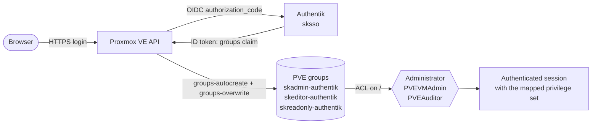
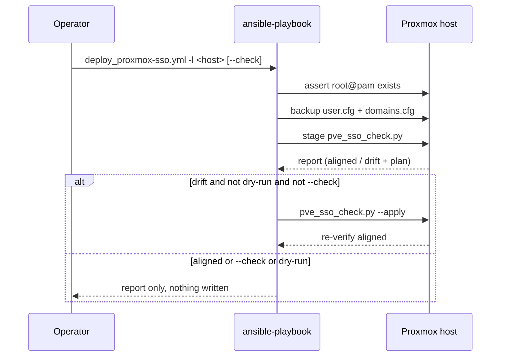

# proxmox-sso

**Purpose:** standardize Proxmox VE SSO (Authentik OIDC) across every Proxmox host -
one realm shape, one set of groups-driven ACLs - idempotently, with a dry-run mode
and a parity checker usable outside Ansible. **Maturity tier:** T0 - N/A (no key
material; the OIDC client secret is handled as an opaque vault value, never parsed
or derived).

This role does **not** create Authentik applications/providers/groups - that is
done once in Authentik itself (API or UI). It also does not manage `root@pam`
(the permanent break-glass account) beyond asserting it still exists before any
write.

## 1. Overview

- **What it owns:** the PVE `authentik` realm's `groups-claim` / `groups-autocreate`
  / `groups-overwrite` / `scopes` options, the three groups-claim-driven groups
  (`skadmin-authentik`, `skeditor-authentik`, `skreadonly-authentik`), and their
  ACL grants on `/`.
- **What it explicitly does NOT do:** touch `username-claim`, `client-id`,
  `issuer-url`, `client-key`, or the realm's `default` flag (each is per-host,
  changing any of them orphans existing users or breaks login) - these are never
  read for comparison and never written by the idempotency checker; it does not
  remove the legacy manual groups/ACLs (a separate, explicitly-confirmed step);
  and it does not touch the Authentik side (groups, provider scope mappings) -
  that is a prerequisite, not something this role calls.

## 2. Architecture





Data classification: the OIDC client secret (`proxmox_sso_client_secret`) is
**secret** - vault-sourced only, passed to `pveum realm add` with `no_log: true`,
never logged, never part of the checker's state (the script drops `client-key`
from any realm JSON it reads). Realm options, group names, and ACL grants are
**internal** (operational config, not sensitive).

## 3. Build

No build step - this is an Ansible role (pure YAML + a stdlib-only Python 3
script, no third-party deps).

## 4. Test

```sh
cd v1/ansible/core/proxmox-sso
python3 -m pytest tests/ -v                 # 15 unit tests, no live host needed
ansible-playbook --syntax-check deploy_proxmox-sso.yml
```

Parity check against a real host (read-only, no inventory needed):
```sh
ssh root@<host> 'python3 - --json' < scripts/pve_sso_check.py
# or, already staged by a prior ansible run:
ssh root@<host> python3 /root/.pve-sso-check/pve_sso_check.py --json
```
Exit code `0` = aligned, `1` = drift found, `2` = error - the same contract any
parity harness (e.g. `live_parity`) expects.

## 5. Release / Deploy

```sh
# dry run - report drift, change nothing (also forced under --check regardless
# of this flag):
ansible-playbook -i <your-private-inventory> \
  --vault-password-file "$HOME/.vault_pass_env/.prod_vault_pass" \
  core/proxmox-sso/deploy_proxmox-sso.yml -l <host> --check

# apply - one host at a time (the playbook hardcodes serial: 1):
ansible-playbook -i <your-private-inventory> \
  --vault-password-file "$HOME/.vault_pass_env/.prod_vault_pass" \
  core/proxmox-sso/deploy_proxmox-sso.yml -l <host>
```
Rollback: restore the timestamped backup from `proxmox_sso_backup_dir`
(default `/root/pve-sso-backups/`) - `cp user.cfg.bak-<ts> /etc/pve/user.cfg`,
same for `domains.cfg`; both take effect immediately (`pve-cluster` watches
`/etc/pve`, no restart needed).

**Front-end / Exposure:** N/A - this role runs over SSH against the Proxmox
management API's own CLI (`pveum`/`pvesh`); it opens no network surface of
its own.

## 6. Configuration / Usage

Real hostnames and secrets are **never** committed to this public repo. These
vars are inherently per-host (each Proxmox host has its own OIDC issuer/client),
so define them as `host_vars/<your-host>/proxmox-sso-prod_vault.yml` - copy
[`example-host_vars-vault.yml.example`](./example-host_vars-vault.yml.example)
and `ansible-vault`-encrypt it - rather than the shared per-env vault other
`v1/ansible/core/*` roles use.

Example private inventory group (not checked in):
```ini
[proxmox_sso]
CHANGEME_HOST_1 ansible_host=CHANGEME_HOST_1 ansible_user=root
CHANGEME_HOST_2 ansible_host=CHANGEME_HOST_2 ansible_user=root
```

### Vars table

| Var | Default | Source | Purpose |
|---|---|---|---|
| `proxmox_sso_realm` | `authentik` | inventory/defaults | PVE realm id to manage. Must already exist unless the three `proxmox_sso_issuer_url`/`client_id`/`client_secret` vars are also set (new-host bootstrap). |
| `proxmox_sso_issuer_url` | *(none)* | host_vars (vault) | OIDC issuer URL. Only read when the realm doesn't exist yet. **Never commit a real value** - vault or private inventory only. |
| `proxmox_sso_client_id` | *(none)* | host_vars (vault) | OIDC client id. Same rule as above. |
| `proxmox_sso_client_secret` | *(none)* | **vault only** | OIDC client secret. `no_log: true` on the one task that uses it; never read back, never logged, never part of the parity report. |
| `proxmox_sso_username_claim` | *(none, required for new-host bootstrap)* | host_vars (vault) | Per-host, set once at realm creation and never changed afterwards (changing it orphans every existing user). New hosts should use the claim that yields `<authentik-username>@authentik` as the PVE userid - see the SOP's "adding a new Proxmox host" section. |
| `proxmox_sso_group_roles` | `{skadmin-authentik: Administrator, skeditor-authentik: PVEVMAdmin, skreadonly-authentik: PVEAuditor}` | defaults | Documents the standard; the actual enforcement lives in `scripts/pve_sso_check.py`'s `TARGET_ACLS` (edit both together). |
| `proxmox_sso_dry_run` | `false` | defaults/extra-vars | `true` reports drift only. `--check` forces this regardless of the value. |
| `proxmox_sso_backup_dir` | `/root/pve-sso-backups` | defaults | Where timestamped `user.cfg`/`domains.cfg` backups land before any write. |
| `proxmox_sso_script_remote_path` | `/root/.pve-sso-check/pve_sso_check.py` | defaults | Staging path for the checker script on the target host. |
| `proxmox_sso_keep_script` | `false` | defaults | Leave the staged checker on the host after the run, for manual re-checks. |

## 7. API / Reference

`scripts/pve_sso_check.py` CLI:

| Flag | Meaning |
|---|---|
| `--realm-name NAME` | realm to check (default `authentik`) |
| `--realm-json / --acl-json / --group-json FILE\|-` | read fixture JSON instead of live `pvesh` (unit tests / offline review) |
| `--apply` | apply the plan instead of just reporting it |
| `--json` | machine-readable report on stdout |

Pure functions (unit-tested, importable): `diff_realm`, `diff_groups`, `diff_acls`,
`plan_commands`, `normalize_groups`, `exit_code_for`.

## 8. Troubleshooting

| Symptom | Check |
|---|---|
| Role fails at "Fail loudly if root@pam is missing" | `pveum user list` on the host - something deleted the break-glass account; stop and investigate before doing anything else. |
| `pveum realm add` task fails | Confirm `proxmox_sso_issuer_url`/`client_id`/`client_secret`/`username_claim` are all set and the realm genuinely doesn't exist yet (`pveum realm list`). |
| Checker reports drift that never clears after `--apply` | Run `pve_sso_check.py --json` directly on the host and read `plan` - a `pveum` command may be failing silently; re-run it by hand to see the real error. |
| User still only has old (manual-group) permissions after SSO login | Confirm the Authentik provider for *this* host's application actually sends the `groups` claim (its own OIDC discovery doc's `scopes_supported`/`claims_supported` should list `groups`) - this role only configures the PVE side. |
| Admin access unexpectedly narrows after a run | It shouldn't: existing manual groups/ACLs are never touched by this role. Check `pveum acl list` and the backup in `proxmox_sso_backup_dir` for what changed, and restore from there if needed. |

## 9. Maturity-tier + Version reference

**T0 - N/A (no key material generated/derived; the OIDC client secret is an
opaque vault-sourced value passed through, never parsed).** VERSION_LIFECYCLE
phase: **v1 - current production** (this repo's `v1/` tree; see the top-level
`CLAUDE.md`). Ships as part of `skstacks` - see that repo's own CHANGELOG/tags
for the release this role first appears in.

## Related projects / See also

- 📐 **Standards:** [sk-standards](https://github.com/smilinTux/sk-standards) - doc/SOP, architecture/data-flow, and version-lifecycle standards this README follows.
- ↔️ **Sibling:** [`optional/sksso`](../../optional/sksso/README.md) - the Authentik (sksso) service itself; this role configures Proxmox as an OIDC *client* of it. Deploying sksso is covered there; creating the per-host OAuth2 provider + application (with the `groups` scope mapping) is done in Authentik itself, out of band.
- ⬆️ **Depends on:** an existing Authentik application/provider per Proxmox host, with `skadmin`/`skeditor`/`skreadonly` groups and a `groups` scope mapping.
