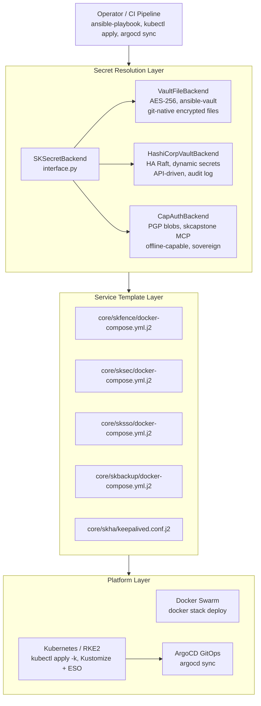
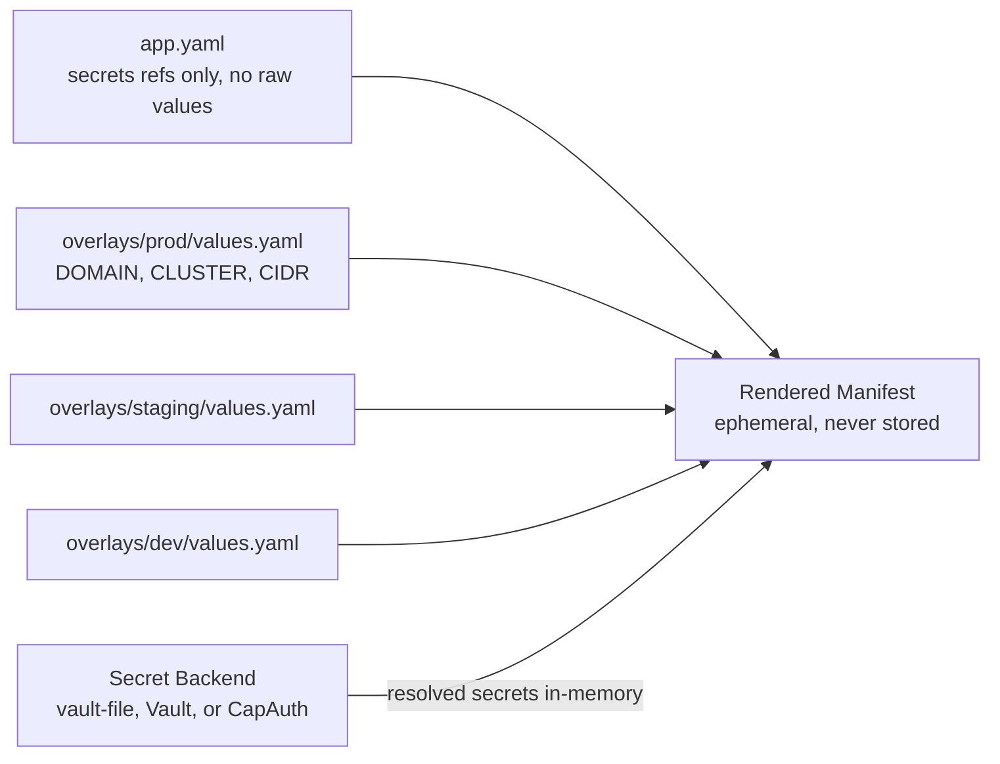
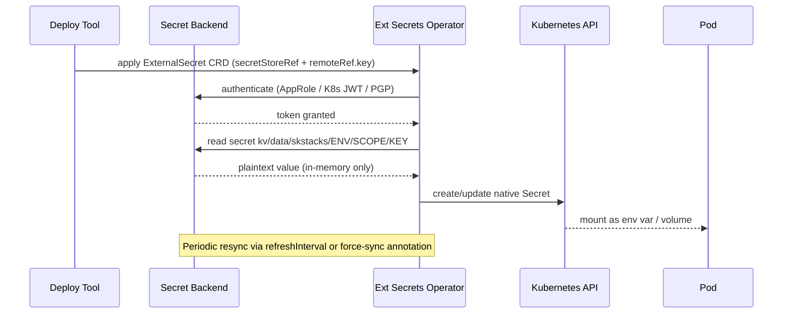
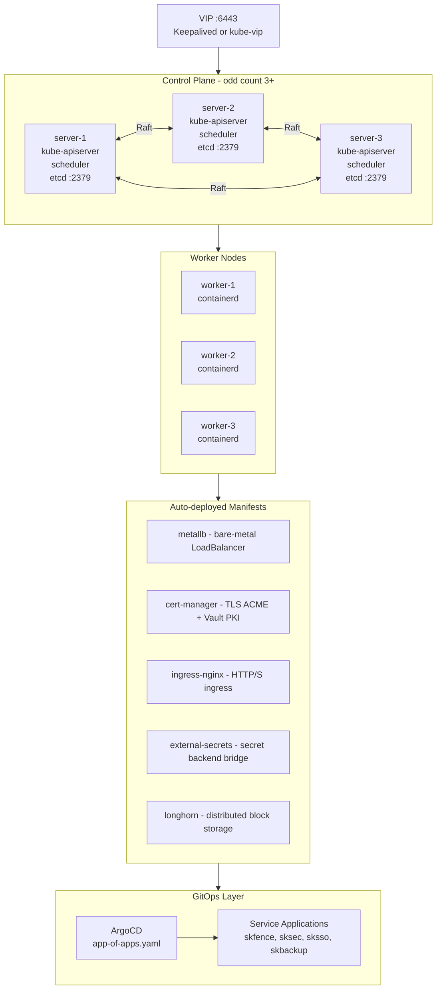
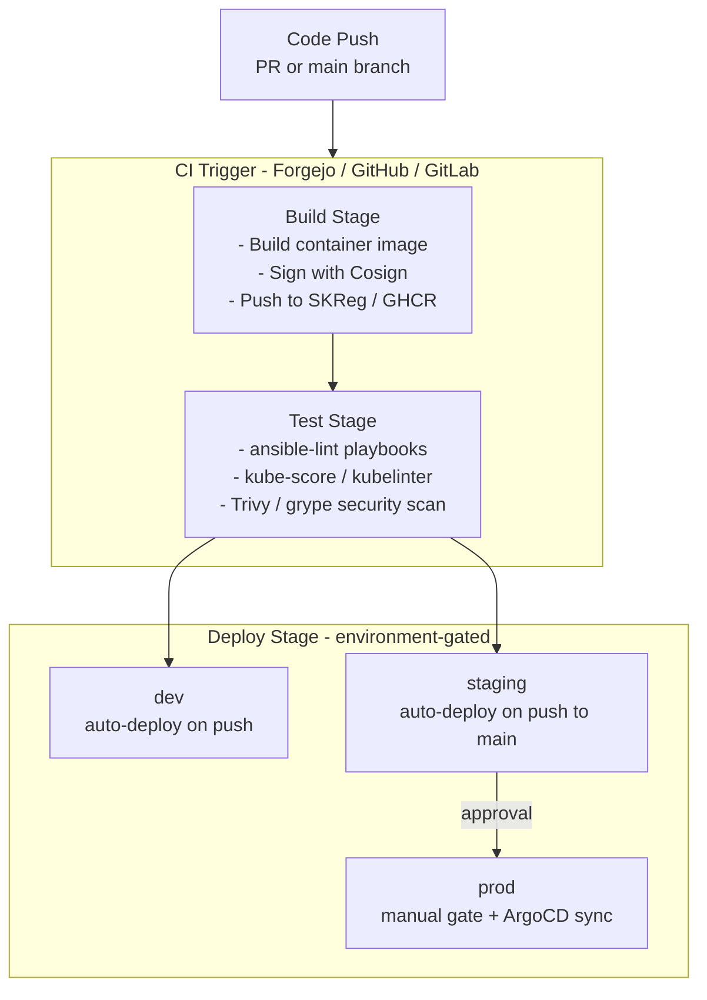
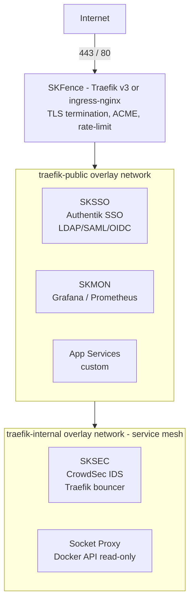
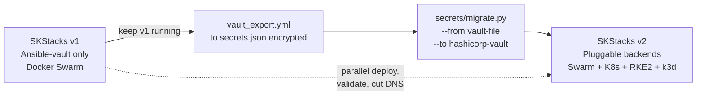

# SKStacks v2 — Architecture

## Design Principles

1. **Secret backend is a plug** — swap vault-file → HashiCorp Vault → CapAuth
   without changing service templates.
2. **Platform is a target** — the same service descriptor renders to
   docker-compose, K8s manifests, or Helm values.
3. **Secrets never live in Git** — example/template files contain placeholder
   tokens (`CHANGEME_*`). Real values come from the selected backend at deploy time.
4. **Least privilege by default** — each service gets its own secret scope.
5. **GitOps-ready** — ArgoCD / Flux can drive the K8s/RKE2 side while
   Ansible handles node-level config.

---

## System Layers



---

## Secret Scoping Model

Every service is assigned a **secret scope** — a path prefix in the chosen
backend. No service can read another service's secrets.

```
# vault-file
~/.vault_pass_env/.{scope}_{env}_vault_pass
group_vars/{env}/{scope}-{env}_vault.yml

# HashiCorp Vault
kv/data/skstacks/{env}/{scope}/*
  └─ kv/data/skstacks/prod/skfence/*
  └─ kv/data/skstacks/prod/sksec/*
  └─ kv/data/skstacks/prod/custom-app/*

# CapAuth
~/.skstacks/secrets/{env}/{scope}.gpg   (encrypted with agent key)
  └─ prod/skfence.gpg
  └─ prod/sksec.gpg
```

---

## App Descriptor (`app.yaml`)

Every service — core or custom — is described by an `app.yaml`. This file
contains **no secrets**, only references to secret keys.

```yaml
# v2/core/skfence/app.yaml
name: skfence
scope: skfence          # secret backend path prefix
version: "3.3"
platforms: [docker-swarm, kubernetes, rke2]

secrets:
  - key: cloudflare_dns_token
    description: "Cloudflare DNS API token for ACME DNS-01 challenge"
    rotation_days: 90
  - key: dashboard_user
    description: "Traefik dashboard basic-auth user"
  - key: dashboard_password_hash
    description: "Traefik dashboard bcrypt password hash"
    sensitive: true

config:
  DOMAIN: "${SKSTACKS_DOMAIN}"
  CLUSTERNAME: "${SKSTACKS_CLUSTER}"
  CERT_RESOLVER: main
  TLS_OPTIONS: default@file
  LOG_LEVEL: INFO
  RATE_LIMIT_AVERAGE: "100"
  RATE_LIMIT_BURST: "50"

networks:
  - cloud-edge
  - cloud-public
  - cloud-socket-proxy
```

---

## Multi-Environment Overlay Model

Environment-specific values (domain, cluster name, network CIDRs) live in
`overlays/{env}/values.yaml`. They never include raw secret values — those
come from the secret backend.

```
overlays/
├── prod/
│   └── values.yaml          # DOMAIN=your-domain.com, CLUSTER=skstack01, etc.
├── staging/
│   └── values.yaml
└── dev/
    └── values.yaml
```



---

## Kubernetes / RKE2 Secret Flow

For K8s and RKE2 deployments, the **External Secrets Operator (ESO)** bridges
the chosen secret backend into native K8s Secrets.



For the CapAuth backend, a lightweight ESO provider plugin communicates with
the local `skcapstone` MCP server to decrypt PGP-encrypted secret blobs.

---

## RKE2 Platform Architecture



### Why RKE2 over vanilla K8s?

| Feature | Vanilla K8s | RKE2 |
|---------|-------------|------|
| CIS-benchmark hardened | Optional | **Built-in** |
| etcd embedded | External required | **Built-in** |
| FIPS 140-2 compliant | No | **Supported** |
| Air-gap install | Complex | **Native** |
| Rancher integration | Manual | **Native** |
| Runtime | user choice | containerd (hardened) |
| Upgrade strategy | rolling, manual | **Automated via channel** |

---

## CI/CD Pipeline Model



---

## Network Topology (all platforms)



All inter-service traffic stays on private overlay networks.
Public exposure is only via SKFence/ingress-nginx.

---

## Migration Path: v1 → v2

1. **Keep v1 running.** v2 is parallel, not a drop-in replacement.
2. **Choose secret backend.** vault-file is the zero-effort migration path.
3. **Export existing vaults** with `vault-file/ansible/vault_export.yml` → creates
   portable `secrets.json` (encrypted).
4. **Import to new backend** with `secrets/migrate.py --from vault-file --to hashicorp-vault`.
5. **Deploy v2 services** alongside v1, validate, then cut over DNS.
6. **Decommission v1** service by service.


