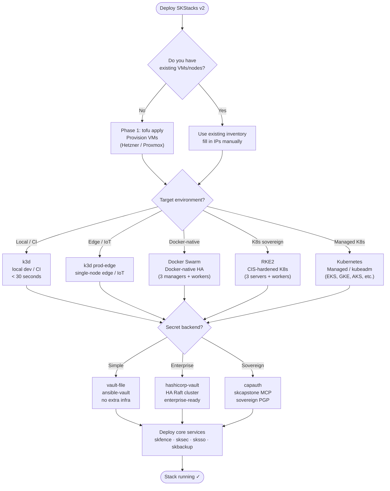

# SKStacks v2 — Deployment Guide

Full step-by-step instructions for every platform variant, plus ready-to-use
AI prompts for configuring and executing each deployment through the SKCapstone
agent mesh.

---



## Platform comparison

| Platform | Best for | Nodes | Complexity | TLS | Secrets |
|----------|----------|-------|------------|-----|---------|
| **Docker Swarm** | Production bare-metal, existing infra | 3+ managers + workers | Low | Traefik + ACME | Ansible Vault / Hashicorp |
| **RKE2** | Production K8s, CIS-hardened, Rancher | 3 servers + 3+ workers | High | cert-manager + ACME | ESO + Vault |
| **Vanilla K8s** | Generic K8s, cloud or on-prem | 1+ control-plane + workers | Medium | cert-manager | ESO + Vault |
| **k3d** | Local dev, CI pipelines, edge/IoT | All-in-Docker | Very Low | Self-signed / ACME | vault-file / capauth |

---

## Secrets backend decision

Before deploying any platform, choose your secrets backend:

| Backend | When to use |
|---------|-------------|
| `vault-file` | Solo operator, air-gapped, simple setup. Ansible Vault AES-256. |
| `hashicorp-vault` | Team deployments, audit trail, dynamic secrets. HA Raft 3 nodes. |
| `capauth` | Sovereign agent mesh. Secrets stored as PGP blobs via skcapstone MCP. |

Configure in `.env`:
```bash
SKSTACKS_SECRET_BACKEND=vault-file   # or: hashicorp-vault, capauth
```

Migration between backends:
```bash
cd skstacks/v2/secrets
python migrate.py --from vault-file --to hashicorp-vault --env prod
```

---

---

# Platform 1 — Docker Swarm

**Use when:** You have bare-metal servers, want proven simplicity, or are
migrating from an existing Compose/Swarm setup. Includes Keepalived VRRP
for floating VIP HA and Traefik v3 with automatic TLS.

## Architecture

```
              ┌──────────────────────────────────────┐
              │   Keepalived VRRP — SWARM_VIP        │
              │   Priority: mgr-01=100 / 02=90 / 03=80│
              └───────┬────────────┬─────────────────┘
                      │            │
          ┌───────────▼──┐  ┌──────▼────────┐  ┌──────────────┐
          │ swarm-mgr-01 │  │ swarm-mgr-02  │  │ swarm-mgr-03 │
          │ ACME master  │  │ traefik-wrkr  │  │ traefik-wrkr │
          └──────────────┘  └───────────────┘  └──────────────┘
                      │            │                    │
          ┌───────────▼────────────▼────────────────────▼──────┐
          │            Docker Swarm overlay network            │
          └───────────────────────────────────────────────────┘
                      │            │                    │
          ┌───────────▼──┐  ┌──────▼────────┐  ┌──────▼───────┐
          │  worker-01   │  │  worker-02    │  │  worker-N    │
          └──────────────┘  └───────────────┘  └──────────────┘
```

## Prerequisites

```bash
# On your workstation
ansible --version          # ≥ 2.14
ansible-galaxy collection install community.general

# On all nodes (Ubuntu 22.04 / Debian 12 recommended)
# Docker Engine ≥ 24, Python 3, SSH key auth, passwordless sudo
```

## Step-by-step deployment

### 1. Clone and enter platform directory

```bash
cd skstacks/v2/platform/swarm
```

### 2. Configure environment

```bash
cp .env.example .env
```

Edit `.env` and fill every blank value:

```bash
SWARM_MANAGER_IP=10.0.1.10        # bootstrap manager's real IP
SWARM_VIP=10.0.1.5                # free IP on same /24 — becomes HA endpoint
SWARM_MANAGEMENT_CIDR=10.0.0.0/8  # lock down swarm management ports
DOMAIN=example.com
ACME_EMAIL=admin@example.com
CF_DNS_API_TOKEN=<cloudflare-zone-dns-edit-token>
TRAEFIK_DASHBOARD_CIDR=10.0.0.0/8
TRAEFIK_DASHBOARD_AUTH=<htpasswd-hash>  # htpasswd -nB admin
ANSIBLE_USER=ubuntu
MANAGER_01_IP=10.0.1.10
MANAGER_02_IP=10.0.1.11
MANAGER_03_IP=10.0.1.12
WORKER_01_IP=10.0.2.10
WORKER_02_IP=10.0.2.11
ENV=prod
```

### 3. Configure inventory

```bash
cp ansible/inventory.example ansible/inventory
# Edit ansible/inventory — replace ${VAR} with real IPs/usernames
```

### 4. Configure group variables

```bash
cp ansible/group_vars/all.yml.example ansible/group_vars/all.yml
# Edit all.yml — replace ${VAR} placeholders
```

Create vault for secrets:
```bash
ansible-vault create ansible/group_vars/all_vault.yml
```

Add to vault:
```yaml
vault_keepalived_auth_pass: "your-strong-vrrp-password"
vault_acme_email: "admin@example.com"
```

Reference in `all.yml`:
```yaml
keepalived_auth_pass: "{{ vault_keepalived_auth_pass }}"
acme_email: "{{ vault_acme_email }}"
```

### 5. Deploy

```bash
cd ansible
ansible-playbook -i inventory playbooks/deploy.yml \
  --extra-vars "env=prod" \
  --ask-vault-pass
```

### 6. Label ACME master node (post-deploy, one-time)

```bash
docker node update --label-add traefik.acme.master=true swarm-manager-01
```

### 7. Deploy Traefik stack

```bash
export $(cat ../.env | xargs)
docker stack deploy -c ../stacks/traefik/docker-compose.yml traefik
```

### 8. Verify

```bash
docker node ls                          # all nodes Active/Ready
docker service ls                       # traefik-acme 1/1, traefik-worker 3/3
curl -k https://${SWARM_VIP}/ping      # 200 OK from Traefik
```

## Port reference

| Port | Proto | Purpose |
|------|-------|---------|
| 2377 | TCP | Swarm cluster management |
| 7946 | TCP/UDP | Container network discovery |
| 4789 | UDP | VXLAN overlay |
| 80 | TCP | Traefik HTTP → HTTPS redirect |
| 443 | TCP | Traefik HTTPS |
| 8080 | TCP | Traefik dashboard (restrict source) |

---

---

# Platform 2 — RKE2 (CIS-hardened Kubernetes)

**Use when:** You need production Kubernetes with security compliance (CIS,
FIPS), embedded etcd HA, and Rancher/GitOps integration. Best for regulated
environments or teams scaling beyond Swarm.

## Architecture

```
  VIP :6443 (kube-vip or keepalived)
       │
  ┌────▼──────┐  ┌───────────┐  ┌───────────┐
  │ server-1  │  │ server-2  │  │ server-3  │  ← Raft etcd quorum
  │ :6443 API │  │ :6443 API │  │ :6443 API │
  └───────────┘  └───────────┘  └───────────┘
       │
  /var/lib/rancher/rke2/server/manifests/   ← auto-deployed
  ├── metallb.yaml        (bare-metal LoadBalancer)
  ├── cert-manager.yaml   (TLS automation)
  ├── ingress-nginx.yaml  (HTTP/S routing)
  ├── longhorn.yaml       (distributed storage)
  └── external-secrets.yaml (secret backend bridge)
       │
  ┌────▼──────┐  ┌───────────┐  ┌───────────┐
  │ worker-1  │  │ worker-2  │  │ worker-3  │
  └───────────┘  └───────────┘  └───────────┘
```

## Prerequisites

```bash
# Workstation
ansible --version          # ≥ 2.14
kubectl version --client   # ≥ 1.28
helm version               # ≥ 3.14

# Nodes: RHEL 8/9, Rocky/Alma Linux, Ubuntu 22.04 or Debian 12
# Min: 4 vCPU / 8 GB RAM / 100 GB SSD per server node
# Min: 4 vCPU / 16 GB RAM / 200 GB SSD per worker node
# Ports: 9345/tcp (RKE2 join), 6443/tcp (API), 2379-2380/tcp (etcd server↔server)
```

## Step-by-step deployment

### 1. Configure inventory

```bash
cd skstacks/v2/platform/rke2/ansible
cp inventory.example.yml inventory.yml
```

Edit `inventory.yml` — replace every `CHANGEME_` value:

```yaml
all:
  vars:
    ansible_user: ubuntu
    ansible_ssh_private_key_file: ~/.ssh/id_rke2
    rke2_version: "v1.29.4+rke2r1"
    cluster_name: skstack-prod
    cluster_domain: example.com
    rke2_vip_ip: "192.168.1.10"
    rke2_vip_interface: eth0
    metallb_address_pool: "192.168.1.200-192.168.1.250"
    secret_backend: hashicorp-vault
  children:
    rke2_servers:
      hosts:
        server-1:
          ansible_host: 192.168.1.11
        server-2:
          ansible_host: 192.168.1.12
        server-3:
          ansible_host: 192.168.1.13
    rke2_agents:
      hosts:
        worker-1:
          ansible_host: 192.168.1.21
        worker-2:
          ansible_host: 192.168.1.22
        worker-3:
          ansible_host: 192.168.1.23
```

### 2. Bootstrap first server node

```bash
ansible-playbook -i inventory.yml install-rke2-server.yml \
  --limit rke2_servers[0]
```

Wait until the API is healthy:
```bash
watch kubectl --kubeconfig ~/.kube/skstack-prod.yaml get nodes
```

### 3. Join remaining server nodes (one at a time — preserves etcd quorum)

```bash
ansible-playbook -i inventory.yml install-rke2-server.yml \
  --limit rke2_servers[1:]
```

### 4. Join worker nodes

```bash
ansible-playbook -i inventory.yml install-rke2-agents.yml
```

### 5. Apply auto-deploy manifests

Copy manifests to the first server — RKE2 picks them up automatically:
```bash
scp manifests/*.yaml server-1:/var/lib/rancher/rke2/server/manifests/
```

Or apply directly with kubectl once the cluster is up:
```bash
export KUBECONFIG=~/.kube/skstack-prod.yaml
kubectl apply -f manifests/metallb.yaml
kubectl apply -f manifests/cert-manager.yaml
kubectl apply -f manifests/ingress-nginx.yaml
kubectl apply -f manifests/longhorn.yaml
kubectl apply -f manifests/external-secrets.yaml
```

### 6. Run Longhorn preflight check

```bash
bash scripts/longhorn-preflight.sh
# Verifies open-iscsi, multipathd, disk space on all nodes
```

### 7. Configure secrets backend

```bash
# If using hashicorp-vault:
bash ../../secrets/hashicorp_vault/bootstrap.sh \
  --vault-addr https://vault.example.com \
  --nodes "192.168.1.31,192.168.1.32,192.168.1.33"

# Apply ESO SecretStore pointing to Vault:
kubectl apply -f ../kubernetes/external-secrets/cluster-secret-store.yaml
```

### 8. Deploy ArgoCD app-of-apps (GitOps)

```bash
kubectl apply -f ../../cicd/argocd/app-of-apps.yaml
# ArgoCD takes over — monitors repo and self-heals all apps
```

### 9. Verify

```bash
export KUBECONFIG=~/.kube/skstack-prod.yaml
kubectl get nodes -o wide                    # all Ready
kubectl get pods -A | grep -v Running        # no crashloops
kubectl get svc -n ingress-nginx             # EXTERNAL-IP assigned by MetalLB
curl -k https://192.168.1.200/healthz        # ingress responding
```

## Port reference

| Port | Proto | Purpose |
|------|-------|---------|
| 6443 | TCP | Kubernetes API server |
| 9345 | TCP | RKE2 node registration |
| 2379-2380 | TCP | etcd (server↔server only) |
| 10250 | TCP | kubelet API |
| 8472 | UDP | VXLAN (Canal CNI) |
| 51820 | UDP | WireGuard (Canal encrypted, optional) |

---

---

# Platform 3 — Vanilla Kubernetes (Kustomize)

**Use when:** You're deploying to a managed K8s provider (EKS, GKE, AKS) or
running your own kubeadm cluster and want Kustomize-based overlay management
with External Secrets Operator.

## Structure

```
platform/kubernetes/
├── base/                    # shared across all environments
│   ├── kustomization.yaml
│   ├── namespaces.yaml
│   ├── metallb-config.yaml
│   └── cluster-issuer.yaml
├── external-secrets/        # ESO SecretStore + ExternalSecret examples
│   ├── cluster-secret-store.yaml
│   ├── db-credentials.yaml
│   ├── api-keys.yaml
│   └── tls-wildcard.yaml
└── overlays/
    ├── dev/                 # self-signed certs, local MetalLB pool
    ├── staging/             # staging ACME, staging Vault namespace
    └── prod/                # prod ACME, prod Vault namespace
```

## Step-by-step deployment

### 1. Point kubectl at your cluster

```bash
export KUBECONFIG=~/.kube/your-cluster.yaml
kubectl cluster-info
```

### 2. Choose your overlay

```bash
# Local dev (self-signed TLS, no real DNS needed)
kubectl apply -k overlays/dev

# Staging (ACME staging certs, mirrors prod structure)
kubectl apply -k overlays/staging

# Production
kubectl apply -k overlays/prod
```

### 3. Install cert-manager

```bash
helm repo add jetstack https://charts.jetstack.io
helm repo update
helm install cert-manager jetstack/cert-manager \
  --namespace cert-manager --create-namespace \
  --set installCRDs=true
```

Verify:
```bash
kubectl get pods -n cert-manager
```

### 4. Install External Secrets Operator

```bash
helm repo add external-secrets https://charts.external-secrets.io
helm install external-secrets external-secrets/external-secrets \
  --namespace external-secrets-system --create-namespace
```

### 5. Apply SecretStore (Vault backend)

Edit `external-secrets/cluster-secret-store.yaml` — set your Vault address:
```bash
kubectl apply -f external-secrets/cluster-secret-store.yaml
```

### 6. Apply ExternalSecrets

```bash
kubectl apply -f external-secrets/db-credentials.yaml
kubectl apply -f external-secrets/api-keys.yaml
kubectl apply -f external-secrets/tls-wildcard.yaml
```

Verify secrets synced:
```bash
kubectl get externalsecret -A
# STATUS column should show "SecretSynced"
```

### 7. Customise overlays for your environment

```bash
cd overlays/prod
# Edit kustomization.yaml — add your own patches
# Edit patches/cluster-issuer.yaml — set your ACME email and domain
kubectl apply -k .
```

### 8. Verify

```bash
kubectl get clusterissuer                    # READY=True
kubectl get certificate -A                   # READY=True
kubectl get externalsecret -A               # SecretSynced
```

---

---

# Platform 4 — k3d (Local Dev / CI / Edge)

**Use when:** You want a full Kubernetes environment on a laptop, need fast
CI cluster spin-up (< 30 seconds), or are deploying to a resource-constrained
edge node. k3d runs k3s inside Docker containers.

## Cluster variants

| Config | Servers | Agents | LB Ports | Use case |
|--------|---------|--------|----------|----------|
| `local` | 1 | 2 | 80/443 | Daily dev — mirrors real cluster |
| `ci` | 1 | 0 | none | GitHub Actions / Forgejo CI |
| `staging` | 3 | 2 | 8080/8443 | Multi-node staging on one machine |
| `prod-edge` | 1 | 0 | 80/443 | Raspberry Pi / edge device |

## Prerequisites

```bash
# Docker Engine ≥ 24 (running)
docker --version

# k3d ≥ 5.6
curl -s https://raw.githubusercontent.com/k3d-io/k3d/main/install.sh | bash
k3d version

# kubectl ≥ 1.28
curl -LO "https://dl.k8s.io/release/$(curl -L -s https://dl.k8s.io/release/stable.txt)/bin/linux/amd64/kubectl"
chmod +x kubectl && sudo mv kubectl /usr/local/bin/
```

## Step-by-step deployment

### 1. Configure environment

```bash
cd skstacks/v2/platform/k3d
cp .env.example .env
# Edit .env — at minimum set K3D_CLUSTER_NAME
```

### 2. Create cluster

```bash
# Local dev (default)
bash scripts/create.sh

# Or specify config:
K3D_CONFIG=ci bash scripts/create.sh
K3D_CONFIG=staging bash scripts/create.sh
K3D_CONFIG=prod-edge bash scripts/create.sh
```

The script runs:
```bash
k3d cluster create \
  --config clusters/${K3D_CONFIG}.yaml \
  --name ${K3D_CLUSTER_NAME} \
  --image ${K3D_IMAGE}
```

### 3. Merge kubeconfig

```bash
bash scripts/kubeconfig-merge.sh
kubectl config use-context k3d-skstacks
kubectl get nodes   # should show 1 server + 2 agents for local config
```

### 4. Apply manifests

```bash
kubectl apply -f manifests/namespaces.yaml
kubectl apply -f manifests/cert-manager.yaml
```

### 5. Apply your overlay

```bash
# Local dev
kubectl apply -k overlays/local

# CI (minimal — no persistent storage, no ingress)
kubectl apply -k overlays/ci
```

### 6. Pre-load images (optional — speeds up pod startup)

```bash
# Pre-load images into the k3d cluster nodes
bash scripts/load-images.sh nginx:alpine my-app:latest
```

### 7. Verify

```bash
kubectl get nodes
# NAME                      STATUS   ROLES
# k3d-skstacks-server-0    Ready    control-plane
# k3d-skstacks-agent-0     Ready    <none>
# k3d-skstacks-agent-1     Ready    <none>

curl http://localhost/    # hits ingress-nginx via port 80 mapping
```

### 8. Destroy when done

```bash
bash scripts/destroy.sh
```

## CI/CD usage (GitHub Actions / Forgejo)

```yaml
- name: Create k3d cluster
  run: |
    curl -s https://raw.githubusercontent.com/k3d-io/k3d/main/install.sh | bash
    cd skstacks/v2/platform/k3d
    K3D_CONFIG=ci bash scripts/create.sh
    bash scripts/kubeconfig-merge.sh

- name: Deploy and test
  run: |
    kubectl apply -k overlays/ci
    kubectl wait --for=condition=ready pod -l app=myapp --timeout=120s
```

---

---

# AI Deployment Prompts

These prompts are designed to be given directly to an AI agent (Claude Code,
skcapstone MCP, or any tool-capable LLM) to configure and execute the
deployment. Each prompt is self-contained — the AI will read the scaffold,
fill in the blanks, and run the commands.

---

## Docker Swarm — AI prompts

### Prompt A: Interactive configuration wizard

```
You are deploying a Docker Swarm cluster using the SKStacks v2 scaffold at
skstacks/v2/platform/swarm/.

Ask me the following questions one at a time and record my answers:
1. What is the IP address of your primary (bootstrap) manager node?
2. What is the floating VIP you want to use for HA? (must be unused, same /24 as managers)
3. What domain will this cluster serve? (e.g. example.com)
4. What is your Let's Encrypt ACME email address?
5. What is your Cloudflare DNS API token? (needs Zone.DNS:Edit permission)
6. List the IPs of your 3 manager nodes and 2+ worker nodes.
7. What SSH user has passwordless sudo on all nodes?

Then:
- Write .env with all values filled in
- Write ansible/inventory with all nodes
- Write ansible/group_vars/all.yml from the example
- Run: ansible-vault create ansible/group_vars/all_vault.yml
- Run: cd ansible && ansible-playbook -i inventory playbooks/deploy.yml --extra-vars "env=prod" --ask-vault-pass
```

### Prompt B: Deploy with existing .env

```
Deploy a Docker Swarm cluster using the SKStacks v2 scaffold.
Working directory: skstacks/v2/platform/swarm/

The .env file already exists and is populated. Do the following:
1. Read .env and validate all required variables are non-empty.
2. Generate ansible/inventory from ansible/inventory.example using values from .env.
3. Generate ansible/group_vars/all.yml from all.yml.example using values from .env.
4. Run the Ansible deploy playbook:
   cd ansible && ansible-playbook -i inventory playbooks/deploy.yml \
     --extra-vars "env=prod" --extra-vars "@group_vars/all_vault.yml"
5. After deploy, run: docker node update --label-add traefik.acme.master=true swarm-manager-01
6. Deploy Traefik: docker stack deploy -c stacks/traefik/docker-compose.yml traefik
7. Verify: docker node ls && docker service ls && curl -k https://${SWARM_VIP}/ping
Report any errors with full output.
```

### Prompt C: Add a new service stack to the swarm

```
Add a new Docker Swarm stack to the existing cluster at skstacks/v2/platform/swarm/.

Service details I need you to ask me about:
- Service name
- Docker image and tag
- Port to expose (internal container port)
- Environment variables needed
- Persistent volumes needed (yes/no, if yes: path and size)
- Should it be on traefik-public or traefik-internal network?

Then:
1. Create stacks/{service-name}/docker-compose.yml with Traefik labels for HTTPS routing
2. Add the service to stacks/{service-name}/.env.example
3. Deploy: docker stack deploy -c stacks/{service-name}/docker-compose.yml {service-name}
4. Verify the Traefik router is registered: curl https://{domain}/
```

---

## RKE2 — AI prompts

### Prompt A: Full cluster bootstrap

```
Bootstrap a production RKE2 Kubernetes cluster using SKStacks v2.
Working directory: skstacks/v2/platform/rke2/

Ask me for:
1. Number of server (control-plane) nodes and their IPs
2. Number of worker nodes and their IPs
3. Desired VIP for the kube-apiserver (free IP on management network)
4. Network interface name on nodes (e.g. eth0, ens3)
5. MetalLB LoadBalancer IP pool range (e.g. 192.168.1.200-250)
6. Cluster name and primary domain
7. SSH user and key path
8. Secret backend: vault-file, hashicorp-vault, or capauth

Then:
1. Write ansible/inventory.yml from inventory.example.yml with provided values
2. Bootstrap first server: ansible-playbook -i inventory.yml install-rke2-server.yml --limit rke2_servers[0]
3. Wait for API healthy, then join remaining servers: --limit rke2_servers[1:]
4. Join workers: ansible-playbook -i inventory.yml install-rke2-agents.yml
5. Fetch kubeconfig to ~/.kube/{cluster_name}.yaml
6. Apply manifests: scp manifests/*.yaml server-1:/var/lib/rancher/rke2/server/manifests/
7. Wait for all system pods Running: kubectl get pods -A --watch
8. Configure chosen secrets backend
9. Apply ArgoCD app-of-apps: kubectl apply -f ../../cicd/argocd/app-of-apps.yaml
Report status at each step.
```

### Prompt B: Upgrade RKE2 version

```
Upgrade the RKE2 cluster at skstacks/v2/platform/rke2/ to a new version.

Current kubeconfig: ~/.kube/{cluster_name}.yaml

Steps:
1. Read current rke2_version from ansible/inventory.yml
2. Ask me: what version to upgrade to? (check https://github.com/rancher/rke2/releases)
3. Drain and upgrade server nodes one at a time (serial: 1 to preserve etcd quorum):
   ansible-playbook -i inventory.yml upgrade-rke2.yml --limit rke2_servers[0]
   kubectl wait --for=condition=Ready node/server-1 --timeout=300s
   # Repeat for server-2, server-3
4. Drain and upgrade worker nodes (can be parallel if > 3 workers):
   ansible-playbook -i inventory.yml upgrade-rke2.yml
5. Verify: kubectl get nodes -o wide (all show new version)
```

### Prompt C: Add a new namespace + app via ArgoCD

```
Add a new application to the RKE2 cluster via ArgoCD using SKStacks v2.
Working directory: skstacks/v2/

Ask me:
- Application name
- Git repo URL containing the Helm chart or Kustomize manifests
- Target namespace
- Sync policy (manual or automated)
- Any Helm values overrides

Then:
1. Create cicd/argocd/apps/{app-name}.yaml as an ArgoCD Application manifest
2. Add it to cicd/argocd/app-of-apps.yaml as a child app
3. Apply: kubectl apply -f cicd/argocd/apps/{app-name}.yaml
4. Watch sync: kubectl get application -n argocd {app-name} --watch
5. Report final sync status and any health check failures
```

---

## Vanilla Kubernetes — AI prompts

### Prompt A: Deploy to managed K8s (EKS/GKE/AKS)

```
Deploy SKStacks v2 Kubernetes platform to a managed cluster.
Working directory: skstacks/v2/platform/kubernetes/

Ask me:
1. Kubeconfig path or current context name
2. Target environment: dev, staging, or prod
3. Vault address (for ESO SecretStore) — or 'skip' to use vault-file
4. MetalLB pool (skip if cloud LB is available)
5. ACME email and domain

Then:
1. Verify cluster access: kubectl cluster-info
2. Install cert-manager via Helm with CRDs
3. Install External Secrets Operator via Helm
4. Apply the chosen overlay: kubectl apply -k overlays/{env}
5. Apply external-secrets manifests: kubectl apply -f external-secrets/
6. Verify: kubectl get clusterissuer && kubectl get externalsecret -A
Report any resources not ready.
```

### Prompt B: Promote from dev to prod overlay

```
Promote the Kubernetes deployment from dev to prod overlay.
Working directory: skstacks/v2/platform/kubernetes/

Steps:
1. Show diff between overlays/dev and overlays/prod
2. Ask me to confirm each difference (cert issuer, MetalLB pool, replica counts)
3. Apply prod overlay: kubectl apply -k overlays/prod
4. Monitor rollout: kubectl rollout status deployment -A --watch
5. Run smoke tests: curl the ingress endpoints from overlays/prod
Report any failures with pod logs.
```

---

## k3d — AI prompts

### Prompt A: Spin up local dev cluster (< 60 seconds)

```
Create a local k3d development cluster using SKStacks v2.
Working directory: skstacks/v2/platform/k3d/

Steps:
1. Check prerequisites: docker --version, k3d version, kubectl version
2. If k3d not installed: curl -s https://raw.githubusercontent.com/k3d-io/k3d/main/install.sh | bash
3. Read .env.example, ask me if I want to change any defaults (cluster name, k3s version)
4. Write .env with confirmed values
5. Create cluster: bash scripts/create.sh
6. Merge kubeconfig: bash scripts/kubeconfig-merge.sh
7. Apply local overlay: kubectl apply -k overlays/local
8. Verify: kubectl get nodes && curl http://localhost/
Print cluster info and context name when done.
```

### Prompt B: Set up k3d for CI pipeline

```
Configure k3d for use in a GitHub Actions or Forgejo CI pipeline.
Working directory: skstacks/v2/platform/k3d/

Generate a CI workflow file (.github/workflows/k3d-test.yml or .forgejo/workflows/k3d-test.yml)
that:
1. Installs k3d (pinned version from .env K3D_IMAGE)
2. Creates cluster using clusters/ci.yaml (fast: 1 server, 0 agents, no LB)
3. Merges kubeconfig
4. Applies overlays/ci
5. Runs: kubectl wait --for=condition=ready pod --all -A --timeout=120s
6. Executes any test manifests in tests/
7. Always destroys cluster (even on failure): bash scripts/destroy.sh

Ask me: GitHub Actions or Forgejo? Then write the appropriate workflow file.
```

### Prompt C: Deploy to edge device (Raspberry Pi / low-resource node)

```
Deploy k3d prod-edge cluster on a Raspberry Pi or single-node edge device.
Working directory: skstacks/v2/platform/k3d/

Ask me:
1. Target device hostname/IP and SSH user
2. Available RAM (to set k3s resource limits)
3. Persistent data path on device (default: /var/lib/k3d-skstacks)
4. Any local registry mirror to use?

Then:
1. SSH to device and verify Docker is running
2. Install k3d on device
3. Copy clusters/prod-edge.yaml and .env to device
4. On device: K3D_CONFIG=prod-edge bash scripts/create.sh
5. Merge kubeconfig back to workstation: bash scripts/kubeconfig-merge.sh --remote {device-ip}
6. Apply overlays/local (edge uses same base, restricted resources)
7. Verify: kubectl get nodes && kubectl get pods -A
```

---

## Cross-platform AI prompts

### Migrate Docker Swarm services to RKE2

```
Migrate running services from a Docker Swarm cluster to the RKE2 cluster.
Reference: skstacks/v2/platform/swarm/stacks/ and skstacks/v2/platform/rke2/

Steps:
1. List all running Swarm stacks: docker stack ls
2. For each stack, read its docker-compose.yml
3. Convert each service to a Kubernetes Deployment + Service + Ingress manifest
4. Map Swarm volumes to Longhorn PersistentVolumeClaims
5. Map Traefik labels to ingress-nginx annotations
6. Map Docker secrets to ExternalSecrets referencing the same Vault paths
7. Apply manifests to RKE2 cluster
8. Verify each service responds before removing from Swarm
9. Remove old Swarm stacks one at a time

Report any conversion issues that need manual review.
```

### Choose the right platform

```
Help me choose the right SKStacks v2 deployment platform.

Ask me these questions:
1. How many physical/virtual nodes do you have available?
2. Do the nodes have at least 8GB RAM and 4 vCPU each?
3. Do you need Kubernetes (kubectl, Helm, operators) or is Compose/Swarm sufficient?
4. Is this for local development, CI, staging, or production?
5. Do you need CIS security hardening or FIPS compliance?
6. Do you have an existing Docker Swarm you want to keep compatible with?
7. Do you need GitOps (ArgoCD) or is manual deploy OK?

Based on my answers, recommend one of: swarm, rke2, kubernetes, or k3d.
Explain why and give me the exact first 3 commands to get started.
```

### Secrets backend migration

```
Migrate all secrets from one SKStacks backend to another.
Working directory: skstacks/v2/secrets/

Ask me:
1. Current backend: vault-file, hashicorp-vault, or capauth
2. Target backend
3. Environment filter (prod, staging, dev, or all)

Then:
1. Run: python migrate.py --from {current} --to {target} --env {environment} --dry-run
2. Show me the diff of what will be migrated
3. Ask for confirmation
4. Run without --dry-run
5. Verify secrets are readable from the new backend
6. Update .env SKSTACKS_SECRET_BACKEND={target}
Report any keys that failed to migrate.
```

---

## Tips for AI-assisted deployments

1. **Always run `--dry-run` first** for Ansible playbooks and `kubectl diff -k .` before `kubectl apply -k .`
2. **Pin versions** — set exact `rke2_version`, `K3D_IMAGE`, and Helm chart versions in your `.env` before asking AI to deploy
3. **Vault passwords** — never paste real vault passwords in AI prompts; use `--ask-vault-pass` flag and enter interactively
4. **Secrets in prompts** — use placeholder references (`$CF_DNS_API_TOKEN`) in prompts; load real values from `.env` at runtime
5. **One environment at a time** — ask AI to deploy dev, verify, then promote to staging, verify, then prod
6. **Use `skcapstone run_ansible_playbook` MCP tool** for AI-driven deployments — it streams output to the activity feed and stores results in memory automatically
