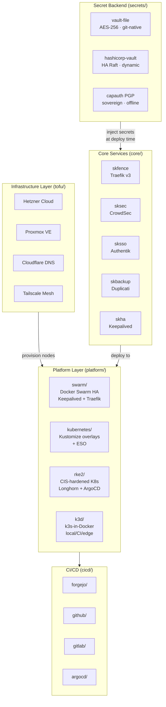
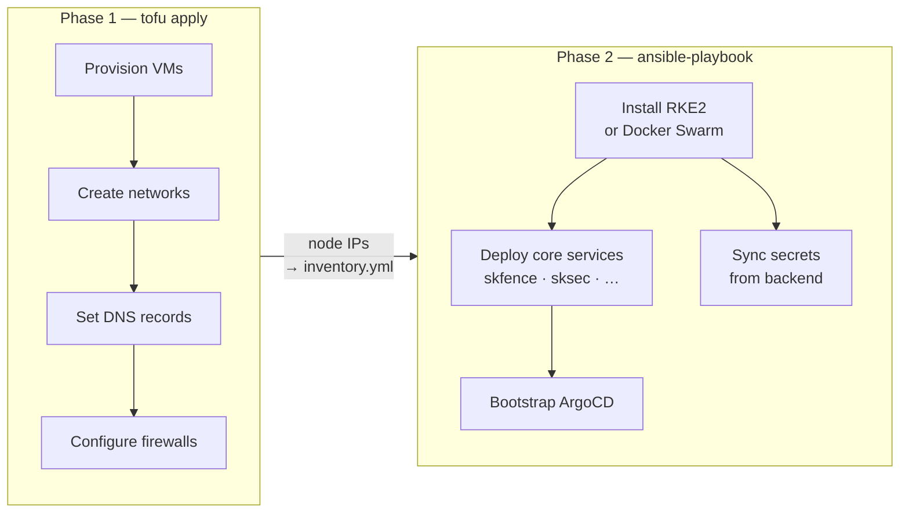

# SKStacks v2 — Sovereign Infrastructure Framework

SKStacks v2 is a **security-backend-agnostic** infrastructure framework for
deploying production-grade sovereign stacks on Docker Swarm, Kubernetes, and
RKE2. It is the successor to SKStacks v1 (Ansible-vault-only, Docker Swarm).

---

## What's New in v2

| Feature | v1 | v2 |
|---------|----|----|
| Secret backend | Ansible vault files only | **Pluggable** — vault-file, HashiCorp Vault, or CapAuth/PGP |
| Platforms | Docker Swarm | Docker Swarm + Kubernetes + **RKE2** + **k3d** |
| CI/CD | Forgejo Actions | Forgejo + **GitHub Actions** + **GitLab CI** + **ArgoCD GitOps** |
| Config model | Per-service Ansible vars | Unified `app.yaml` descriptor + platform overlays |
| Secret injection | Ansible template render | Runtime injection via agent sidecar or ESO |
| K8s secret sync | None | **External Secrets Operator** bridge to all backends |

---

## Architecture at a Glance



### Two-phase deployment



---

## Quick Start

### 0. Provision Infrastructure (OpenTofu)

```bash
cd v2/tofu/examples/hetzner-rke2/
cp terraform.tfvars.example terraform.tfvars && $EDITOR terraform.tfvars
tofu init && tofu plan && tofu apply

# Export Ansible inventory from tofu output
tofu output -raw ansible_inventory > ../../platform/rke2/ansible/inventory.yml
```

### 1. Choose Your Secret Backend

```bash
# Option A — vault-file (Ansible vault, standalone, no extra infra)
export SKSTACKS_SECRET_BACKEND=vault-file

# Option B — HashiCorp Vault (centralised, dynamic secrets, audit log)
export SKSTACKS_SECRET_BACKEND=hashicorp-vault
export VAULT_ADDR=https://vault.your-domain.com:8200
export VAULT_TOKEN=<your-token>  # or use AppRole / K8s auth

# Option C — CapAuth/PGP (sovereign, offline-capable, skcapstone integration)
export SKSTACKS_SECRET_BACKEND=capauth
export CAPAUTH_KEY_ID=<pgp-fingerprint>
export CAPAUTH_AGENT=opus  # skcapstone agent instance
```

### 2. Choose Your Platform

```bash
# Docker Swarm (HA, Keepalived VRRP, Traefik v3)
cd platform/swarm
cp .env.example .env && $EDITOR .env
ansible-playbook -i ansible/inventory ansible/playbooks/deploy.yml

# Kubernetes (generic, Kustomize)
cd platform/kubernetes
kubectl apply -k overlays/prod

# RKE2 (Rancher, CIS-hardened)
cd platform/rke2
ansible-playbook -i ansible/inventory.yml ansible/playbooks/install-rke2-server.yml
ansible-playbook -i ansible/inventory.yml ansible/playbooks/install-rke2-agent.yml

# k3d (local dev / CI / edge)
cd platform/k3d
cp .env.example .env && $EDITOR .env
./scripts/create.sh   # K3D_CONFIG=local by default
```

See [DEPLOYMENT.md](./DEPLOYMENT.md) for full step-by-step instructions and AI prompts for all four platforms.

### 3. Deploy Core Services

```bash
# Docker Swarm
ansible-playbook -e env=prod -e secret_backend=vault-file \
  core/skfence/deploy.yml

# RKE2 / K8s  — via ArgoCD app-of-apps
kubectl apply -f cicd/argocd/app-of-apps.yaml
```

---

## Directory Structure

```
v2/
├── README.md                  ← you are here
├── ARCHITECTURE.md            ← deep architecture notes
├── DEPLOYMENT.md              ← step-by-step deployment guide (all platforms)
├── SECRETS.md                 ← secrets & auth deployment guide (all backends)
├── SECURITY-BACKENDS.md       ← compare the three secret backends
│
├── tofu/                      ← OpenTofu infrastructure layer (Phase 1)
│   ├── README.md              ← quickstart + provider guide
│   ├── modules/
│   │   ├── hetzner-cluster/   ← Hetzner VMs + network + firewall
│   │   ├── proxmox-cluster/   ← Proxmox cloud-init VMs
│   │   ├── cloudflare-dns/    ← DNS records + WAF rules
│   │   └── tailscale-mesh/    ← Tailscale ACLs (planned)
│   ├── state/                 ← S3/MinIO, HTTP (Forgejo), local backends
│   ├── secrets/               ← vault-file wrapper, Vault provider
│   └── examples/
│       ├── hetzner-rke2/      ← Hetzner + RKE2 (production-grade)
│       └── proxmox-swarm/     ← Proxmox + Docker Swarm (on-premises)
│
├── secrets/                   ← secret backend abstraction (Phase 1+2)
│   ├── interface.py           ← SKSecretBackend ABC (Python tooling)
│   ├── factory.py             ← backend selector
│   ├── vault-file/            ← Backend 1: Ansible Vault encrypted files
│   ├── hashicorp-vault/       ← Backend 2: HashiCorp Vault
│   └── capauth/               ← Backend 3: CapAuth sovereign PGP
│
├── core/                      ← framework-managed core services (Phase 2)
│   ├── skfence/               ← Traefik v3 reverse proxy + ACME
│   ├── sksec/                 ← CrowdSec IDS + Traefik bouncer
│   ├── sksso/                 ← Authentik SSO (LDAP/SAML/OIDC)
│   ├── skbackup/              ← Duplicati automated backups
│   └── skha/                  ← Keepalived VRRP high availability
│
├── platform/                  ← platform-specific deployment configs
│   ├── swarm/                 ← Docker Swarm Ansible playbooks + Traefik stacks
│   ├── kubernetes/            ← Kustomize base + overlays
│   ├── rke2/                  ← RKE2 install + manifests + Helm values
│   └── k3d/                   ← k3d (k3s-in-Docker) for local dev + CI + edge
│
├── cicd/                      ← CI/CD pipeline templates
│   ├── forgejo/
│   │   ├── tofu-plan-apply.yml ← PR plan + main apply + destroy gate
│   │   ├── service-deploy.yml  ← Ansible/K8s service deploy
│   │   └── image-build.yml     ← Container build + Cosign sign
│   ├── github/                ← GitHub Actions equivalents
│   ├── gitlab/                ← GitLab CI
│   └── argocd/                ← ArgoCD GitOps app manifests
│
└── overlays/                  ← environment overrides
    ├── prod/
    ├── staging/
    └── dev/
```

---

## Secret Backend Decision Guide

| I need… | Use |
|---------|-----|
| Simple, git-native, no extra infra | **vault-file** |
| Dynamic secrets, audit trail, enterprise compliance | **hashicorp-vault** |
| Fully sovereign, offline, PGP-signed identity, skcapstone integration | **capauth** |

See [SECURITY-BACKENDS.md](./SECURITY-BACKENDS.md) for a full comparison and [SECRETS.md](./SECRETS.md) for step-by-step deployment instructions and AI prompts.

---

## License

AGPL-3.0-or-later — Part of the [smilinTux](https://smilintux.org) sovereign stack.
