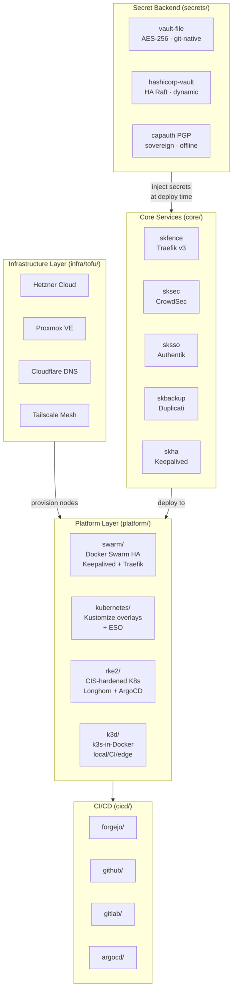
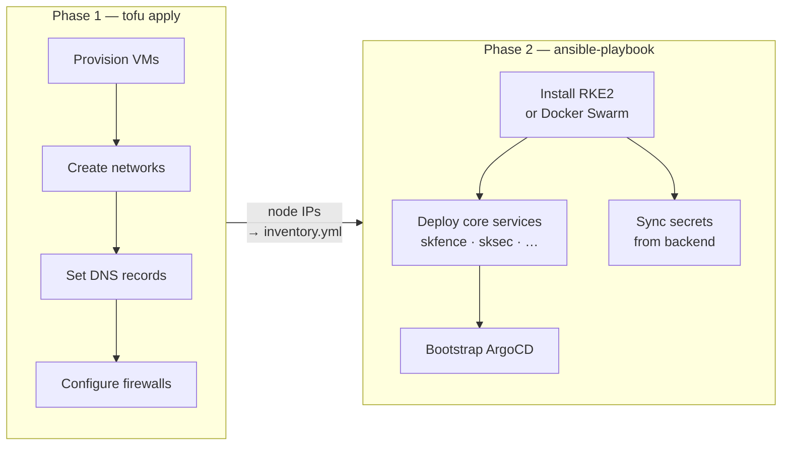

# SKStacks v2 — Sovereign Infrastructure Framework

SKStacks v2 is a **security-backend-agnostic** infrastructure framework for
deploying production-grade sovereign stacks on Docker Swarm, Kubernetes, and
RKE2. It is the successor to SKStacks v1 (Ansible-vault-only, Docker Swarm).

---

## What's New in v2

| Feature | v1 | v2 |
|---------|----|----|
| Secret backend | Ansible vault files only | **Pluggable** — vault-file, HashiCorp Vault, or CapAuth/PGP |
| Platforms | Docker Swarm | Docker Swarm + Kubernetes + **RKE2** + **k3d** |
| CI/CD | Forgejo Actions | Forgejo + **GitHub Actions** + **GitLab CI** + **ArgoCD GitOps** |
| Config model | Per-service Ansible vars | Unified `app.yaml` descriptor + platform overlays |
| Secret injection | Ansible template render | Runtime injection via agent sidecar or ESO |
| K8s secret sync | None | **External Secrets Operator** bridge to all backends |

---

## Architecture at a Glance


```mermaid
flowchart TD
    subgraph INF["Infrastructure Layer  (infra/tofu/)"]
        HZ["Hetzner Cloud"]
        PX["Proxmox VE"]
        CF["Cloudflare DNS"]
        TS["Tailscale Mesh"]
    end

    subgraph SEC["Secret Backend  (secrets/)"]
        VF["vault-file\nAES-256 · git-native"]
        HV["hashicorp-vault\nHA Raft · dynamic"]
        CA["capauth PGP\nsovereign · offline"]
    end

    subgraph SVC["Core Services  (core/)"]
        SKF["skfence\nTraefik v3"]
        SKS["sksec\nCrowdSec"]
        SSO["sksso\nAuthentik"]
        SKB["skbackup\nDuplicati"]
        HA["skha\nKeepalived"]
    end

    subgraph PLT["Platform Layer  (platform/)"]
        SW["swarm/\nDocker Swarm HA\nKeepalived + Traefik"]
        K8["kubernetes/\nKustomize overlays\n+ ESO"]
        RK["rke2/\nCIS-hardened K8s\nLonghorn + ArgoCD"]
        K3["k3d/\nk3s-in-Docker\nlocal/CI/edge"]
    end

    subgraph CI["CI/CD  (cicd/)"]
        FG["forgejo/"]
        GH["github/"]
        GL["gitlab/"]
        AR["argocd/"]
    end

    INF -->|"provision nodes"| PLT
    SEC -->|"inject secrets\nat deploy time"| SVC
    SVC -->|"deploy to"| PLT
    PLT --> CI
```

### Two-phase deployment


```mermaid
flowchart LR
    subgraph P1["Phase 1 — tofu apply"]
        P1A["Provision VMs"]
        P1B["Create networks"]
        P1C["Set DNS records"]
        P1D["Configure firewalls"]
        P1A --> P1B --> P1C --> P1D
    end

    subgraph P2["Phase 2 — ansible-playbook"]
        P2A["Install RKE2\nor Docker Swarm"]
        P2B["Deploy core services\nskfence · sksec · …"]
        P2C["Bootstrap ArgoCD"]
        P2D["Sync secrets\nfrom backend"]
        P2A --> P2B --> P2C
        P2A --> P2D
    end

    P1 -->|"node IPs\n→ inventory.yml"| P2
```

---

## Quick Start

### 0. Provision Infrastructure (OpenTofu)

```bash
cd v2/infra/tofu/examples/hetzner-rke2/
cp terraform.tfvars.example terraform.tfvars && $EDITOR terraform.tfvars
tofu init && tofu plan && tofu apply

# Export Ansible inventory from tofu output
tofu output -raw ansible_inventory > ../../platform/rke2/ansible/inventory.yml
```

> Running from an instance repo? Write the inventory to `envs/<env>/inventory.yml`
> instead, and run tofu from the instance. See [docs/INSTANCE-MODEL.md](docs/INSTANCE-MODEL.md).


### 1. Choose Your Secret Backend

```bash
# Option A — vault-file (Ansible vault, standalone, no extra infra)
export SKSTACKS_SECRET_BACKEND=vault-file

# Option B — HashiCorp Vault (centralised, dynamic secrets, audit log)
export SKSTACKS_SECRET_BACKEND=hashicorp-vault
export VAULT_ADDR=https://vault.your-domain.com:8200
export VAULT_TOKEN=<your-token>  # or use AppRole / K8s auth

# Option C — CapAuth/PGP (sovereign, offline-capable, skcapstone integration)
export SKSTACKS_SECRET_BACKEND=capauth
export CAPAUTH_KEY_ID=<pgp-fingerprint>
export CAPAUTH_AGENT=opus  # skcapstone agent instance
```

### 2. Choose Your Platform

```bash
# Docker Swarm (HA, Keepalived VRRP, Traefik v3)
cd platform/swarm
cp .env.example .env && $EDITOR .env
ansible-playbook -i ansible/inventory ansible/playbooks/deploy.yml

# Kubernetes (generic, Kustomize)
cd platform/kubernetes
kubectl apply -k overlays/prod

# RKE2 (Rancher, CIS-hardened)
cd platform/rke2
ansible-playbook -i ansible/inventory.yml ansible/playbooks/install-rke2-server.yml
ansible-playbook -i ansible/inventory.yml ansible/playbooks/install-rke2-agent.yml

# k3d (local dev / CI / edge)
cd platform/k3d
cp .env.example .env && $EDITOR .env
./scripts/create.sh   # K3D_CONFIG=local by default
```

See [DEPLOYMENT.md](./DEPLOYMENT.md) for full step-by-step instructions and AI prompts for all four platforms.

### 3. Deploy Core Services

```bash
# Docker Swarm
ansible-playbook -e env=prod -e secret_backend=vault-file \
  cloud/skfence/deploy.yml

# RKE2 / K8s  — via ArgoCD app-of-apps
kubectl apply -f cicd/argocd/app-of-apps.yaml
```

---

## skos Relationship: v2 is the Deployment Engine

**skos** is the sovereign operating system that orchestrates the whole stack.
**v2 is the deployment engine skos consumes** — it provides the capability
ports, adapters, and platform manifests; skos calls into v2 to provision,
deploy, and manage each capability.


**Ports / Adapters model:** every  directory is a **port** (stable
capability interface). The  field in  names the
recommended **adapter** (the underlying technology). Swap the adapter without
changing anything that depends on the port.

**** is the canonical reference implementation of this pattern:
 defines the port; , , and
 are three interchangeable adapters. Every other port follows the
same shape.

---

## The 4C Capability Layout

All ports are organized into four macro-groups that match the secret
control-plane taxonomy top-to-bottom:

| C | Owns | Ports |
|---|---|---|
| **cloud/** | edge, routing, naming, deploy, infra, dweb |       |
| **comms/** | chat, voice, transport, bus |     |
| **compute/** | data, cache, object, files, models, automation, observability, backup |          |
| **core/** | identity, defense, WAF, PKI, secrets |       |

Each port lives at . The  stub declares the
port name, recommended adapter (), required secrets (keys only — no
values), and target platforms. Real values are injected at deploy time by the
secret backend.

---

## Directory Structure

```
v2/
├── cloud/        # Ports: skfence skmesh skdns skcicd skinfra skdweb
├── comms/        # Ports: skcomms skchat skvoice skbus
├── compute/      # Ports: skdata skcache skobject skfiles skmodel skflow skmon skpulse skbackup
├── core/         # Ports: capauth sksso sksec skwaf skca skvault
├── secrets/      # SKSecretBackend reference implementation (vault_file / hashicorp_vault / capauth)
├── infra/
│   └── tofu/     # OpenTofu modules + examples (was v2/tofu/ -- renamed 2026-06-09)
├── platform/     # Per-platform deployment glue (swarm / kubernetes / rke2 / k3d)
├── cicd/         # Forgejo / GitHub / ArgoCD pipelines
├── overlays/     # Cross-cutting environment overrides (prod / staging / dev)
├── docs/         # v2-specific design docs
└── tests/        # Secret backend test harnesses
```

See [CONVENTIONS.md](./CONVENTIONS.md) for the full methodology (naming rules,
ports/adapters pattern, how to add a new port or adapter, path reference).
See [docs/APP-DESCRIPTOR.md](./docs/APP-DESCRIPTOR.md) for the `app.yaml` schema.

---

## Secret Backend Decision Guide

| I need… | Use |
|---------|-----|
| Simple, git-native, no extra infra | **vault-file** |
| Dynamic secrets, audit trail, enterprise compliance | **hashicorp-vault** |
| Fully sovereign, offline, PGP-signed identity, skcapstone integration | **capauth** |

See [SECURITY-BACKENDS.md](./SECURITY-BACKENDS.md) for a full comparison and [SECRETS.md](./SECRETS.md) for step-by-step deployment instructions and AI prompts.

---

## License

AGPL-3.0-or-later — Part of the [smilinTux](https://smilintux.org) sovereign stack.
