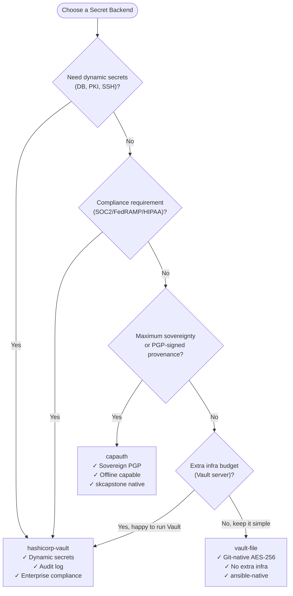
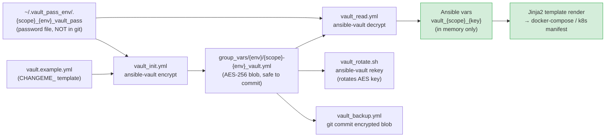
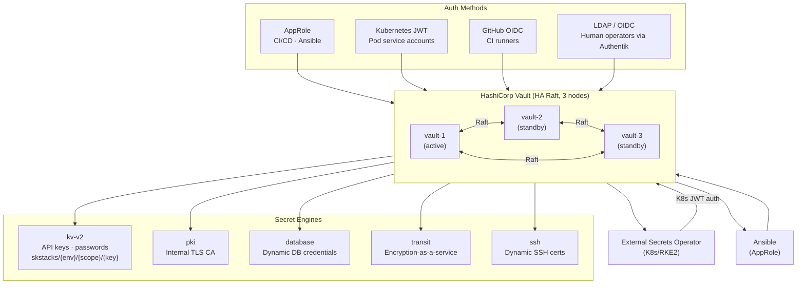
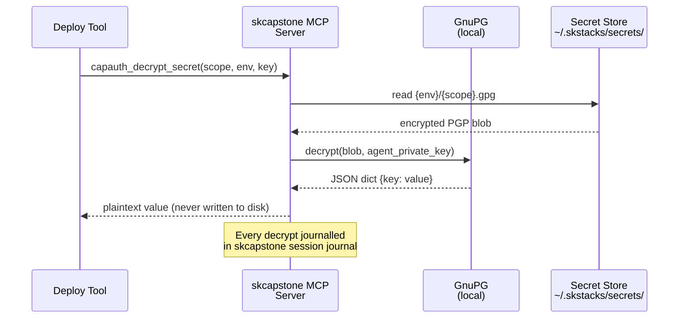
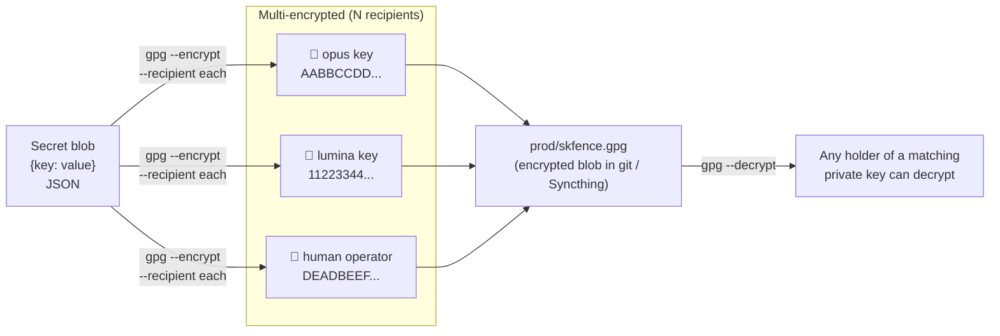
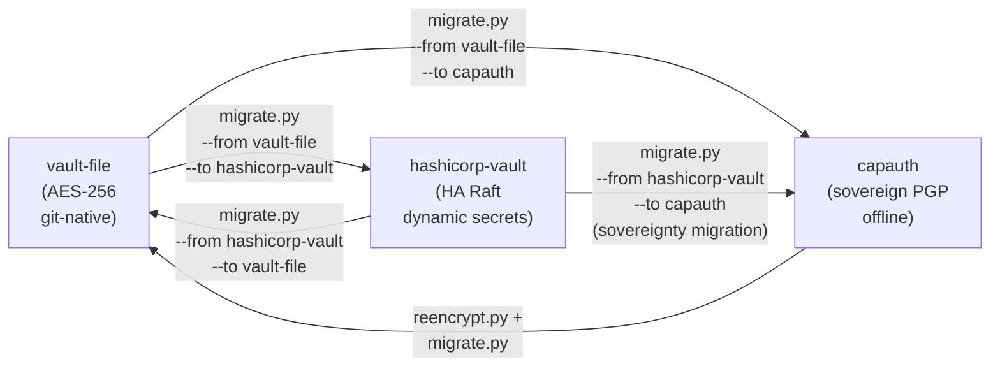

# SKStacks v2 — Security Backends

SKStacks v2 supports three pluggable secret backends. All three implement the
same `SKSecretBackend` interface, so you can swap backends without touching
service templates.

---

## Comparison

| | vault-file | hashicorp-vault | capauth |
|---|---|---|---|
| **Extra infra required** | None | Vault server | skcapstone agent |
| **Encryption** | AES-256-GCM (ansible-vault) | AES-256-GCM + Transit engine | PGP (GnuPG, RSA-4096 or Ed25519) |
| **Dynamic secrets** | No | Yes (DB, PKI, SSH) | No |
| **Audit log** | No | Yes (full CRUD log) | Yes (via skcapstone) |
| **Key rotation** | Manual | Automated via lease renewal | Manual (PGP key rotation) |
| **Offline capable** | Yes | No (needs Vault server) | Yes (local PGP keys) |
| **Multi-node sync** | Via git + ansible | Via Vault HA (Raft) | Via SKComm Syncthing |
| **K8s/ESO integration** | Via ansible-vault ESO provider | Native Vault ESO provider | Custom ESO provider plugin |
| **CI/CD secret injection** | Via Forgejo/GitHub secrets | Via Vault agent / ESO | Via skcapstone MCP |
| **Air-gap support** | Full | Partial (no auto-renew) | Full |
| **Compliance (SOC2/FedRAMP)** | Partial | Full | Partial |
| **Sovereign / self-hosted** | Full | Full | **Maximum** |
| **Complexity** | Low | High | Medium |



---

## Backend 1 — vault-file (Ansible Vault)

### When to use

- You already use Ansible for deployment
- You want git-native encrypted secrets
- No extra infrastructure budget
- Small-to-medium team

### How it works

Each service scope gets an encrypted YAML file:

```
secrets/vault-file/vaults/{env}/{scope}-{env}_vault.yml   (AES-256 encrypted)
~/.vault_pass_env/.{scope}_{env}_vault_pass               (password file, NOT in git)
```

Ansible reads secrets at deploy time using `--vault-password-file`.
The rendered docker-compose / K8s manifests are ephemeral — never stored.

### Secret lifecycle

```
1. Generate:   vault-file/ansible/vault_init.yml    → creates encrypted vault
2. Edit:       ansible-vault edit {vault}.yml
3. Read:       vault-file/ansible/vault_read.yml    → resolves to template vars
4. Rotate:     ansible-vault rekey {vault}.yml      → rotates AES key
5. Backup:     vault-file/ansible/vault_backup.yml  → git-committed encrypted backup
```



### Password storage recommendations

```bash
# Option A — OS keychain (recommended for workstations)
secret-tool store --label='skstacks-prod' service skstacks env prod
# → retrieve: secret-tool lookup service skstacks env prod

# Option B — pass (GPG-backed password manager)
pass insert skstacks/prod
pass show skstacks/prod > ~/.vault_pass_env/.prod_vault_pass

# Option C — HashiCorp Vault (bootstrap: store vault-file password IN Vault)
vault kv put secret/skstacks/meta prod_vault_pass=$(cat ~/.vault_pass_env/.prod_vault_pass)
```

### Directory layout

```
secrets/vault-file/
├── README.md
├── ansible/
│   ├── vault_init.yml          ← create a new encrypted vault
│   ├── vault_read.yml          ← resolve secrets to Ansible vars
│   ├── vault_backup.yml        ← backup all vaults to git
│   └── vault_export.yml        ← export to portable secrets.json (for migration)
├── examples/
│   └── vault.example.yml       ← sanitized template with CHANGEME_ placeholders
└── scripts/
    ├── vault_init.sh
    └── vault_rotate.sh
```

---

## Backend 2 — hashicorp-vault

### When to use

- Enterprise / compliance requirement (SOC2, FedRAMP, HIPAA)
- You need dynamic database / PKI / SSH secrets
- Multi-team, multi-service, fine-grained ACL policies
- Full audit trail of every secret read/write

### How it works

HashiCorp Vault runs as a service (standalone or HA Raft cluster) and exposes
a REST API. SKStacks integrates via:

1. **Ansible**: `community.hashi_vault.hashi_vault` lookup plugin
2. **K8s/RKE2**: External Secrets Operator `VaultProvider`
3. **Runtime sidecar**: Vault Agent injector (K8s annotation-based)



### Auth methods used

| Context | Auth method |
|---------|-------------|
| Ansible / operator | AppRole (`role_id` + `secret_id`) |
| K8s / RKE2 pods | Kubernetes auth (service account JWT) |
| CI/CD runners | AppRole or JWT (OIDC) |
| Human operators | LDAP / OIDC (via Authentik SSO) |

### Secret engines

| Engine | Used for |
|--------|---------|
| `kv-v2` | Static secrets (API keys, passwords) |
| `pki` | TLS certificate authority (replaces ACME for internal services) |
| `database` | Dynamic PostgreSQL / MySQL credentials |
| `transit` | Encryption-as-a-service (encrypt data without exposing keys) |
| `ssh` | Dynamic SSH certificate signing |

### KV path convention

```
kv/data/skstacks/{env}/{scope}/{key}

Examples:
  kv/data/skstacks/prod/skfence/cloudflare_dns_token
  kv/data/skstacks/prod/sksec/bouncer_api_key
  kv/data/skstacks/prod/skgit/db_password
  kv/data/skstacks/staging/skfence/cloudflare_dns_token
```

### Deployment

```bash
# Standalone (dev/staging)
cd secrets/hashicorp-vault
docker compose up -d vault

# Production HA (RKE2)
helm install vault hashicorp/vault \
  -n vault --create-namespace \
  -f helm/vault-values.yaml
```

### Policy model

```hcl
# secrets/hashicorp-vault/policies/skfence-policy.hcl
path "kv/data/skstacks/+/skfence/*" {
  capabilities = ["read"]
}
path "kv/metadata/skstacks/+/skfence/*" {
  capabilities = ["list"]
}
```

Each service scope gets its own policy. The CI/CD runner role can only read
the scopes it needs to deploy.

---

## Backend 3 — capauth (Sovereign PGP)

### When to use

- Maximum sovereignty — no dependency on external secret server
- Offline / air-gap deployments
- Integration with skcapstone agent identity
- PGP-signed secret provenance required
- Full self-custody of encryption keys

### How it works

Secrets are **PGP-encrypted blobs** stored in a flat-file store:

```
~/.skstacks/secrets/{env}/{scope}.gpg
```

Each blob is a JSON dict of `{key: value}` pairs, symmetrically encrypted
with the agent's PGP public key (RSA-4096 or Ed25519+Curve25519). Only the
agent possessing the matching private key can decrypt.

The **skcapstone MCP server** provides the decryption oracle:

```python
# SKCapstone MCP tool call (happens at deploy time):
result = mcp.call("capauth_decrypt_secret", {
    "scope": "skfence",
    "env":   "prod",
    "key":   "cloudflare_dns_token"
})
# → returns plaintext value, never touches disk
```



### Key management

```
Identity key:     ~/.gnupg/private-keys-v1.d/{fingerprint}.key
                  Also backed up via skcapstone soul blueprint
Agent config:     ~/.skstacks/capauth.yaml
Secret store:     ~/.skstacks/secrets/
Sync:             SKComm Syncthing mesh (encrypted blobs only)
```

### Multi-agent scenarios

For teams with multiple agents or operators:

1. Each operator has their own PGP keypair (managed by skcapstone or manual).
2. Secrets are **multi-encrypted** — encrypted to N public keys.
3. Any holder of a listed private key can decrypt.
4. Key revocation: re-encrypt all blobs to the remaining valid keys.

```yaml
# capauth.yaml — who can decrypt each env
prod:
  recipients:
    - fingerprint: "AABBCCDD..."   # opus agent
    - fingerprint: "11223344..."   # lumina agent
    - fingerprint: "DEADBEEF..."   # human operator
staging:
  recipients:
    - fingerprint: "AABBCCDD..."   # opus agent
```



### skcapstone integration

When `SKSTACKS_SECRET_BACKEND=capauth`, the deploy tooling calls the
skcapstone MCP server (via `mcp__skcapstone__*` tools) to:

1. **Store** secrets: `memory_store` with `tags=["secret", scope, env]` +
   PGP-encrypt to file.
2. **Retrieve** secrets: locate by tag, PGP-decrypt via agent private key.
3. **Audit**: every decrypt is journalled in the skcapstone session journal.
4. **Rotate**: re-encrypt with new key, re-sign, store new blob.

### ESO integration (K8s/RKE2)

A lightweight ESO provider sidecar (`capauth-eso-provider`) runs on the RKE2
cluster and communicates with the node-local skcapstone agent via Unix socket.

```yaml
# ExternalSecret using CapAuth provider
apiVersion: external-secrets.io/v1beta1
kind: ExternalSecret
metadata:
  name: skfence-secrets
spec:
  secretStoreRef:
    name: capauth-store
    kind: ClusterSecretStore
  target:
    name: skfence-secrets
  data:
    - secretKey: CLOUDFLARE_DNS_TOKEN
      remoteRef:
        key: "prod/skfence/cloudflare_dns_token"
```

---

## Migrating Between Backends

```bash
# vault-file → hashicorp-vault
python3 secrets/migrate.py \
  --from vault-file \
  --to hashicorp-vault \
  --env prod \
  --vault-pass-file ~/.vault_pass_env/.prod_vault_pass \
  --vault-addr https://vault.your-domain.com:8200 \
  --vault-token $VAULT_TOKEN

# vault-file → capauth
python3 secrets/migrate.py \
  --from vault-file \
  --to capauth \
  --env prod \
  --vault-pass-file ~/.vault_pass_env/.prod_vault_pass \
  --pgp-fingerprint AABBCCDD...

# hashicorp-vault → capauth (full sovereignty migration)
python3 secrets/migrate.py \
  --from hashicorp-vault \
  --to capauth \
  --env prod \
  --vault-addr https://vault.your-domain.com:8200 \
  --vault-token $VAULT_TOKEN \
  --pgp-fingerprint AABBCCDD...
```



---

## Secret Rotation Schedule (all backends)

| Secret type | Recommended rotation | Automated? |
|-------------|----------------------|------------|
| Database passwords | 90 days | vault: yes (dynamic), others: manual |
| API keys (Cloudflare, etc.) | 180 days | No |
| TLS certificates | 60–90 days | Yes (ACME / Vault PKI) |
| Vault AppRole secret_id | 30 days | Yes (via CI/CD pipeline) |
| PGP keys (CapAuth) | 1 year | No (manual rekey) |
| SSH keys | 90 days | vault: yes (SSH engine), others: manual |
| JWT secrets (n8n, etc.) | 180 days | No |
| Backup encryption keys | 1 year | No |

---

## Emergency Procedures

### vault-file: Lost password file

```bash
# If you have a backup password:
ansible-vault rekey --new-vault-password-file ~/.vault_pass_env/.new_pass vault.yml

# If no backup: secret is unrecoverable — must regenerate from source
```

### hashicorp-vault: Vault sealed / unreachable

```bash
# Check seal status
vault status

# Unseal (Shamir threshold scheme)
vault operator unseal <key-1>
vault operator unseal <key-2>
vault operator unseal <key-3>

# If lost unseal keys: vault data is unrecoverable
# → restore from encrypted snapshot backup
vault operator raft snapshot restore backup.snap
```

### capauth: Lost PGP private key

```bash
# If skcapstone soul blueprint backup exists:
skcapstone ritual  # rehydrates agent with backed-up key material

# If no backup: secrets are unrecoverable for that key
# → other recipients (if multi-encrypted) can re-encrypt to new key
gpg --export-secret-keys NEWKEY > new.key
python3 secrets/capauth/reencrypt.py --old-fingerprint OLD --new-fingerprint NEW
```
