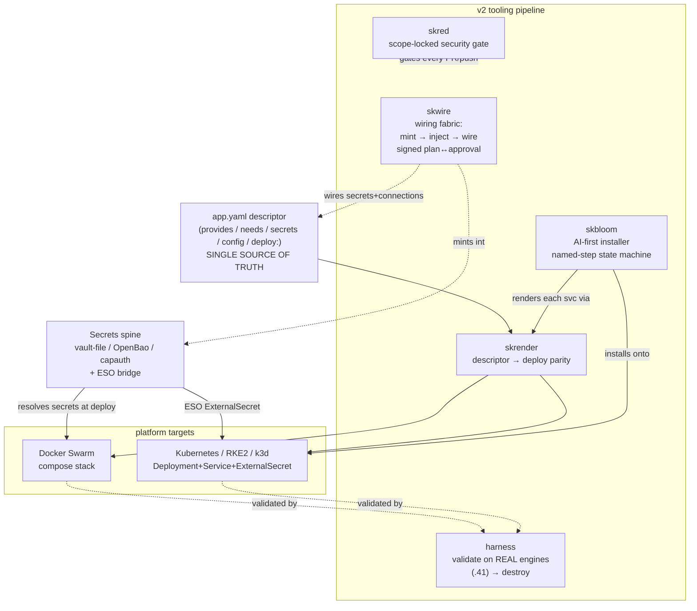
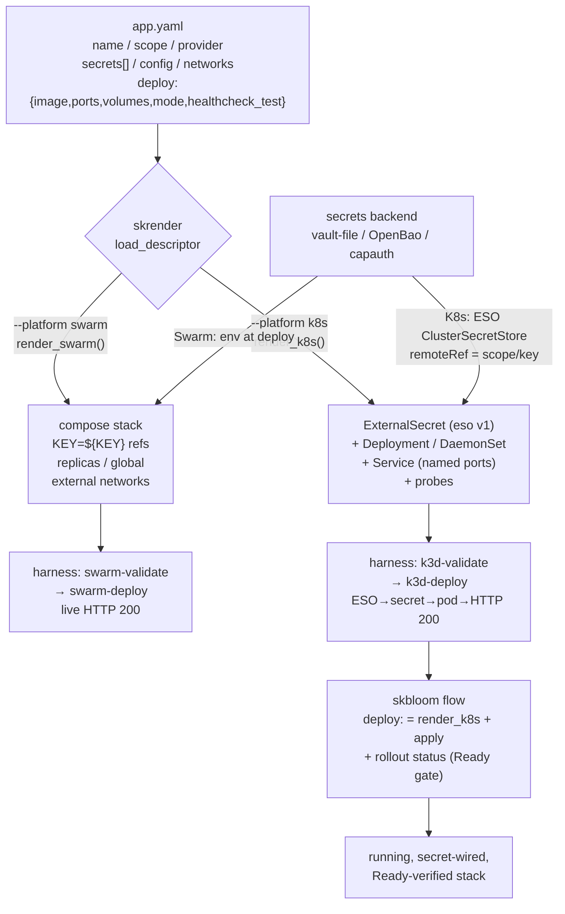
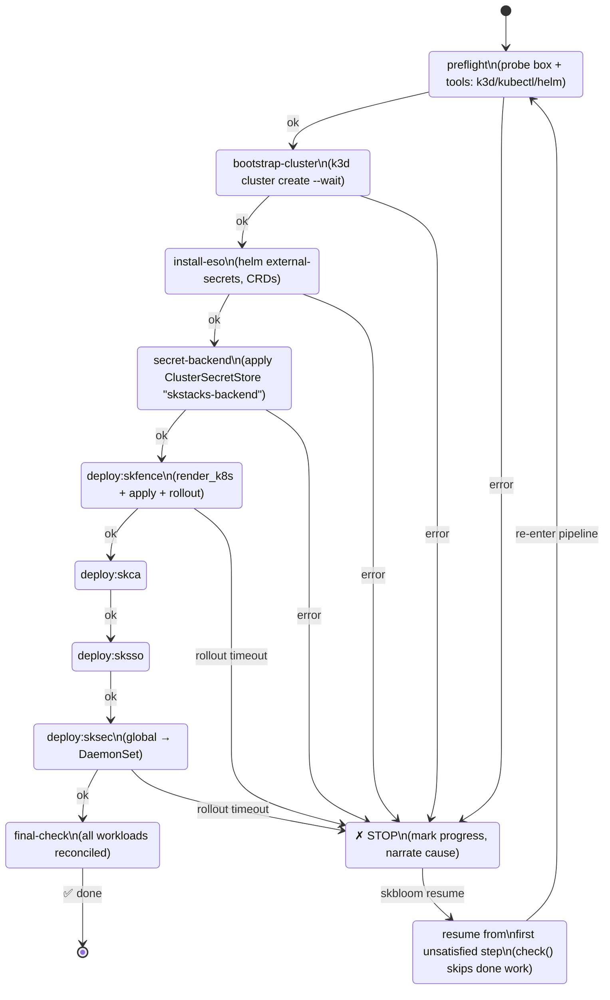

> Part of the SKStacks v2 stack. Companion to [STACK-MAP.md](STACK-MAP.md)
> (the architecture map), [APP-DESCRIPTOR.md](APP-DESCRIPTOR.md) (the `app.yaml`
> schema), and [skbloom-design-proposal.md](skbloom-design-proposal.md) (the
> AI-installer design we are building toward). Per-service docs live under
> [services/](services/).

# SKStacks v2 — Architecture Deep-Dive

This document goes one level below [ARCHITECTURE.md](../ARCHITECTURE.md): it
explains how the **new tooling pipeline** (`skwire` · `skrender` · `harness` ·
`skbloom` · `skred`) fits together to turn a single descriptor into a running,
secret-wired, security-gated, sovereign stack — on Swarm *or* Kubernetes,
validated against real engines.

---

## 1. What SKStacks v2 is

SKStacks v2 is a **sovereign, security-backend-agnostic infrastructure
framework**. It is descriptor-driven and built on a strict **ports / adapters**
model:

- Every `sk*` directory is a **port** — a stable capability interface (edge,
  identity, secrets, data, …).
- The `provider:` field in each `app.yaml` names the recommended **adapter** —
  the underlying technology (Traefik, Authentik, OpenBao, …). Swap the adapter
  without changing anything that depends on the port.
- `secrets/interface.py` (`SKSecretBackend`, an `ABC`) is the canonical
  reference implementation of the pattern: one port, three swappable adapters
  (`vault-file`, `hashicorp-vault`/OpenBao, `capauth`).

It is the successor to SKStacks v1 (Ansible-vault-only, Swarm-only). v2 deploys
the *same* descriptors to **Docker Swarm, Kubernetes, RKE2, and k3d**, with
secrets resolved at deploy time from a pluggable backend — **secrets never live
in Git** (descriptors carry key references and `CHANGEME_*` placeholders only).

**Position relative to skos:** skos is the sovereign agent OS; **v2 is the
deployment engine skos consumes** — it provides the capability ports, adapters,
and platform manifests, and skos calls into it to provision, deploy, and manage
each capability.

---

## 2. The new tooling pipeline (the heart of v2)

Five small, mostly pure-stdlib Python packages turn a descriptor into a running
stack. Each does one job; together they form the pipeline.

| Package | One-line role | Surface |
|---------|---------------|---------|
| **skwire** | universal bootstrapper / wiring fabric — mint-then-inject secrets, signed plan↔approval | CLI + chat web UI + embeddable engine |
| **skrender** | descriptor → deploy: one `app.yaml` `deploy:` block → BOTH a Swarm compose stack AND K8s manifests | `skrender <svc> --platform {swarm,k8s}` |
| **harness** | proves descriptor → deploy → **WORKS** → destroy on REAL engines (.41) | shell scenarios + PASS/FAIL matrix |
| **skbloom** | AI-first installer: resumable named-step state machine + LLM concierge + web app-store | `skbloom {plan,up,resume,status,reset,serve}` |
| **skred** | scope-locked self-hardening security loop (scan → gate → LLM-fix) | `skred {scan,report,gate}` + nightly CI |

### 2.0 System context



### 2.1 skwire — universal bootstrapper / wiring fabric

*"Terraform plans infrastructure; skwire wires it — secrets, connections, and
confirmations — for humans and agents alike."* Pure-stdlib core, zero deps,
**embeddable** (`import skwire`). Released as **`skwire-v0.3.0`** native binaries
(Linux/macOS/Windows) plus a universal single-file **`skwire.pyz`** (~150K,
Python 3.10+) and `pip install skwire`.

**Three roles, one primitive:**

1. **Wiring engine — mint-then-inject (the moat).** Generate every API
   key/secret *first*, inject pre-boot, then push cross-service config via each
   app's API. No more "boot → scrape a random key → paste it everywhere." Because
   skwire owns the wire graph, **rotating one key re-wires it everywhere in one
   call** (`rotate(plan, store, injector, keys=None)`).
2. **Bootloader / bootstrapper** — a stack initramfs: `seed → resolve → mint →
   bring-up → wire → handoff`, deterministic and resumable. Drop your code in
   (declare `provides` / `needs`) and skwire handles the rest.
3. **Confidence protocol** — a typed `Plan` + stable `plan_hash` that **both**
   parties trust: human↔AI (you approve the hash; the AI can't deviate) and
   service↔service (each wire derives from the signed plan). `approve(plan,
   approver)` issues an `ApprovalToken` bound to `plan.plan_hash`;
   `verify_approval` refuses if the plan changed.

**Extension points** (`skwire.protocols`, all `runtime_checkable` Protocols — the
core depends only on these): `SecretStore` (mint/get/put) · `Injector`
(env/file/api) · `Signer` (capauth/PGP in prod) · `Probe` (env facts).
Concrete impls ship for each: `RandomSecretStore`, `EnvFileInjector` /
`JsonConfigInjector` / `ApiPostInjector`, etc.

**The concierge arc:** `preflight` (consent-gated env scan → `suggest()` +
"deploy here or elsewhere?") → Socratic intent → `resolver` (descriptors → graph
→ `Plan` + `plan_hash`; rejects cycles + missing providers) → `explain`
(plain-English narration → "want me to just do it?") → `approval` (the "heck
yeah", hash-bound) → `executor` (mint → inject → wire, masked report) →
`rotation` (reads `rotation_days`, offers to schedule a cron).

**Surfaces:** `skwire` CLI (`scan` / `plan` / `up` / `rotate` / `catalog` /
`add` / `serve`); a polished, **white-labelable** chat window (`skwire serve`,
stdlib HTTP server + single HTML file, themed by the vanity/branding layer);
**packs** (`skwire.packs` entry-point — any project registers its descriptors,
injectors, probes, and questions); and a **catalog** (first-party built-ins +
auto-pulled community `smilinTux/skwire-catalog` JSON + pip-installed packs +
`SKWIRE_CATALOG_URL`). A *node* is anything wireable — `sk*` services, the *arr
media stack, even the agent toolchain (Claude Code / Codex with a model endpoint
+ key as a minted secret).

### 2.2 skrender — descriptor → deploy parity

One `app.yaml` `deploy:` block renders to **BOTH** a Swarm compose stack
(`render_swarm`) **AND** K8s manifests (`render_k8s`) — from a single source of
truth, so the two never drift.

**Wiring rules (consistent across platforms):**

| Descriptor field | Swarm output | K8s output |
|------------------|--------------|------------|
| `secrets:` | `KEY=${KEY}` env interpolation refs (never inline) | an **ESO `ExternalSecret`** (`external-secrets.io/v1`) → synced `Secret`, consumed via `envFrom: secretRef` |
| `ha: true` + `min_replicas: N` | N replicas, `placement.max_replicas_per_node: 1` | `replicas: N` Deployment |
| `deploy.mode: global` | Swarm **global** service (per-node agent) | a **DaemonSet** (e.g. CrowdSec/`sksec`) |
| `config:` | plain `environment` | `env:` name/value pairs |
| `networks:` | external overlays | — |
| `ports:` | compose `ports` | a `Service` with **named** ports (`p<port>`); **portless workload → no Service** |
| `healthcheck_test:` | container healthcheck (interval/timeout/retries) | `livenessProbe` + `readinessProbe` (`exec`) |

Two extra guarantees baked into the code: a **vanity name** override (`name=`)
changes the user-facing service/URL/object names while the **secret scope stays
the real service**, so secrets still resolve; and secret env names are
**UPPERCASED consistently** so the same `${CLOUDFLARE_DNS_TOKEN}` var appears on
both platforms. The ESO `remoteRef.key` is `<scope>/<key>`.

A **parity test** renders every descriptor that declares a `deploy:` block to
both platforms, so drift fails CI. Pilot slice: `cloud/skfence` (Traefik, HA),
`core/sksec` (CrowdSec, `global`), `core/sksso` (Authentik, HA).

### 2.3 harness — proves it actually works on REAL engines

Structural unit tests prove a manifest is *shaped* right; the harness proves it
**runs**. Each scenario is self-contained and cleans up after itself; built to
run on **`.41`** (k3d, Docker Swarm, libvirt/QEMU all present).

| Scenario | What it proves |
|----------|----------------|
| `k3d-validate.sh` | K8s manifests pass a **live API server** (`kubectl apply --dry-run=server`, ESO CRDs installed) |
| `swarm-validate.sh` | compose passes the **real Docker engine** (`docker compose config`) |
| `k3d-deploy.sh` | full K8s loop: k3d → **ESO operator** → fake secret backend → render+deploy → ExternalSecret syncs → pod Ready → **secret in pod + live HTTP 200** → destroy |
| `swarm-deploy.sh` | full Swarm loop: render → deploy (unique name, test port) → replica runs → **secret env + live HTTP 200** → remove |
| `vm-deploy.sh` | full loop on a **fresh QEMU/KVM VM**: cloud-init → k3s → deploy → live HTTP 200 → destroy |
| `run-all.sh` | runs the scenarios and prints a **PASS/FAIL matrix** |

The fixture **`fixtures/skwhoami`** (`traefik/whoami`) is a *real* service that
actually becomes Ready and answers HTTP — so "verify working" means a live
request, not "the object was created." Running these against real engines has
already caught bugs structural tests missed (now fixed): K8s Services need a
`name` per port; a portless workload must emit **no** Service; ESO graduated to
`external-secrets.io/v1`; cross-platform env-name consistency.

### 2.4 skbloom — AI-first installer

`skbloom up` stands up a complete, wired, sovereign stack from one command (or a
web app-store UI) — not a bare cluster. The architecture's central safety
property: **the LLM only ever produces the *what*** (which validated services);
deterministic Python owns the *how* (render + apply).

**The spine — a resumable named-step state machine** (`steps.py`). Each `Step`
has a `name`, an idempotent `run`, and an optional `check()` (already satisfied →
skip). `StateStore` persists completed step names to **`~/.skbloom/steps.json`**,
so an interrupted/failed run **resumes exactly where it stopped**. `run_steps`
stops on the first failure (resumable on next call); `iter_steps` is the
generator variant that yields per-event dicts for live UIs. This is Kubefirst's
`provisionWatcher` pattern, but the steps are deterministic Python the engine
owns.

**The sovereign flow** (`flow.py`):

```
preflight → bootstrap-cluster (k3d) → install-eso → secret-backend
  → deploy:<svc> … → final-check
```

Each `deploy:<svc>` renders the service's `app.yaml` with **skrender**
(`render_k8s`, vanity name supported), applies it, and waits on
`kubectl rollout status` — so a step isn't "done" until the workload is actually
Ready. skbloom thus *inherits descriptor→deploy parity* (the harness already
proves these manifests run). Default sovereign set: `cloud/skfence`, `core/skca`,
`core/sksso`, `core/sksec`.

**LLM concierge** (`concierge.py`) — natural-language intent → a **validated**
`Profile`. The deterministic matcher is the floor: a `Profile` is *only ever*
built from services that exist on disk (those with a `deploy:` block), so the
**model can never invent a service**. A curated **alias map** makes matching
robust ("single sign-on" / "login" / "oidc" → `sksso`); a relative-floor scorer
drops incidental single-word overlaps; "everything" / "the works" selects the
whole set; and a **vanity name** ("call it login") is applied when exactly one
service matched. When a model client is present (reusing skwire's model ladder
via `resolve_client`) it phrases a friendly reply — but a guard strips any reply
that names a service outside the profile.

**CLI** (`cli.py`): `plan` / `up` / `resume` / `status` / `reset` / `serve`,
plus a positional natural-language intent and `--services` / `--seed`. **Web
app-store UI** (`web/server.py` + `index.html`): stdlib HTTP server exposing
`/api/services`, `/api/branding`, `/api/propose`, and `/api/up` — the last
streams install progress as **Server-Sent Events** (`text/event-stream`, driven
by `iter_steps`) so the browser shows a live step timeline. Proven end-to-end on
real K8s; the model-driven concierge + ArgoCD app-of-apps/PR-apply are the next
increments (design: [skbloom-design-proposal.md](skbloom-design-proposal.md)).

### 2.5 skred — scope-locked self-hardening security loop

*"Try to break our own stuff, on a schedule, and fix what we find — without ever
touching anything that isn't ours."* skred runs best-of-breed OSS scanners
through a **scope-locked** orchestrator, normalizes output into one comparable
shape, gates CI by severity, and closes the loop with LLM-suggested fixes.

- **The safety rail (non-negotiable):** every target — path, host, IP, or URL —
  is checked against a **`ScopeGuard`** (own domains / CIDRs / repo roots)
  **before** any scanner runs. Boundary-aware domain matching blocks
  `skworld.io.evil.com` and `notskworld.io`; an empty allowlist refuses
  everything — **fail closed**. The orchestrator scope-gates first, then runs only
  installed scanners.
- **Scanners** (adapters, each `available()`-gated so a missing tool is skipped):
  **gitleaks** (committed secrets — the watchdog we've been burned by), **trivy**
  (dep CVEs, IaC misconfig, container/fs secrets), **semgrep** (SAST). Adding
  nuclei / checkov / kube-bench is one `Scanner` adapter.
- **Normalized `Finding`s + severity gate:** every tool's severity word maps to
  one scale (`Severity` IntEnum: `INFO < LOW < MEDIUM < HIGH < CRITICAL`,
  fail-safe → INFO); findings are deduped and ranked worst-first.
  `skred gate . --fail-on high` exits non-zero on any HIGH+ finding.
- **LLM remediation** (`remediate.py`): each finding carries a built-in hint;
  when a local model is available (reusing skwire's ladder via `resolve_client`)
  skred asks for a sharper, actionable fix — fail-safe, any model error leaves
  the hint untouched.
- **Nightly CI:** `.github/workflows/skred-scan.yml` installs the scanners and
  runs `skred gate` on every PR/push **plus a nightly cron** (`17 7 * * *`),
  uploading the normalized report as an artifact (`SKWIRE_LLM_DISABLE=1` keeps CI
  deterministic).

---

## 3. The descriptor → deploy → install data-flow



The single arc: a descriptor is rendered (parity), validated/deployed on a real
engine (harness), then installed as an ordered, resumable flow (skbloom) with
secrets resolved by the spine on each platform.

---

## 4. The 4C service layers

All ports are organized into four macro-groups (`v2/<C>/<port>/`) that mirror the
secret control-plane taxonomy. There are **28 `app.yaml` descriptors**; **10
declare a `deploy:` block** today and so are renderable/deployable by
skrender/skbloom (the rest are capability stubs awaiting their deploy block).

| C (layer) | Owns | Ports |
|-----------|------|-------|
| **core/** | identity, defense, WAF, PKI, secrets | `capauth` `sksso` `sksec` `skwaf` `skca` `skvault` |
| **cloud/** | edge, routing, naming, deploy, infra, dweb | `skfence` `skmesh` `skdns` `skcicd` `skinfra` `skdweb` |
| **comms/** | chat, voice, transport, bus | `skcomms` `skchat` `skvoice` `skbus` |
| **compute/** | data, cache, object, files, models, automation, observability, backup | `skdata` `skcache` `skobject` `skfile(s)` `skblock` `skmodel` `skflow` `skmon` `skpulse` `skbackup` |

**The 10 deploy-ready services** (declare a `deploy:` block):

| Layer | Service | Adapter / note |
|-------|---------|----------------|
| cloud | `skfence` | Traefik v3 edge (HA) |
| comms | `skbus` | message bus / queue |
| compute | `skcache` | Redis/Valkey KV |
| compute | `skmodel` | LLM / inference |
| compute | `skobject` | S3 object store |
| core | `capauth` | PGP capability identity |
| core | `skca` | step-ca PKI |
| core | `sksec` | CrowdSec — `mode: global` → DaemonSet |
| core | `sksso` | Authentik SSO (HA) |
| core | `skvault` | OpenBao / vault-file secrets |

(The harness fixture `harness/fixtures/skwhoami` and the example `apps/skturn`
also carry deploy blocks but sit outside the 4C count; 4C = 27 descriptors, +1
`apps/skturn` = **28** total.) Each port declares its name, recommended adapter
(`provider:`), required secret **keys only** (no values), and target platforms.
See [APP-DESCRIPTOR.md](APP-DESCRIPTOR.md) for the full schema.

---

## 5. Secrets spine

Every backend implements the single `SKSecretBackend` ABC
(`secrets/interface.py`): `get` / `get_all` / `get_with_meta` / `set` /
`set_many` / `delete` / `list_keys` / `list_scopes` / `rotate` / `health_check`.
The deploy tooling only ever calls this interface; the concrete backend is chosen
at runtime by `secrets/factory.py` from `SKSTACKS_SECRET_BACKEND`.

| Backend | Tech | Best for |
|---------|------|----------|
| **vault-file** | AES-256, ansible-vault, git-native encrypted files | simple, no extra infra; the **factory default** + zero-effort v1 migration path |
| **hashicorp-vault** / **OpenBao** | HA Raft, dynamic secrets, audit log | dynamic secrets, audit trail, enterprise compliance (OpenBao is the ratified default server — MPL-2.0, avoids BSL) |
| **capauth** | PGP-encrypted blobs, skcapstone MCP | fully sovereign, offline-capable, PGP-signed identity |

**Secret scoping:** every service gets a path-prefixed scope; no service can read
another's secrets (`kv/data/skstacks/<env>/<scope>/*`, or `<env>/<scope>.gpg`,
etc.).

**ESO bridge (K8s/RKE2/k3d):** the **External Secrets Operator** turns the chosen
backend into native K8s Secrets. skrender emits an `ExternalSecret`
(`external-secrets.io/v1`) referencing a `ClusterSecretStore` named
`skstacks-backend` with `remoteRef.key = <scope>/<key>`; ESO authenticates
(AppRole / K8s JWT / PGP), reads in-memory, and writes the `Secret` the pod
consumes via `envFrom`. (skbloom registers a `fake` provider store for
demo/test; the capauth path uses a lightweight ESO provider plugin against the
local skcapstone MCP.)

**No-catch-22 bootstrap:** vault-file and capauth are *server-less* roots, so
they bootstrap OpenBao with a **PGP-encrypted init** (no plaintext on disk);
K8s-auth needs no pre-shared secret. The `lan` exposure baseline is always-on so
there is no networking chicken-and-egg either. skwire's **mint-then-inject**
generates every secret up front, removing the "boot then scrape a key" step
entirely. See [../SECRETS.md](../SECRETS.md) and `secrets/BOOTSTRAP.md`.

---

## 6. Platforms

The same descriptors render to four targets:

| Platform | Glue (`platform/<p>/`) | Notes |
|----------|------------------------|-------|
| **docker-swarm** | Ansible + Keepalived VRRP + Traefik v3 | HA Swarm; `docker stack deploy` |
| **kubernetes** | Kustomize overlays + ESO | generic K8s, `kubectl apply -k` |
| **rke2** | Ansible + Longhorn + ArgoCD | CIS-hardened, embedded etcd, FIPS-capable, air-gap-native |
| **k3d** | `scripts/create.sh` | k3s-in-Docker — local dev / CI / edge; skbloom's bootstrap cluster |

For K8s-family targets, **ArgoCD app-of-apps** is the GitOps apply mechanism
(`cicd/argocd/app-of-apps.yaml`); Ansible handles node-level config. See
[../DEPLOYMENT.md](../DEPLOYMENT.md) for per-platform step-by-step instructions.

---

## 7. CI (`.github/workflows/`)

| Workflow | Trigger | Does |
|----------|---------|------|
| **skwire-release.yml** | push to `v2/skwire/**`, PRs, **`skwire-v*` tags** | pytest → build universal `skwire.pyz` → build native binaries on each OS runner (Linux/macOS-arm64/Windows via PyInstaller) → smoke-test → on a `skwire-v*` tag, bundle artifacts + `install.sh`/`install.ps1` into a GitHub Release |
| **skred-scan.yml** | push/PR on `v2/**` + **nightly cron `17 7 * * *`** | install gitleaks/trivy/semgrep → `skred gate . --fail-on high` (scope-locked) → upload normalized report artifact |
| **v2-tests.yml** | push/PR on `v2/**` | fast unit tests for `skwire`, `skred`, `skrender` (descriptor→deploy parity), and `skbloom` (installer engine + concierge) |

(`v2-deploy.yml` also exists for the platform deploy path.) The three pipeline
workflows above are the CI spine: release skwire, harden via skred, and keep the
renderer/installer green.

---

## 8. The skbloom install state machine

The installer is an ordered list of named, idempotent steps; each persists a
completion flag to `~/.skbloom/steps.json`. A failed run **stops at the failing
step** and the next invocation **resumes from there** (`check()` short-circuits
work already satisfied — cluster exists, ESO installed, rollout Ready).



Each `deploy:<svc>` step is one rendered service; the `check()` for a deploy step
inspects pod status so the step is only "done" once the workload is `Running`
and Ready. The web UI surfaces this same timeline live over SSE; the CLI narrates
it with `▶ / ✓ / · / ✗` markers.

---

## 9. How the pieces compose (one paragraph)

A service is described **once** in `app.yaml` (a port + its adapter + secret key
references + a `deploy:` block). **skrender** turns that one block into a Swarm
compose stack *and* K8s manifests with identical app-env and an ESO
`ExternalSecret` for secrets. **skwire** mints every secret up front and injects
it pre-boot, brokering a `plan_hash`-bound approval so humans and agents trust the
same plan. The **harness** proves the rendered manifests actually deploy and
answer HTTP on real k3d/Swarm/VM engines (and catches drift). **skbloom** wraps it
all in a resumable named-step flow (`preflight → bootstrap → ESO → backend →
deploy:<svc>… → final-check`), with an LLM concierge that turns intent into a
*validated* profile (never an invented service) and a web app-store streaming
install over SSE. **skred** continuously tries to break the estate — scope-locked,
fail-closed — and gates every PR + a nightly run on HIGH+ findings. The **secrets
spine** (vault-file / OpenBao / capauth behind one ABC, bridged to K8s by ESO,
bootstrapped without a catch-22) feeds all of it. Swap any adapter; the ports
don't move.

---

### See also
- [STACK-MAP.md](STACK-MAP.md) — the full architecture map + how repos/sites connect
- [skbloom-design-proposal.md](skbloom-design-proposal.md) — the AI-installer design we build toward
- [APP-DESCRIPTOR.md](APP-DESCRIPTOR.md) — the `app.yaml` schema reference
- [../ARCHITECTURE.md](../ARCHITECTURE.md) · [../SECRETS.md](../SECRETS.md) · [../SECURITY-BACKENDS.md](../SECURITY-BACKENDS.md) · [../DEPLOYMENT.md](../DEPLOYMENT.md)
- per-service docs: [services/](services/)
