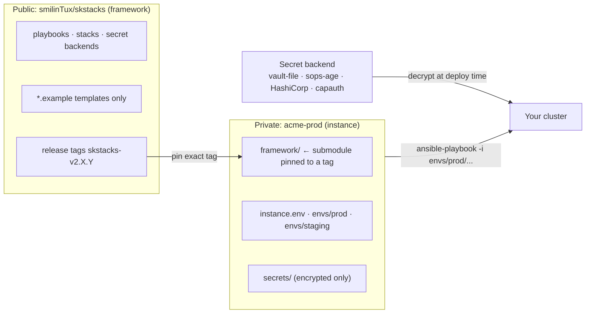
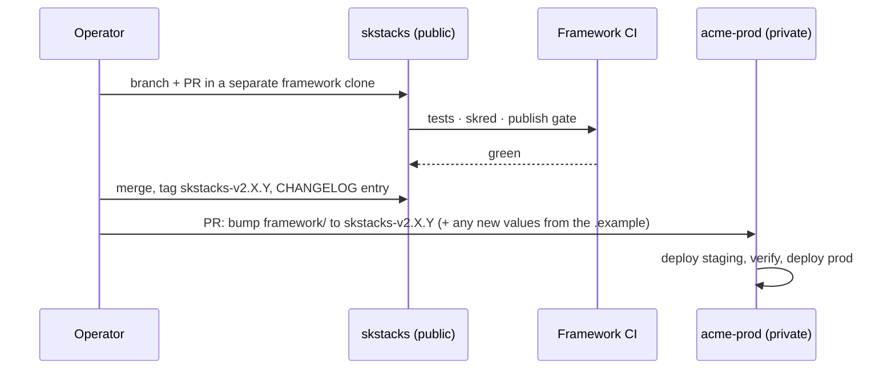

# SKStacks: the framework + instance model

**Status:** Adopted design, 2026-09-24. Implementation in progress. See
[What exists today](#what-exists-today-and-what-is-still-to-build) before
relying on any command in this guide.

## In one paragraph

SKStacks is split into two kinds of repository. The **framework**
(`smilinTux/skstacks`, public) contains the code that knows *how* to deploy:
playbooks, stack definitions, secret backends, platform glue, and `.example`
templates. An **instance** (one private repo per cluster) contains only *your*
cluster's facts: hosts, addresses, domains, per-environment values, and
encrypted secrets. The instance pins an exact framework release and deploys
with it. Framework code never lives in an instance, and your cluster's values
never live in the framework.



## Why it is built this way

Before this split, one repository played both roles. The framework asked you
to write real config into its own tree (`cp .env.example .env`,
`tofu output > platform/rke2/ansible/inventory.yml`), so framework code and
production values shared a directory and a git history. Making the framework
public then required scrubbing that history by hand, and every future push
was one wrong remote away from publishing a cluster.

The split makes the safe outcome structural instead of a matter of care:

- A private instance never has the public framework as a push target, so a
  habitual `git push` cannot publish your cluster.
- The public framework never contains real values, so it can be released as
  often as you like without a scrub.
- Each cluster gets its own repo, access list and secret backend, which is the
  blast-radius and per-team (or per-client) separation the per-environment
  vault passwords were always meant to give.

## The golden rule: framework or instance?

Before any change, ask two questions:

| Question | If yes |
|---|---|
| Would another operator running a different cluster want this change? | **Framework** |
| Does it contain a hostname, address, domain, account, secret, or client name? | **Instance** |

If both answers are yes, the change is split in two: the mechanism goes to the
framework (with an `.example`), and your values go to the instance. Example: a
new MetalLB address-pool option is framework; your actual pool range is
instance.

## The two repositories

| | Framework | Instance |
|---|---|---|
| Repo | `smilinTux/skstacks` | one per cluster, e.g. `yourorg/acme-prod` |
| Visibility | Public, AGPL-3.0 | Private |
| Contains | code, templates, docs, tests | `instance.env`, `envs/`, encrypted `secrets/` |
| Real values | never | always, and only here |
| Versioned by | release tags `skstacks-v2.X.Y` | its own git history |
| Consumes the other? | no | pins the framework as a submodule |
| CI | tests, skred, publish gate | deploy to its own environments |

## Instance repository layout

```
acme-prod/
├── framework/               # git submodule → smilinTux/skstacks @ skstacks-v2.9.0 (read-only)
├── instance.env             # cluster-wide, non-secret: name, domain, secret backend
├── envs/
│   ├── prod/
│   │   ├── inventory.yml    # your hosts and addresses
│   │   ├── platform.env     # platform settings (swarm / rke2 / kubernetes / k3d)
│   │   ├── overlays/        # value overrides: metallb-values.yaml, cert-manager-values.yaml, ...
│   │   └── tofu.tfvars      # only if you provision with OpenTofu
│   ├── staging/             # same shape; optional
│   └── dev/                 # same shape; optional
├── secrets/                 # ENCRYPTED ONLY (vault-file or sops-age). Never plaintext.
├── .gitignore               # blocks .env, *.bak, *.new, .gemini/, password files
└── README.md                # what this cluster is, who owns it, how to deploy it
```

`instance.env` example:

```bash
SKSTACKS_CLUSTER=acme-prod
SKSTACKS_DOMAIN=example.com
SKSTACKS_SECRET_BACKEND=vault-file          # or sops-age, hashicorp-vault, capauth
SKSTACKS_VAULT_DIR=./secrets/vaults         # encrypted files, committed
SKSTACKS_VAULT_PASS_DIR=~/.vault_pass_env   # password files, NEVER committed
```

Password files, age keys, Vault tokens and PGP private keys live **outside both
repositories**, on the operator's machine or in your secret manager. Only
ciphertext is committed, and only to the private instance.

## The contract between them

The framework promises to:

1. Take every piece of instance configuration as a path argument (`-i`,
   `-e @file`, `--env-file`) or an environment variable, never from paths
   inside its own tree.
2. Never write into its own tree during a deploy (no generated inventories or
   `.env` files beside the code).
3. Ship only `.example` files for anything an instance fills in, and keep those
   examples current with every change that adds a setting.
4. Treat any change to the variables, file names or layout above as a
   **breaking change** (a new major or minor version, called out in the
   CHANGELOG with a migration note).
5. Ship with fail-closed defaults: loopback-only scan scope, no real domains, no
   real addresses.

The instance promises to:

1. Pin an exact framework tag. Never track a branch in production.
2. Never edit files inside `framework/`. If the framework needs to change,
   change it upstream (see below).
3. Keep every real value in `instance.env`, `envs/` or `secrets/`, and keep
   secrets encrypted.

## Getting started: a new cluster

1. **Create an empty private repo** and lay it out as in
   [Instance repository layout](#instance-repository-layout).
2. **Pin the framework:**
   ```bash
   git submodule add https://github.com/smilinTux/skstacks.git framework
   git -C framework checkout skstacks-v2.9.0
   git -C framework remote set-url --push origin DISABLED   # read-only by design
   git add framework .gitmodules && git commit -m "pin framework skstacks-v2.9.0"
   ```
3. **Fill in `instance.env`** with your cluster name, domain and secret backend.
4. **Choose and initialize a secret backend.** See
   [SECRETS.md](../SECRETS.md). For `vault-file`, create encrypted vaults under
   `secrets/vaults/` and put the password files in `SKSTACKS_VAULT_PASS_DIR`.
5. **Create an environment** by copying the framework's examples into `envs/prod/`:
   inventory, platform settings and any value overlays you need.
6. **Deploy:**
   ```bash
   set -a; . ./instance.env; set +a      # secret-backend settings for this cluster
   ansible-playbook -i envs/prod/inventory.yml \
     framework/v2/platform/swarm/ansible/playbooks/deploy.yml
   ```
   Ansible picks up `envs/prod/group_vars/` beside the inventory by itself; no
   wrapper needed.
7. **Wire CI** so merges to the instance's main branch deploy staging first,
   then prod on approval.

Cloning an existing instance always needs the submodule:

```bash
git clone --recurse-submodules git@your-git:yourorg/acme-prod.git
# already cloned without it?
git submodule update --init
# push-disable is local config, so a fresh clone needs it again:
git -C framework remote set-url --push origin DISABLED
```

## Running each platform from an instance

Load the cluster-wide settings once per shell:

```bash
set -a; . ./instance.env; set +a
```

| Platform | Command (run from the instance root) |
|---|---|
| Docker Swarm | `ansible-playbook -i envs/prod/inventory.yml framework/v2/platform/swarm/ansible/playbooks/deploy.yml` |
| k3d (local) | `set -a; . envs/dev/platform.env; set +a; framework/v2/platform/k3d/scripts/create.sh` |
| RKE2 preflight | `framework/v2/platform/rke2/scripts/longhorn-preflight.sh -i envs/prod/inventory.yml` |

**OpenTofu:** never run `tofu` inside `framework/`. With the default local
backend it writes `terraform.tfstate` (which holds secrets) next to the code.
Keep a small root module in the instance instead:

```hcl
# envs/prod/tofu/main.tf
module "cluster" {
  source = "../../../framework/v2/infra/tofu/modules/proxmox-cluster"
  # your values here, or in envs/prod/tofu/terraform.tfvars
}

# re-export so `tofu output` works from the instance
output "ansible_inventory" {
  value = module.cluster.ansible_inventory
}
```

```bash
cd envs/prod/tofu && tofu init && tofu apply
tofu output -raw ansible_inventory > ../inventory.yml
```

## Day-to-day workflows

### 1. A change to your cluster only

A new host, an address, a domain, a rotated secret, a tuned value for this
cluster.

1. Branch in the **instance** repo, edit `envs/<env>/…`, `instance.env` or
   `secrets/`.
2. PR, review, merge.
3. Deploy staging (`-i envs/staging/inventory.yml`), verify, then prod.

The framework is not touched and nothing becomes public.

### 2. A change to how SKStacks works (upstream first)

A bug fix in a playbook, a new service, a new option.



1. Work in a **separate clone of the framework**, not in `framework/` inside an
   instance (that submodule is push-disabled on purpose).
2. Use example values only. Add or update the `.example` for any new setting.
3. PR to `smilinTux/skstacks`. CI runs the tests, skred and the publish gate.
4. Merge and tag a release (see [Versioning](#versioning-and-releases)).
5. In each instance that wants it: bump the submodule, add any new values the
   CHANGELOG calls for, deploy staging, then prod.

### 3. Upgrading an instance to a newer framework

```bash
git -C framework fetch --tags
git -C framework checkout skstacks-v2.10.0
git add framework
# read the CHANGELOG between your old and new tag; apply any migration notes to envs/
git commit -m "framework: skstacks-v2.9.0 -> skstacks-v2.10.0"
# deploy staging, verify, then prod (see Getting started, step 6)
```

Rolling back is the same move in reverse: check out the previous tag and
redeploy.

### 4. An urgent production fix

Upstream first still applies; it just moves faster. Fix it in the framework,
cut a patch release (`skstacks-v2.9.1`), bump the instance, deploy. If you
genuinely cannot wait for a release, the instance may pin the **commit** of
the merged fix, recorded with a note to return to a tag at the next release.
Never patch files inside `framework/` from the instance.

### 5. Several clusters or clients

One instance repo per cluster. A client cluster gets its own private repo, its
own access list and its own secret backend or password files, so one client's
credentials can never be read from another's repo. Every instance pins the
same public framework and upgrades on its own schedule.

## Versioning and releases

- Framework releases are git tags of the form `skstacks-vMAJOR.MINOR.PATCH`.
  The major number is the generation (`2` for v2), so within v2:
  - **Patch** (`skstacks-v2.9.0` → `skstacks-v2.9.1`): fixes only. No instance
    action needed.
  - **Minor** (`skstacks-v2.9.1` → `skstacks-v2.10.0`): new features or
    settings. Instances may need to add values; the CHANGELOG lists them.
  - A change to the [contract](#the-contract-between-them) ships as a minor
    release and is marked **BREAKING** in the CHANGELOG with a migration note.
    A new generation (v3) is the only major bump.
- The first public release is `skstacks-v2.9.0`.
- Every release has a CHANGELOG entry saying what an instance must do, if
  anything.
- Instances pin exact tags. `main` is for framework development, not for
  deploying.

## Guardrails

| Guardrail | Where | Stops |
|---|---|---|
| Publish gate (secrets, estate addresses, hostnames, client names, emails) | framework CI on every push and same-repo PR (`skred.denylist`, patterns from a CI secret) | real values reaching the public repo |
| skred security scan | framework CI | new secrets and vulnerable patterns |
| Push disabled on `framework/` | every instance clone | editing the framework from inside an instance |
| No framework push remote in instances | instance setup | a stray `git push` publishing a cluster |
| `.gitignore` for `.env`, `*.bak`, `*.new`, `.gemini/`, password files | both repos | backup copies and tool state leaking secrets |
| Encrypted-only `secrets/` + passwords outside the repo | instance | a leaked repo exposing plaintext |
| Fail-closed defaults in framework tools | framework | shipping anyone's estate as a default |

## What exists today and what is still to build

Be clear-eyed about this section: the model above is the target, and parts of
it are not built yet.

**Exists now**

- The tag naming convention. Tags `skstacks-v2.1.0` to `skstacks-v2.8.0` exist
  on the old pre-public history (archived); the public repo starts fresh at
  `skstacks-v2.9.0`.
- Secret backends that already take their location from the environment
  (`SKSTACKS_VAULT_DIR`, `SKSTACKS_VAULT_PASS_DIR`, `SKSTACKS_SOPS_DIR`).
- `.example` templates for overlays, inventories and tfvars.
- skred, with fail-closed default scope, running in framework CI.
- The estate denylist gate (`skred.denylist`) in framework CI on every push and
  same-repo PR, plus the publish gate on release exports.
- A CHANGELOG, starting at `skstacks-v2.9.0`.
- Platform scripts that already work from an instance, unchanged. Checked
  2026-09-24: the k3d scripts only source a `.env` *if one exists*, and a
  clean `framework/` checkout has none, so they use the variables you export;
  swarm and rke2 take the inventory with `-i`, and the framework's
  `ansible/group_vars/*.example` sit beside the example inventory, not beside
  the playbooks, so they are never loaded when you pass your own inventory.

**To build** (tracked as implementation work)

- v1 onto the model: role `defaults/` instead of playbook-side `group_vars`,
  and no estate values baked into templates (for example
  `| default('<a real domain>')`), service by service.

## FAQ

**Why a submodule, not a fork?**
A fork keeps your cluster's values in a tree whose upstream is public, so one
wrong push publishes them. A submodule pins an exact, reviewable version, and
the instance never needs push rights to the framework.

**Why not ship the framework as a package?**
It may become one (an Ansible collection or a Python package). A tagged
submodule gives the same pinning today with no packaging work, and the
contract above does not change if the delivery mechanism does.

**What about v1?**
v1 is the current production generation (Docker Swarm, ansible-vault) and the
base v2 is being built out of. It is moving onto this same model: its framework
code joins the public repo once real values are separated out, one service at a
time. v2 launches first because it is already close to clean.

**Where does framework development happen?**
On GitHub, in `smilinTux/skstacks`. Other copies (for example a self-hosted
Forgejo) are one-way pull mirrors: read from them, never push to them.

**I set a value in my instance but the old value still deploys (v1).**
Ansible loads `group_vars/` from beside the playbook as well as beside the
inventory, and for group-specific vars the playbook side wins. The framework
therefore keeps its defaults in role `defaults/` only. If you see this, a
framework default is in the wrong place: report it upstream.

**I found a bug while deploying my instance. Where do I fix it?**
In a separate clone of the framework, as a PR upstream. Then bump your
instance to the release that contains the fix.
