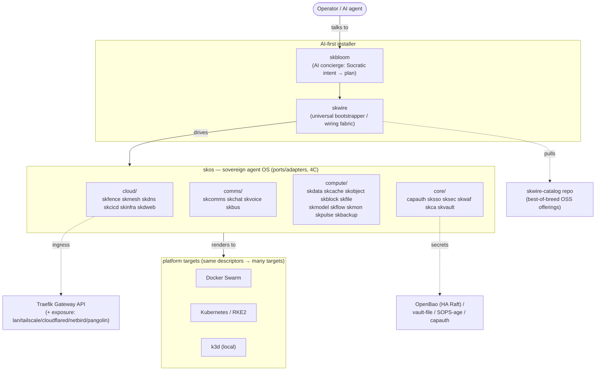
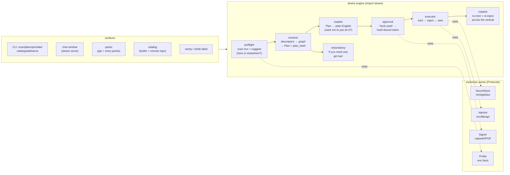
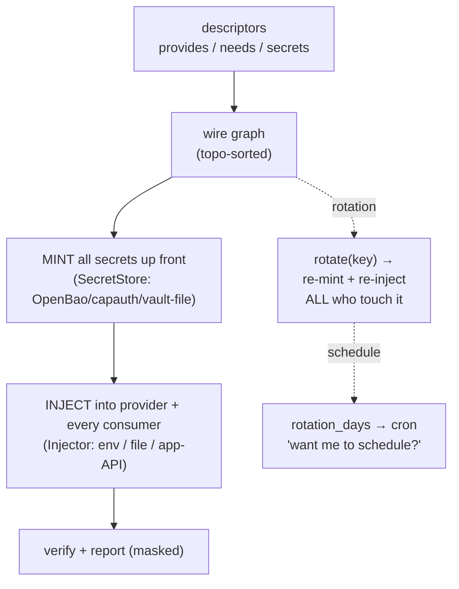
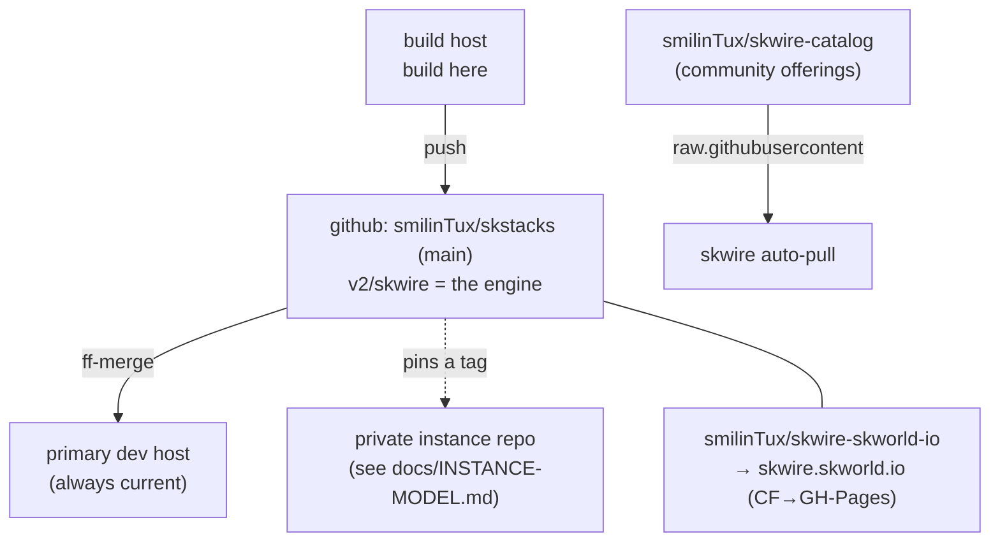

# SKStacks v2 — Stack Map & Design Decisions (2026-06-11)

A single map of everything: the validated best-of-breed stack, the AI-first
installer (**skwire** + skbloom), and how all the components connect. Companion to
`2026-06-11-skstacks-v2-stack-validation.md` (the best-of-breed audit) and
`skbloom-design-proposal.md` / `skhome-skmedia-design.md` (the AI-installer + ports).

---

## 1. The layers — where everything sits



**Key idea:** one set of `app.yaml` descriptors (each declares `provides` / `needs`
/ `secrets` / `config`) is the single source of truth. skos resolves them to a
platform; **skwire** wires them together (secrets + connections); skbloom puts an AI
concierge in front.

---

## 2. skwire — the universal bootstrapper

The engine under the one-click experience. Pure-stdlib, zero-dep, embeddable.



**The arc (what a user experiences):**

```mermaid
sequenceDiagram
    participant U as User
    participant C as Chat window (branded)
    participant E as skwire engine
    participant X as executor
    U->>C: opens skwire serve
    C->>E: scan env (with consent)
    E-->>C: suggestions + "here or elsewhere?"
    C->>E: browse catalog / pick offerings
    E-->>C: Plan ("set up X, wire Y") + redundancy advice
    C->>U: "want me to just do it?"
    U->>C: Heck yeah 🚀
    C->>X: approve(plan_hash) → execute
    X->>X: mint every secret → inject provider+consumers → wire
    X-->>C: done; "auto-rotate every 90d?"
```

---

## 3. OOTB auto-wiring — mint-then-inject (the moat)

The thing nobody else does: generate every secret **first**, inject pre-boot, push
cross-service config — so the stack wires itself with zero manual steps. And because
skwire owns the graph, **rotating one key re-wires it everywhere in one call.**



---

## 4. Catalog / marketplace — open at every edge

```mermaid
flowchart LR
    SKW["skwire\nload_catalog()"] --> B["built-in offerings\n(first-party)"]
    SKW -->|auto-pull| REPO["skwire-catalog repo\ncatalog.json (PRs)"]
    SKW --> PIP["pip-installed packs\n(skwire.packs entry-point)"]
    SKW --> OWN["your own catalog\n(SKWIRE_CATALOG_URL)"]
    REPO -.community PRs.-> REPO
    classDef oss fill:#16323a,stroke:#22d3ee;
    class B,REPO,PIP,OWN oss
```



All offerings are **best-of-breed OSS** (each ships its license + repo). The loop:
*install → use → AI helps you contribute upstream or fork your own.* Take the engine
and roll your own — no lock-in.

---

## 5. Where it all connects (repos, sync, site)



---

## 6. Design decisions (the load-bearing ones)

| Decision | Why |
|---|---|
| **OpenBao default secret server** (not HashiCorp Vault) | LF/MPL-2.0, wire-compatible, free Namespaces; avoids BSL. |
| **No-catch-22 secret bootstrap** | vault-file/capauth are server-less roots → bootstrap OpenBao with PGP-encrypted init (no plaintext); K8s-auth = no pre-shared secret. The factory default stays `vault-file`. |
| **Gateway API + Traefik** (not ingress-nginx) | ingress-nginx EOL Mar-2026; consolidate on the skfence edge engine — one ingress stack. |
| **Two exposure ladders** | mesh: Tailscale(ease)→Netbird(sovereign); tunnel: cloudflared(ease)→Pangolin(sovereign); `lan` always-on baseline kills the bootstrap catch-22. |
| **Loki→VictoriaLogs, Uptime-Kuma→Gatus, +Velero, +Tetragon/Kyverno** | license + footprint + closing real gaps (K8s backup, enforcement, admission). |
| **skwire = mint-then-inject + signed plan handshake** | the OOTB-wiring moat; the plan_hash is the trust anchor for human↔AI and service↔service. |
| **Catalog in its own repo** | adding an app is a PR to JSON — never touches the engine; easy governance. |
| **"if you need one, get two"** | redundancy advisor surfaces load-bearing services and offers an HA pair, in the install flow. |
| **Closed-loop security + authorized self-red-team** | nightly scanners → AI-triage → PR (never auto-merge) → deploy; skred attacks own scope-locked envs to harden. |

---

## 7. Status snapshot (2026-06-11)

- **Platform/secrets/storage/observability/exposure** — built across `v2/` (~190 tests).
- **skwire** — complete shippable product: engine + executor + rotation + catalog +
  redundancy + chat window + vanity + docs + installer + CLI (74 tests, zero-dep).
- **Live:** `skwire-catalog` repo (auto-pulled), `skwire.skworld.io` site.
- **Next:** OpenBao redundancy/HA verification + skwire "deploy a pair", real per-app
  Injectors, flesh skmedia/skhome packs, skos nomad-renderer fix, skred orchestrator.
