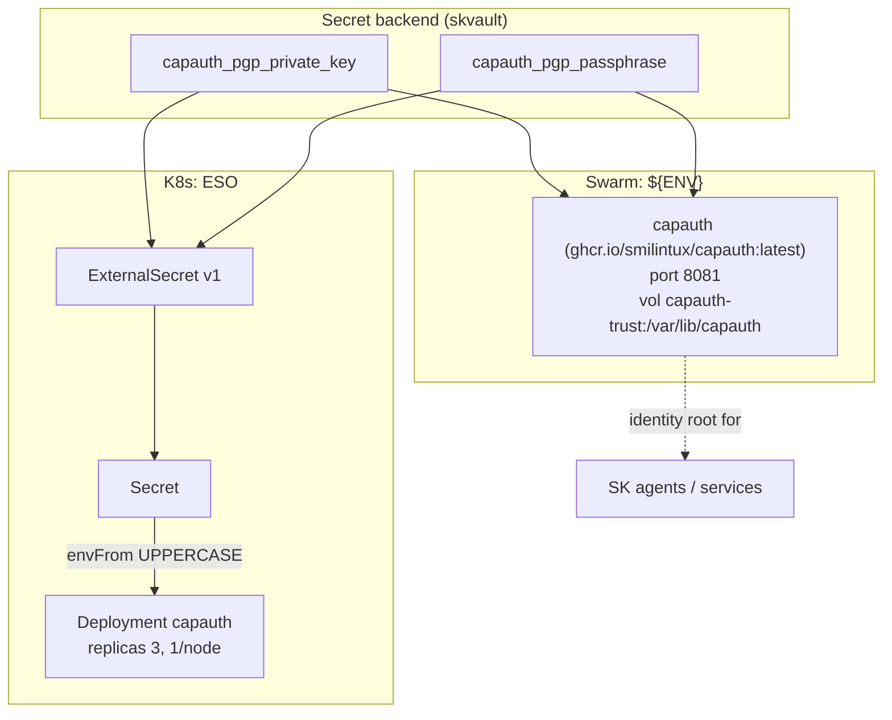

# capauth — Sovereign M2M auth — PGP-based identity and secret access without OAuth

✅ **deploy-ready** · layer: core · version CHANGEME_VERSION · scope `capauth`

## Capability / Provider
- **Capability:** Sovereign M2M auth — PGP-based identity and secret access without OAuth
- **Provider:** CapAuth (sovereign PGP-based; skcapstone MCP integration)
- **Alternates:** Zitadel (OIDC M2M for human+agent hybrid); SPIFFE/SPIRE (workload identity)
- **Platforms:** docker-swarm, bare-metal
- **HA:** yes — identity root, `min_replicas: 3` (redundant)

## Topology

## Secrets

| key | rotation_days | required | description |
|-----|---------------|----------|-------------|
| `capauth_pgp_private_key` | 730 | yes | CapAuth PGP private key (armored) for this agent/service — sensitive |
| `capauth_pgp_passphrase` | — | yes | Passphrase protecting the CapAuth PGP private key — sensitive |

## Config
`LOG_LEVEL=INFO` · `DOMAIN=${SKSTACKS_DOMAIN}` · `CLUSTER=${SKSTACKS_CLUSTER}`

## Deploy
- **Container/image:** `capauth` / `ghcr.io/smilintux/capauth:latest` (built from our registry)
- **Command:** none (image default)
- **Ports:** `8081:8081`
- **Volumes:** `capauth-trust:/var/lib/capauth`
- **HA/replicas:** `min_replicas: 3`
- **Healthcheck:** no `healthcheck_test` in deploy block; descriptor declares URL `https://CHANGEME_HOST.../healthz` (30s/5s/3)

Renders to **both** Swarm compose and K8s manifests via `skrender`. K8s materializes an ESO **ExternalSecret** (`external-secrets.io/v1`) synced into a **Secret** consumed via `envFrom` (UPPERCASE env names, consistent with Swarm's `${ENV}`).

## Dependencies
- **depends_on:** none
- **required_by:** none declared (identity root; also a `skvault` adapter option)
