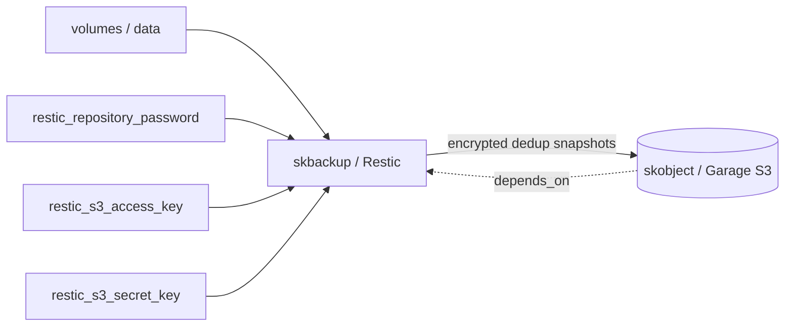

# skbackup — Backup — encrypted deduplicated snapshots to sovereign object storage

📋 **descriptor-only** · layer: compute · version CHANGEME_VERSION · scope `skbackup`

**Status:** 📋 descriptor-only — deploy block TODO. Needs a `deploy:` block (Restic runner/cron container, volumes) and a real healthcheck URL.

## Capability / Provider
- **Capability:** Backup — encrypted deduplicated snapshots to sovereign object storage
- **Provider:** Restic (→ Garage S3); Kopia (GUI alt) / Borg (fast local restore) as alternatives
- **Alternates:** Kopia (GUI); Borg (fast local restore)
- **Platforms:** docker-swarm, bare-metal
- Replaces Duplicati (corruption-bug history).

## Topology

## Secrets

| key | rotation_days | required | description |
|-----|---------------|----------|-------------|
| `restic_repository_password` | 365 | yes | Restic repository encryption password — sensitive |
| `restic_s3_access_key` | — | yes | S3 access key for Garage backend |
| `restic_s3_secret_key` | — | yes | S3 secret key for Garage backend — sensitive |

## Config
`LOG_LEVEL=INFO` · `DOMAIN=${SKSTACKS_DOMAIN}` · `CLUSTER=${SKSTACKS_CLUSTER}`

## Dependencies
- **depends_on:** `skobject`
- **required_by:** none declared
