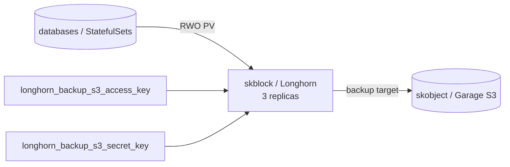

# skblock — Block storage — replicated persistent volumes (RWO)

📋 **descriptor-only** · layer: compute · version CHANGEME_VERSION · scope `skblock`

**Status:** 📋 descriptor-only — deploy block TODO. Longhorn is a K8s/CSI concern; needs CSI-driver manifests (not a single container) before deploy rendering. Healthcheck URL still `CHANGEME_HOST`.

## Capability / Provider
- **Capability:** Block storage — replicated persistent volumes (RWO)
- **Provider:** Longhorn (Apache-2.0, K8s-native synchronous replication + S3 backup)
- **Alternates:** OpenEBS Mayastor (NVMe/SPDK — higher IOPS, dedicated NVMe); Rook-Ceph RBD (at consolidation, ≥5-6 dedicated-disk nodes); Piraeus/LINSTOR DRBD (host-level; Swarm-capable replicated-block option)
- **Platforms:** kubernetes, rke2
- Part of the **skstorage** family (skblock + skfile + skobject). Block HA is a K8s/CSI concern; on Swarm (no CSI) use host-local volumes with app-level replication (Patroni) or host-level DRBD (LINSTOR). Snapshot/backup ships to `skobject`.

## Topology

## Secrets

| key | rotation_days | required | description |
|-----|---------------|----------|-------------|
| `longhorn_backup_s3_access_key` | — | yes | S3 access key for the Longhorn backup target (→ skobject) |
| `longhorn_backup_s3_secret_key` | — | yes | S3 secret key for the Longhorn backup target (→ skobject) — sensitive |

## Config
`REPLICA_COUNT=3` · `BACKUP_TARGET=s3://skstacks-longhorn@${SKSTACKS_DOMAIN}` (→ skobject Garage/SeaweedFS) · `DATA_ENGINE=v1` (v2 SPDK/NVMe-oF GA but young — opt in per hot volume)

## Dependencies
- **depends_on:** none declared (backup target resolves to `skobject`)
- **required_by:** none declared
