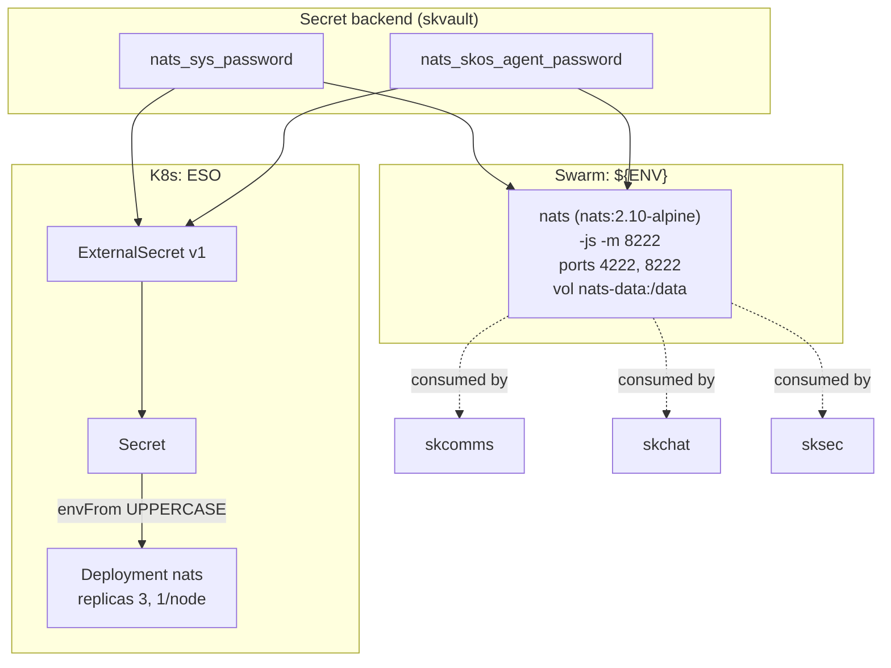

# skbus — Machine A2A event bus — durable pub/sub for agent-to-agent messaging

✅ **deploy-ready** · layer: comms · version CHANGEME_VERSION · scope `skbus`

## Capability / Provider
- **Capability:** Machine A2A event bus — durable pub/sub for agent-to-agent messaging
- **Provider:** NATS JetStream (10 MB binary, sub-millisecond latency, built-in persistence)
- **Alternates:** Redpanda (Kafka-compat at scale)
- **Platforms:** docker-swarm, kubernetes, bare-metal
- **HA:** yes — NATS JetStream 3-node cluster, `min_replicas: 3`
- Subjects: `skos.agent.*.events`

## Topology

## Secrets

| key | rotation_days | required | description |
|-----|---------------|----------|-------------|
| `nats_sys_password` | 90 | yes | NATS `$SYS` account password for operator/admin (sensitive) |
| `nats_skos_agent_password` | — | yes | NATS password for `skos.agent.*` subject namespace (sensitive) |

## Config
`LOG_LEVEL=INFO` · `DOMAIN=${SKSTACKS_DOMAIN}` · `CLUSTER=${SKSTACKS_CLUSTER}`

## Deploy
- **Container/image:** `nats` / `nats:2.10-alpine`
- **Command:** `-js -m 8222`
- **Ports:** `4222:4222`, `8222:8222`
- **Volumes:** `nats-data:/data`
- **HA/replicas:** `min_replicas: 3` (NATS JetStream cluster)
- **Healthcheck:** `["CMD","wget","-qO-","http://localhost:8222/healthz"]` (30s/5s/3)

Renders to **both** Swarm compose and K8s manifests via `skrender`. K8s materializes an ESO **ExternalSecret** (`external-secrets.io/v1`) synced into a **Secret** consumed via `envFrom` (UPPERCASE env names, consistent with Swarm's `${ENV}`).

## Dependencies
- **depends_on:** none
- **required_by:** consumed by `skcomms`, `skchat`, `sksec`, `skmon`, `skvoice` (those declare `depends_on: [skbus]`)
