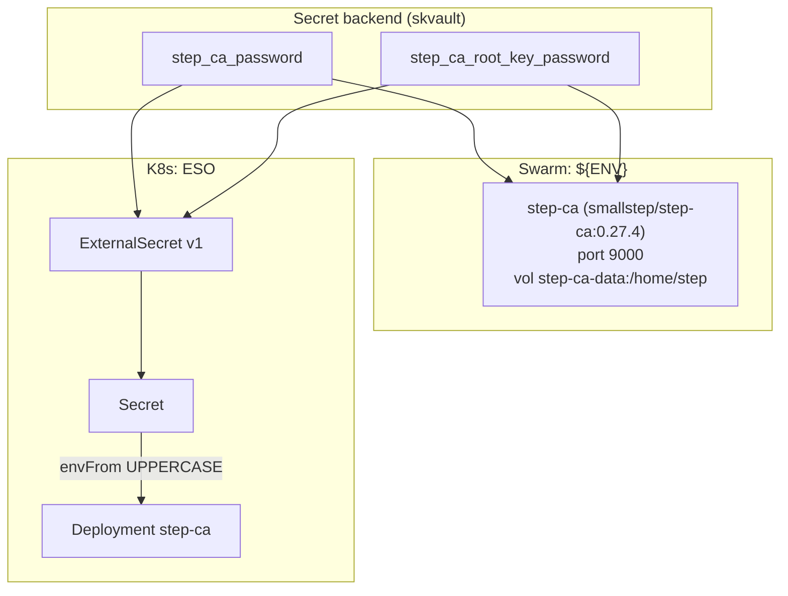

# skca — Internal PKI / mTLS — ACME for internal certs, X.509 mTLS service identity, SSH CA

✅ **deploy-ready** · layer: core · version CHANGEME_VERSION · scope `skca`

## Capability / Provider
- **Capability:** Internal PKI / mTLS — ACME for internal certs, X.509 mTLS service identity, SSH CA
- **Provider:** step-ca (ACME for internal endpoints, X.509 mTLS, SSH certificate authority)
- **Alternates:** none
- **Platforms:** docker-swarm, kubernetes, bare-metal
- **HA:** not declared

## Topology

## Secrets

| key | rotation_days | required | description |
|-----|---------------|----------|-------------|
| `step_ca_password` | 730 | yes | step-ca provisioner password (encrypts CA key) — sensitive |
| `step_ca_root_key_password` | 3650 | yes | step-ca root CA private key password (offline — store in CapAuth) — sensitive |

## Config
`LOG_LEVEL=INFO` · `DOMAIN=${SKSTACKS_DOMAIN}` · `CLUSTER=${SKSTACKS_CLUSTER}`

## Deploy
- **Container/image:** `step-ca` / `smallstep/step-ca:0.27.4`
- **Command:** none (image default)
- **Ports:** `9000:9000`
- **Volumes:** `step-ca-data:/home/step`
- **HA/replicas:** none declared
- **Healthcheck:** no `healthcheck_test` (distroless image → no exec probe); descriptor declares URL `https://CHANGEME_HOST.../healthz` (30s/5s/3)

Renders to **both** Swarm compose and K8s manifests via `skrender`. K8s materializes an ESO **ExternalSecret** (`external-secrets.io/v1`) synced into a **Secret** consumed via `envFrom` (UPPERCASE env names, consistent with Swarm's `${ENV}`).

## Dependencies
- **depends_on:** none
- **required_by:** none declared
