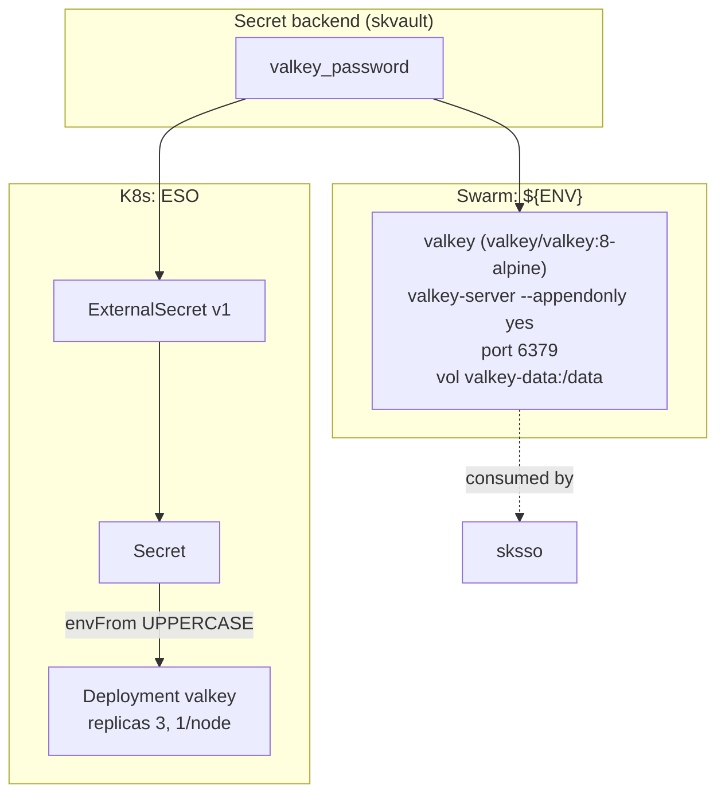

# skcache — Cache / KV store — ephemeral data, session state, pub/sub

✅ **deploy-ready** · layer: compute · version CHANGEME_VERSION · scope `skcache`

## Capability / Provider
- **Capability:** Cache / KV store — ephemeral data, session state, pub/sub
- **Provider:** Valkey (BSD-3, drop-in Redis replacement); DragonflyDB as scale alternative
- **Alternates:** DragonflyDB (10-25x perf at scale)
- **Platforms:** docker-swarm, kubernetes
- **HA:** yes — Valkey replicated, `min_replicas: 3`
- Note: Redis 8 went AGPLv3 May 2025 — swap is 1 config change.

## Topology

## Secrets

| key | rotation_days | required | description |
|-----|---------------|----------|-------------|
| `valkey_password` | 90 | no | Valkey/Redis AUTH password (sensitive) |

## Config
`LOG_LEVEL=INFO` · `DOMAIN=${SKSTACKS_DOMAIN}` · `CLUSTER=${SKSTACKS_CLUSTER}`

## Deploy
- **Container/image:** `valkey` / `valkey/valkey:8-alpine`
- **Command:** `valkey-server --appendonly yes`
- **Ports:** `6379:6379`
- **Volumes:** `valkey-data:/data`
- **HA/replicas:** `min_replicas: 3`
- **Healthcheck:** `["CMD","valkey-cli","ping"]` (30s/5s/3)

Renders to **both** Swarm compose and K8s manifests via `skrender`. K8s materializes an ESO **ExternalSecret** (`external-secrets.io/v1`) synced into a **Secret** consumed via `envFrom` (UPPERCASE env names, consistent with Swarm's `${ENV}`).

## Dependencies
- **depends_on:** none
- **required_by:** `sksso` (declares `depends_on: [skdata, skcache]`)
