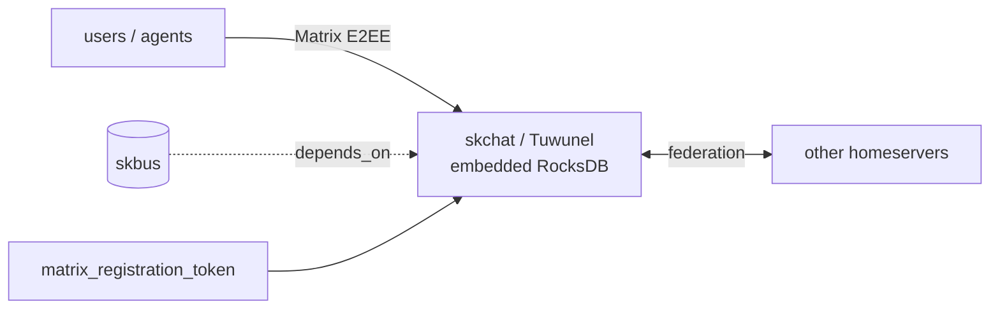

# skchat — Human/agent chat + federation — Matrix E2EE with federation bridge

📋 **descriptor-only** · layer: comms · version CHANGEME_VERSION · scope `skchat`

**Status:** 📋 descriptor-only — deploy block TODO. Needs a `deploy:` block (Tuwunel homeserver container, ports, RocksDB data volume) and a real healthcheck URL.

## Capability / Provider
- **Capability:** Human/agent chat + federation — Matrix E2EE with federation bridge
- **Provider:** Tuwunel (Apache-2.0, Rust single-binary Matrix homeserver; conduwuit successor). Keeps the Matrix protocol; swaps the homeserver off Synapse. Embedded RocksDB — no Postgres. RATIFIED 2026-06-11.
- **Alternates:** Matrix Synapse (scale-out fallback — worker-scale federation, feature-currency); XMPP/Prosody; Nostr (broadcast/identity)
- **Platforms:** docker-swarm, kubernetes

## Topology

## Secrets

| key | rotation_days | required | description |
|-----|---------------|----------|-------------|
| `matrix_registration_token` | 365 | yes | Tuwunel registration token (gates new-account creation) — sensitive |
| `matrix_macaroon_secret_key` | — | no | [Synapse fallback] Macaroon secret key — sensitive |
| `postgres_password` | — | no | [Synapse fallback] PostgreSQL password (Tuwunel uses embedded RocksDB) — sensitive |

## Config
`LOG_LEVEL=INFO` · `DOMAIN=${SKSTACKS_DOMAIN}` · `CLUSTER=${SKSTACKS_CLUSTER}`

## Dependencies
- **depends_on:** `skbus`
- **required_by:** none declared
