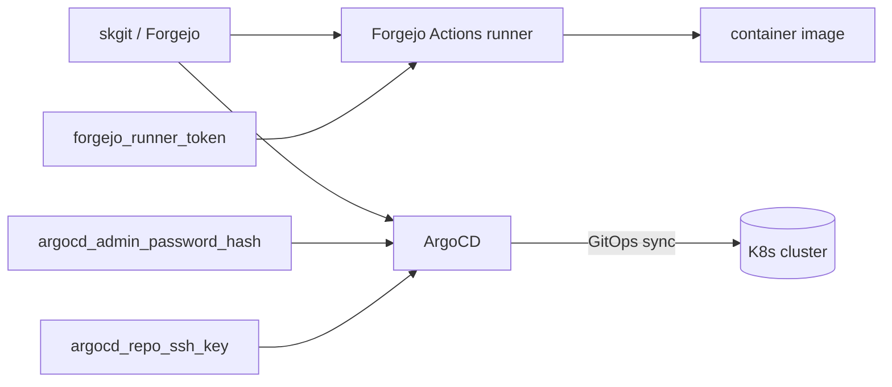

# skcicd — CI/CD — container image build + GitOps deployment pipeline

📋 **descriptor-only** · layer: cloud · version CHANGEME_VERSION · scope `skcicd`

**Status:** 📋 descriptor-only — deploy block TODO. Needs a `deploy:` block (ArgoCD + Forgejo Actions runner containers, ports, volumes) and a real healthcheck URL before it can render to deploy manifests.

## Capability / Provider
- **Capability:** CI/CD — container image build + GitOps deployment pipeline
- **Provider:** Forgejo Actions (CI) + Ansible (node/Swarm CD) + ArgoCD (K8s GitOps)
- **Alternates:** Flux (GitOps alt)
- **Platforms:** kubernetes, rke2
- **SCM ladder:** skgit (Forgejo + Actions, sovereign default) → gitlab → github → gitea. `scm_default: skgit`.

## Topology

## Secrets

| key | rotation_days | required | description |
|-----|---------------|----------|-------------|
| `argocd_admin_password_hash` | 180 | yes | ArgoCD admin bcrypt password hash — sensitive |
| `forgejo_runner_token` | — | yes | Forgejo Actions runner registration token — sensitive |
| `argocd_repo_ssh_key` | — | no | SSH private key ArgoCD uses to pull GitOps repo — sensitive |

## Config
`LOG_LEVEL=INFO` · `DOMAIN=${SKSTACKS_DOMAIN}` · `CLUSTER=${SKSTACKS_CLUSTER}`

## Dependencies
- **depends_on:** none declared
- **required_by:** none declared
