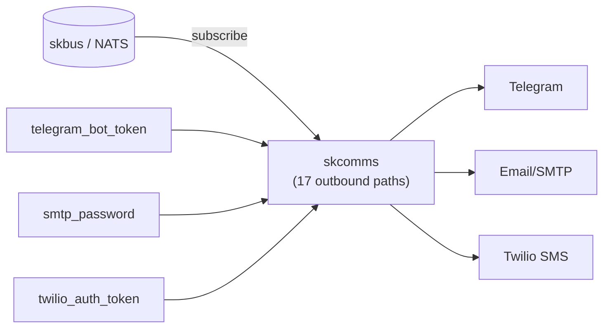

# skcomms — Multi-channel outbound transport — subscribes to skbus, routes to external channels

📋 **descriptor-only** · layer: comms · version CHANGEME_VERSION · scope `skcomms`

**Status:** 📋 descriptor-only — deploy block TODO. Needs a `deploy:` block (sovereign skcomms container/image, ports, volumes) and a real healthcheck URL.

## Capability / Provider
- **Capability:** Multi-channel outbound transport — subscribes to skbus, routes to external channels
- **Provider:** skcomms (sovereign, custom) — subscribes to NATS JetStream skbus
- **Alternates:** none
- **Platforms:** docker-swarm, kubernetes
- Multi-channel outbound transport (17 paths): routes messages to Telegram, email, SMS, etc.

## Topology

## Secrets

| key | rotation_days | required | description |
|-----|---------------|----------|-------------|
| `telegram_bot_token` | 365 | yes | Telegram Bot API token — sensitive |
| `smtp_password` | — | no | SMTP relay password for email delivery — sensitive |
| `twilio_auth_token` | — | no | Twilio auth token for SMS fallback — sensitive |

## Config
`LOG_LEVEL=INFO` · `DOMAIN=${SKSTACKS_DOMAIN}` · `CLUSTER=${SKSTACKS_CLUSTER}`

## Dependencies
- **depends_on:** `skbus`
- **required_by:** none declared
