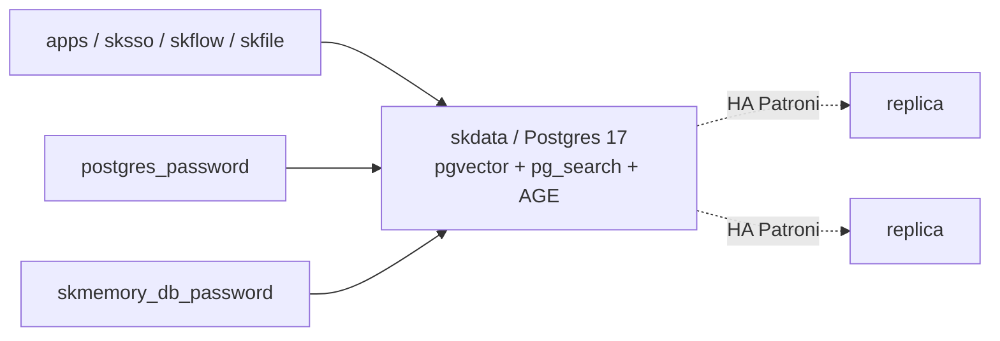

# skdata — Relational + vector + graph + full-text search — consolidated Postgres multitool

📋 **descriptor-only** · layer: compute · version CHANGEME_VERSION · scope `skdata`

**Status:** 📋 descriptor-only — deploy block TODO. Needs a `deploy:` block (the `skmem-pg:pg17-bm25-age` image, port 5432, data volume, `shared_preload_libraries=pg_search,age`) and a real healthcheck URL.

## Capability / Provider
- **Capability:** Relational + vector + graph + full-text search — consolidated Postgres multitool
- **Provider:** PostgreSQL 17 (`skmem-pg:pg17-bm25-age` image: pgvector + ParadeDB pg_search (BM25) + Apache AGE (graph) — one engine)
- **Alternates:** ArcadeDB (graph algos at scale)
- **Platforms:** docker-swarm, bare-metal
- **HA:** yes — the DB everything uses, `min_replicas: 3` (Patroni / streaming replication)

## Topology

## Secrets

| key | rotation_days | required | description |
|-----|---------------|----------|-------------|
| `postgres_password` | 90 | yes | PostgreSQL superuser password — sensitive |
| `skmemory_db_password` | — | yes | skmemory application database password — sensitive |

## Config
`LOG_LEVEL=INFO` · `DOMAIN=${SKSTACKS_DOMAIN}` · `CLUSTER=${SKSTACKS_CLUSTER}`

## Dependencies
- **depends_on:** none declared
- **required_by:** `sksso` (`depends_on: [skdata, skcache]`), `skflow` (`depends_on: [skdata]`), `skfile` (`depends_on: [skobject, skdata]` — metadata engine)
