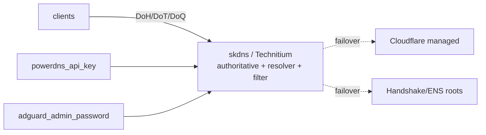

# skdns — Sovereign DNS — internal authoritative + resolver/filter, split-horizon, DNS-01 ACME

📋 **descriptor-only** · layer: cloud · version CHANGEME_VERSION · scope `skdns`

**Status:** 📋 descriptor-only — deploy block TODO. Needs a `deploy:` block (Technitium/PowerDNS+AdGuard container, ports, volumes) and a real healthcheck URL.

## Capability / Provider
- **Capability:** Sovereign DNS — internal authoritative + resolver/filter, split-horizon, DNS-01 ACME
- **Provider:** Technitium (self-host: authoritative + recursive + filtering + DoH/DoT/DoQ, one binary)
- **Alternates:** PowerDNS + AdGuard Home (split self-host); Cloudflare (managed; default for public zones); Handshake (HNS) / ENS (censorship-resistant naming roots)
- **Platforms:** docker-swarm, kubernetes, bare-metal
- **HA:** yes — multi-provider failover, `min_replicas: 3`
- **Resolution layers:** technitium (default), cloudflare, blockchain (HNS/ENS), failover. Secure transport: DoH, DoT, DoQ (no plaintext :53 over WAN).

## Topology

## Secrets

| key | rotation_days | required | description |
|-----|---------------|----------|-------------|
| `powerdns_api_key` | 90 | yes | PowerDNS HTTP API key — sensitive |
| `adguard_admin_password` | — | yes | AdGuard Home admin password hash — sensitive |

## Config
`LOG_LEVEL=INFO` · `DOMAIN=${SKSTACKS_DOMAIN}` · `CLUSTER=${SKSTACKS_CLUSTER}`

## Dependencies
- **depends_on:** none declared
- **required_by:** none declared
