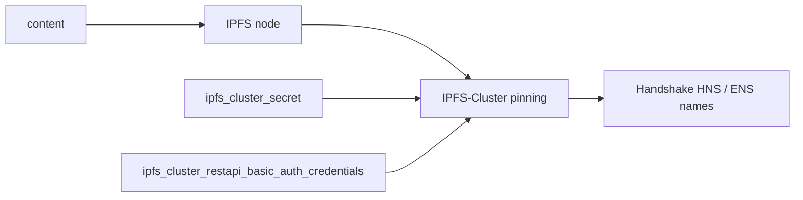

# skdweb — Decentralized availability + sovereign naming — IPFS pinning + seizure-proof names

📋 **descriptor-only** · layer: cloud · version CHANGEME_VERSION · scope `skdweb`

**Status:** 📋 descriptor-only — deploy block TODO. Needs a `deploy:` block (IPFS + IPFS-Cluster containers, ports, volumes) and a real healthcheck URL.

## Capability / Provider
- **Capability:** Decentralized availability + sovereign naming — IPFS pinning + seizure-proof names
- **Provider:** IPFS + IPFS-Cluster (content availability) + Handshake HNS / ENS (sovereign naming)
- **Alternates:** ENS (.eth on existing sketh)
- **Platforms:** docker-swarm, bare-metal

## Topology

## Secrets

| key | rotation_days | required | description |
|-----|---------------|----------|-------------|
| `ipfs_cluster_secret` | 365 | yes | IPFS-Cluster shared secret (hex, 32 bytes) — sensitive |
| `ipfs_cluster_restapi_basic_auth_credentials` | — | no | REST API basic-auth credentials for IPFS-Cluster (user:pass) — sensitive |

## Config
`LOG_LEVEL=INFO` · `DOMAIN=${SKSTACKS_DOMAIN}` · `CLUSTER=${SKSTACKS_CLUSTER}`

## Dependencies
- **depends_on:** none declared
- **required_by:** none declared
