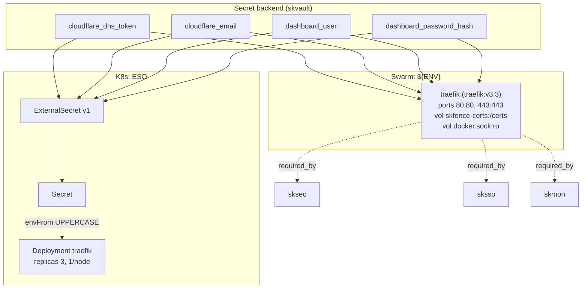

# skfence — Edge / ingress — TLS termination, rate limiting, socket proxy

✅ **deploy-ready** · layer: cloud · version 3.3 · scope `skfence`

## Capability / Provider
- **Capability:** Edge / ingress — TLS termination, rate limiting, socket proxy
- **Provider:** Traefik v3 + Coraza WAF (Traefik WASM plugin; Keepalived for Swarm HA / kube-vip for K8s)
- **Alternates:** Caddy (simple); Envoy Gateway + kube-vip (K8s)
- **Platforms:** docker-swarm, kubernetes, rke2
- **HA:** yes — edge ingress, `min_replicas: 3` (Keepalived / kube-vip)

## Topology

## Secrets

| key | rotation_days | required | description |
|-----|---------------|----------|-------------|
| `cloudflare_dns_token` | 90 | yes | Cloudflare DNS API token for ACME DNS-01 challenge |
| `cloudflare_email` | — | yes | Cloudflare account email |
| `dashboard_user` | — | no | Traefik dashboard basic-auth username (default `admin`) |
| `dashboard_password_hash` | — | no | Traefik dashboard bcrypt password hash (htpasswd format) — sensitive |

## Config
`LOG_LEVEL=INFO` · `CERT_RESOLVER=main` · `TLS_OPTIONS=default@file` · `RATE_LIMIT_AVERAGE=100` · `RATE_LIMIT_BURST=50` · `ACCESS_LOG=true` · `ACCESS_LOG_FORMAT=json`

Overlay networks: `cloud-edge`, `cloud-public`, `cloud-socket-proxy`.

## Deploy
- **Container/image:** `traefik` / `traefik:v3.3`
- **Command:** `--configFile=/etc/traefik/traefik.yml`
- **Ports:** `80:80`, `443:443`
- **Volumes:** `skfence-certs:/certs`, `/var/run/docker.sock:/var/run/docker.sock:ro`
- **HA/replicas:** `replicas: 3`, max one per node
- **Healthcheck:** `["CMD","traefik","healthcheck","--ping"]`; URL `https://traefik.{cluster_name}.{domain}/ping` (30s/5s/3)

Renders to **both** Swarm compose and K8s manifests via `skrender`. K8s materializes an ESO **ExternalSecret** (`external-secrets.io/v1`) synced into a **Secret** consumed via `envFrom` (UPPERCASE env names, consistent with Swarm's `${ENV}`).

## Dependencies
- **depends_on:** none
- **required_by:** `sksec`, `sksso`, `skmon`
