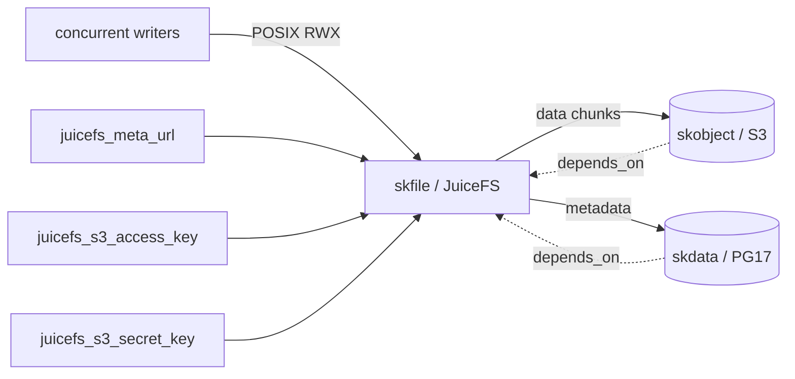

# skfile — Shared file storage — POSIX RWX, many concurrent writers

📋 **descriptor-only** · layer: compute · version CHANGEME_VERSION · scope `skfile`

**Status:** 📋 descriptor-only — deploy block TODO. JuiceFS is a CSI driver (K8s) / FUSE mount (Swarm); needs the driver/mount manifests before deploy rendering. Healthcheck URL still `CHANGEME_HOST`.

## Capability / Provider
- **Capability:** Shared file storage — POSIX RWX, many concurrent writers
- **Provider:** JuiceFS CE (Apache-2.0; data=skobject S3, metadata=PostgreSQL/skdata)
- **Alternates:** CephFS (at Ceph consolidation); SeaweedFS filer (when SeaweedFS is already the object layer)
- **Platforms:** kubernetes, rke2, docker-swarm (CSI on K8s; FUSE mount on Swarm)
- Part of the **skstorage** family. Adapter composition: HA POSIX-RWX with no second clustered filesystem — layers on the object plane (skobject, data) + PostgreSQL (skdata, metadata). Both must be HA (object replication + Patroni).

## Topology

## Secrets

| key | rotation_days | required | description |
|-----|---------------|----------|-------------|
| `juicefs_meta_url` | — | yes | JuiceFS metadata DSN (`postgres://…` → skdata/PG17, HA via Patroni) — sensitive |
| `juicefs_s3_access_key` | — | yes | S3 access key for JuiceFS data chunks (→ skobject) |
| `juicefs_s3_secret_key` | — | yes | S3 secret key for JuiceFS data chunks (→ skobject) — sensitive |

## Config
`META_ENGINE=postgres` · `OBJECT_BACKEND=skobject` · `BUCKET=skstacks-juicefs` (data HA = object replication; meta HA = Postgres HA)

## Dependencies
- **depends_on:** `skobject` (data chunks), `skdata` (metadata engine)
- **required_by:** none declared
