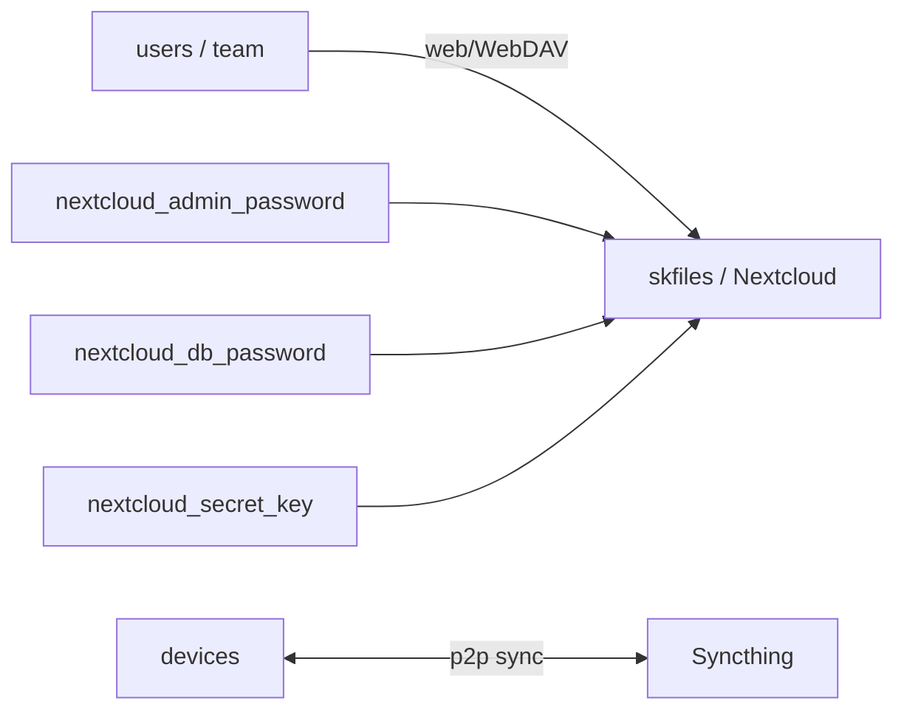

# skfiles — File sync and collaboration — web UI + peer-to-peer device sync

📋 **descriptor-only** · layer: compute · version CHANGEME_VERSION · scope `skfiles`

**Status:** 📋 descriptor-only — deploy block TODO. Needs a `deploy:` block (Nextcloud + Syncthing containers, ports, volumes) and a real healthcheck URL.

## Capability / Provider
- **Capability:** File sync and collaboration — web UI + peer-to-peer device sync
- **Provider:** Nextcloud (collaboration/WebDAV) + Syncthing (p2p sync)
- **Alternates:** Seafile (raw speed)
- **Platforms:** docker-swarm, kubernetes

## Topology

## Secrets

| key | rotation_days | required | description |
|-----|---------------|----------|-------------|
| `nextcloud_admin_password` | 90 | yes | Nextcloud admin account password — sensitive |
| `nextcloud_db_password` | — | yes | PostgreSQL password for Nextcloud database — sensitive |
| `nextcloud_secret_key` | — | yes | Nextcloud instance secret key — sensitive |

## Config
`LOG_LEVEL=INFO` · `DOMAIN=${SKSTACKS_DOMAIN}` · `CLUSTER=${SKSTACKS_CLUSTER}`

## Dependencies
- **depends_on:** none declared
- **required_by:** none declared
