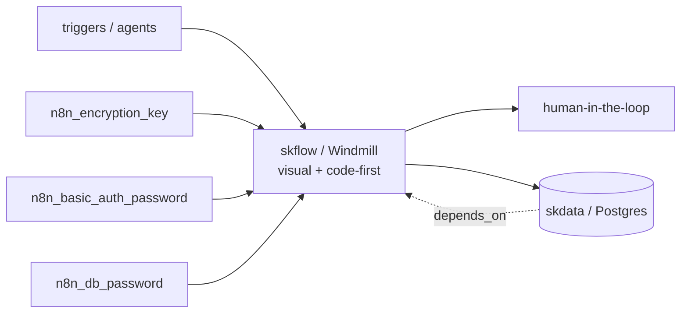

# skflow — Automation / workflow — visual and code-first agent + human-in-loop pipelines

📋 **descriptor-only** · layer: compute · version CHANGEME_VERSION · scope `skflow`

**Status:** 📋 descriptor-only — deploy block TODO. Needs a `deploy:` block (Windmill server/worker containers, ports, volumes) and a real healthcheck URL.

## Capability / Provider
- **Capability:** Automation / workflow — visual and code-first agent + human-in-loop pipelines
- **Provider:** Windmill (AGPLv3, OSI-open, code-first; visual + scripts). RATIFIED 2026-06-11.
- **Alternates:** Activepieces (MIT — permissive visual builder); Temporal (durable workflows at scale); n8n (fair-code / non-OSI — optional, license-flagged; large node ecosystem)
- **Platforms:** docker-swarm, kubernetes

## Topology

> Note: secret keys are named `n8n_*` in the descriptor (carried from the n8n alt); the ratified default provider is Windmill.

## Secrets

| key | rotation_days | required | description |
|-----|---------------|----------|-------------|
| `n8n_encryption_key` | 365 | yes | n8n data encryption key (AES-256) — sensitive |
| `n8n_basic_auth_password` | — | no | n8n UI basic-auth password — sensitive |
| `n8n_db_password` | — | yes | PostgreSQL password for n8n database — sensitive |

## Config
`LOG_LEVEL=INFO` · `DOMAIN=${SKSTACKS_DOMAIN}` · `CLUSTER=${SKSTACKS_CLUSTER}`

## Dependencies
- **depends_on:** `skdata`
- **required_by:** none declared
