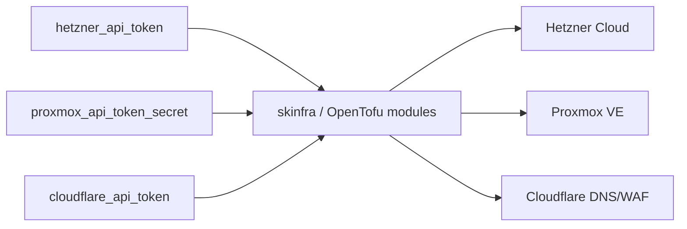

# skinfra — Infrastructure provisioning — cloud/on-prem VM and network lifecycle via IaC

📋 **descriptor-only** · layer: cloud · version CHANGEME_VERSION · scope `skinfra`

**Status:** 📋 descriptor-only — deploy block TODO. OpenTofu is a CLI/IaC runner — needs a `deploy:` block (runner container or job) and a real healthcheck before deploy rendering.

## Capability / Provider
- **Capability:** Infrastructure provisioning — cloud/on-prem VM and network lifecycle via IaC
- **Provider:** OpenTofu (Terraform-compatible, BSL-free)
- **Alternates:** Terraform (BSL); Pulumi
- **Platforms:** bare-metal
- OpenTofu modules target Hetzner, Proxmox, and Cloudflare.

## Topology

## Secrets

| key | rotation_days | required | description |
|-----|---------------|----------|-------------|
| `hetzner_api_token` | 90 | no | Hetzner Cloud API token — sensitive |
| `proxmox_api_token_secret` | — | no | Proxmox VE API token secret — sensitive |
| `cloudflare_api_token` | — | no | Cloudflare API token (DNS + WAF rules) — sensitive |

## Config
`LOG_LEVEL=INFO` · `DOMAIN=${SKSTACKS_DOMAIN}` · `CLUSTER=${SKSTACKS_CLUSTER}`

## Dependencies
- **depends_on:** none declared
- **required_by:** none declared
