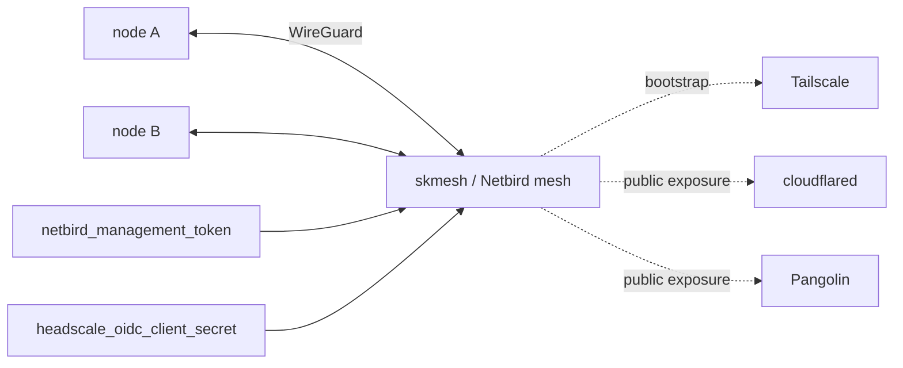

# skmesh — Overlay mesh / tunnels — sovereign WireGuard networking across nodes

📋 **descriptor-only** · layer: cloud · version CHANGEME_VERSION · scope `skmesh`

**Status:** 📋 descriptor-only — deploy block TODO. Needs a `deploy:` block (Netbird / Tailscale / Pangolin containers, ports, volumes) and a real healthcheck URL.

## Capability / Provider
- **Capability:** Overlay mesh / tunnels — sovereign WireGuard networking across nodes
- **Provider:** Netbird (self-hosted, sovereign target); Tailscale for ease + bootstrap; Pangolin as sovereign cloudflared replacement
- **Alternates:** Headscale (supported, NOT recommended — pre-1.0, hobbyist, Tailscale-client-coupled); Pangolin (sovereign cloudflared replacement)
- **Platforms:** docker-swarm, kubernetes, rke2, bare-metal
- **Mesh ladder** (private remote access): tailscale → netbird (recommended end state).
- **Tunnel ladder** (public exposure): cloudflared → pangolin (AGPL/$100K threshold).
- **Ingress exposure entry points** (stackable on the Traefik Gateway): lan (always-on baseline), tailscale, netbird, cloudflared, pangolin.

## Topology

## Secrets

| key | rotation_days | required | description |
|-----|---------------|----------|-------------|
| `netbird_management_token` | 90 | yes | Netbird management API token |
| `headscale_oidc_client_secret` | — | no | OIDC client secret for Headscale SSO integration — sensitive |

## Config
`LOG_LEVEL=INFO` · `DOMAIN=${SKSTACKS_DOMAIN}` · `CLUSTER=${SKSTACKS_CLUSTER}`

## Dependencies
- **depends_on:** none declared
- **required_by:** none declared
