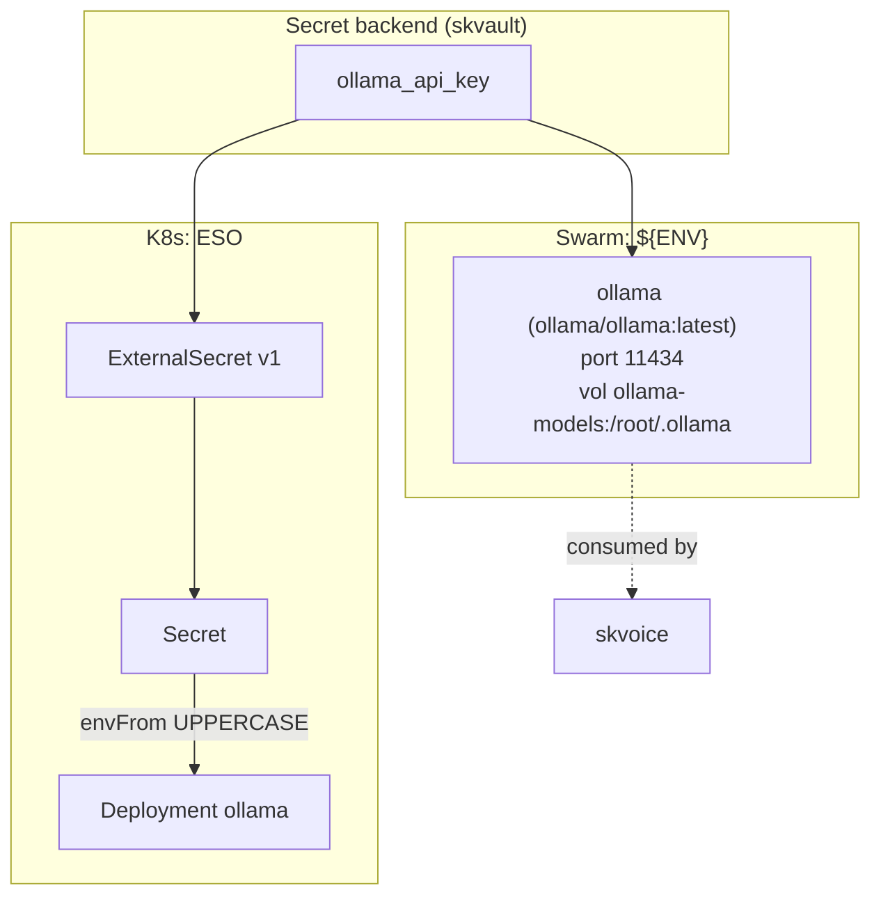

# skmodel — LLM / inference serving — stable seam for local and remote model serving

✅ **deploy-ready** · layer: compute · version CHANGEME_VERSION · scope `skmodel`

## Capability / Provider
- **Capability:** LLM / inference serving — stable seam for local and remote model serving
- **Provider:** Ollama (simple, wide model support); vLLM (high-throughput production serving)
- **Alternates:** vLLM (high-throughput production); llama.cpp (direct GGUF)
- **Platforms:** docker-swarm, bare-metal
- **HA:** not declared (no `ha`, no `min_replicas`)

## Topology

## Secrets

| key | rotation_days | required | description |
|-----|---------------|----------|-------------|
| `ollama_api_key` | — | no | Ollama API key (if auth is enabled) — sensitive |

## Config
`LOG_LEVEL=INFO` · `DOMAIN=${SKSTACKS_DOMAIN}` · `CLUSTER=${SKSTACKS_CLUSTER}`

## Deploy
- **Container/image:** `ollama` / `ollama/ollama:latest`
- **Command:** none (image default)
- **Ports:** `11434:11434`
- **Volumes:** `ollama-models:/root/.ollama`
- **HA/replicas:** none declared
- **Healthcheck:** no `healthcheck_test` in deploy block (descriptor declares URL `https://CHANGEME_HOST.../healthz`, 30s/5s/3)

Renders to **both** Swarm compose and K8s manifests via `skrender`. K8s materializes an ESO **ExternalSecret** (`external-secrets.io/v1`) synced into a **Secret** consumed via `envFrom` (UPPERCASE env names, consistent with Swarm's `${ENV}`).

## Dependencies
- **depends_on:** none
- **required_by:** `skvoice` (declares `depends_on: [skbus, skmodel]`)
