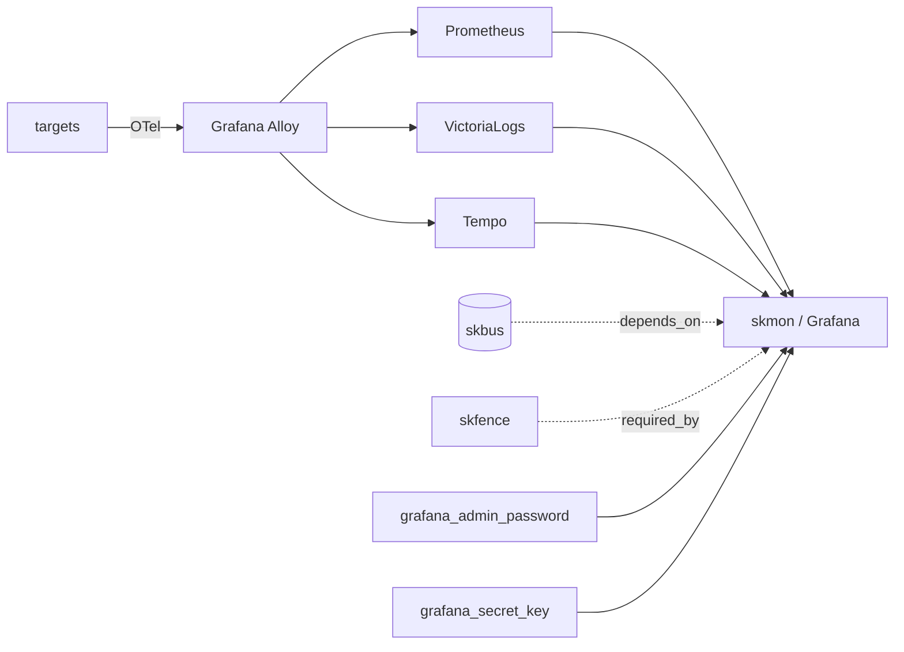

# skmon — Observability — metrics, logs, traces with OTel standard

📋 **descriptor-only** · layer: compute · version CHANGEME_VERSION · scope `skmon`

**Status:** 📋 descriptor-only — deploy block TODO. Multi-component stack (Prometheus/Grafana/VictoriaLogs/Tempo/Alloy); needs `deploy:` blocks (containers, ports, volumes) and a real healthcheck URL.

## Capability / Provider
- **Capability:** Observability — metrics, logs, traces with OTel standard
- **Provider:** Prometheus (metrics) + Grafana (dashboards) + VictoriaLogs (logs, Apache-2.0, replaces Loki) + Tempo (traces) + Grafana Alloy (OTel)
- **Alternates:** SigNoz (all-in-one, ClickHouse)
- **Platforms:** docker-swarm, kubernetes

## Topology

## Secrets

| key | rotation_days | required | description |
|-----|---------------|----------|-------------|
| `grafana_admin_password` | 90 | yes | Grafana admin password — sensitive |
| `grafana_secret_key` | — | yes | Grafana secret key for cookie signing — sensitive |

## Config
`LOG_LEVEL=INFO` · `DOMAIN=${SKSTACKS_DOMAIN}` · `CLUSTER=${SKSTACKS_CLUSTER}`

## Dependencies
- **depends_on:** `skbus`
- **required_by:** listed as `required_by` of `skfence`
