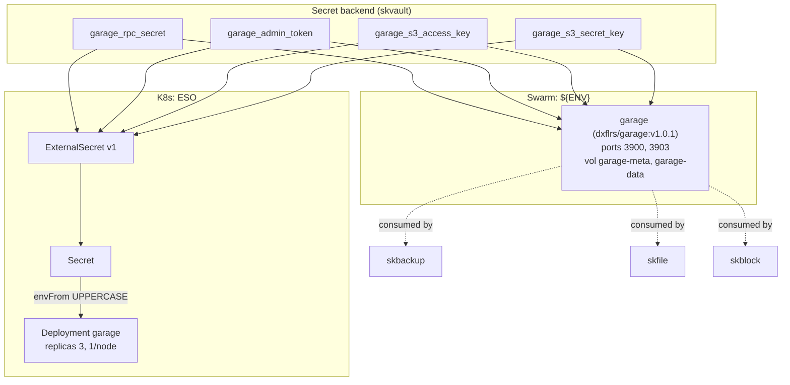

# skobject — Object / S3 storage — blob storage with S3-compatible API

✅ **deploy-ready** · layer: compute · version CHANGEME_VERSION · scope `skobject`

## Capability / Provider
- **Capability:** Object / S3 storage — blob storage with S3-compatible API
- **Provider:** Garage (AGPLv3, single binary, S3-compatible); SeaweedFS for Object-Lock / large scale
- **Alternates:** SeaweedFS (Object-Lock / large scale)
- **Platforms:** docker-swarm, bare-metal
- **HA:** yes — Garage 3 nodes, `replication_factor=3`, `min_replicas: 3`
- Note: replaces archived MinIO (Apr 2026).

## Topology

## Secrets

| key | rotation_days | required | description |
|-----|---------------|----------|-------------|
| `garage_rpc_secret` | 365 | yes | Garage cluster RPC secret (hex, 32 bytes) — sensitive |
| `garage_admin_token` | 90 | yes | Garage admin API token — sensitive |
| `garage_s3_access_key` | — | yes | S3-compatible access key for service consumers |
| `garage_s3_secret_key` | — | yes | S3-compatible secret key for service consumers — sensitive |

## Config
`LOG_LEVEL=INFO` · `DOMAIN=${SKSTACKS_DOMAIN}` · `CLUSTER=${SKSTACKS_CLUSTER}`

## Deploy
- **Container/image:** `garage` / `dxflrs/garage:v1.0.1`
- **Command:** none (image default)
- **Ports:** `3900:3900`, `3903:3903`
- **Volumes:** `garage-meta:/var/lib/garage/meta`, `garage-data:/var/lib/garage/data`
- **HA/replicas:** `min_replicas: 3` (replication_factor=3)
- **Healthcheck:** no `healthcheck_test` in deploy block (descriptor declares URL `https://CHANGEME_HOST.../healthz`, 30s/5s/3)

Renders to **both** Swarm compose and K8s manifests via `skrender`. K8s materializes an ESO **ExternalSecret** (`external-secrets.io/v1`) synced into a **Secret** consumed via `envFrom` (UPPERCASE env names, consistent with Swarm's `${ENV}`).

## Dependencies
- **depends_on:** none
- **required_by:** `skbackup`, `skfile`, `skblock` (declare `depends_on`/backup-target to `skobject`)
