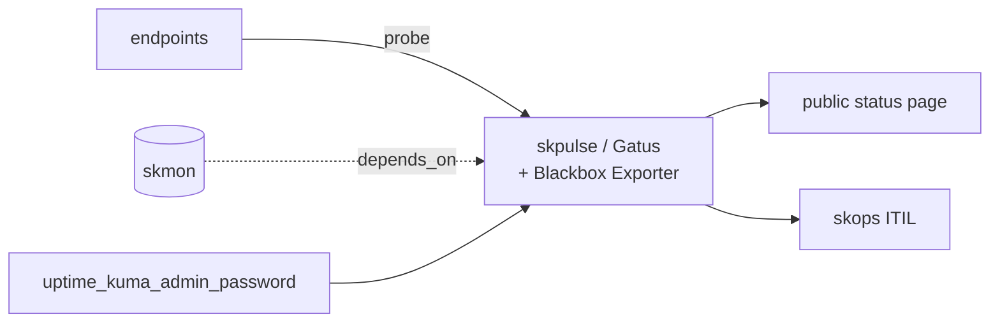

# skpulse — Uptime / external status monitoring — endpoint probing and public status page

📋 **descriptor-only** · layer: compute · version CHANGEME_VERSION · scope `skpulse`

**Status:** 📋 descriptor-only — deploy block TODO. Needs a `deploy:` block (Gatus + Blackbox Exporter containers, ports, volumes) and a real healthcheck URL.

## Capability / Provider
- **Capability:** Uptime / external status monitoring — endpoint probing and public status page
- **Provider:** Gatus (config-as-code uptime, feeds skops ITIL) + Prometheus Blackbox Exporter (internal probing)
- **Alternates:** Prometheus Blackbox Exporter (internal probing)
- **Platforms:** docker-swarm, kubernetes
- Descriptor name references Uptime-Kuma in the description/secret; provider is Gatus + Blackbox Exporter.

## Topology

## Secrets

| key | rotation_days | required | description |
|-----|---------------|----------|-------------|
| `uptime_kuma_admin_password` | 90 | yes | Uptime-Kuma admin password — sensitive |

## Config
`LOG_LEVEL=INFO` · `DOMAIN=${SKSTACKS_DOMAIN}` · `CLUSTER=${SKSTACKS_CLUSTER}`

## Dependencies
- **depends_on:** `skmon`
- **required_by:** none declared
