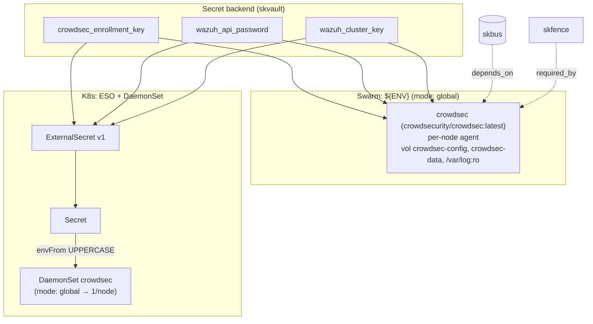

# sksec — Threat defense — reputation, runtime, host, and network intrusion detection

✅ **deploy-ready** · layer: core · version CHANGEME_VERSION · scope `sksec`

## Capability / Provider
- **Capability:** Threat defense — reputation, runtime, host, and network intrusion detection
- **Provider:** CrowdSec (reputation/bouncer) + Falco (runtime eBPF) + Wazuh (HIDS/FIM/SIEM) + Suricata (NIDS)
- **Alternates:** Tetragon (eBPF enforcement) + Kyverno (admission policy)
- **Platforms:** docker-swarm, kubernetes, bare-metal
- **HA:** not declared (runs as a per-node agent — `mode: global`)
- Tiered defense (stack-validation §7): T1 CrowdSec → T2 +Falco/Tetragon/Kyverno → T3 +Wazuh/Zeek.
- DevSecOps: CI scanners `gitleaks, trufflehog, semgrep, trivy, grype, syft, checkov, kubescape`; closed-loop at `core/sksec/closed-loop/` (scan → AI-triage → remediation PR → re-scan → deploy → verify, never auto-merge); red-team at `core/sksec/redteam/` (skred — authorized, scope-locked to own targets).

## Topology

## Secrets

| key | rotation_days | required | description |
|-----|---------------|----------|-------------|
| `crowdsec_enrollment_key` | 365 | no | CrowdSec Central API enrollment key |
| `wazuh_api_password` | 90 | yes | Wazuh REST API password — sensitive |
| `wazuh_cluster_key` | 365 | no | Wazuh cluster communication key — sensitive |

## Config
`LOG_LEVEL=INFO` · `DOMAIN=${SKSTACKS_DOMAIN}` · `CLUSTER=${SKSTACKS_CLUSTER}`

## Deploy
- **Container/image:** `crowdsec` / `crowdsecurity/crowdsec:latest`
- **Mode:** `global` → renders to a **DaemonSet** on K8s (one per node); Swarm global service
- **Ports:** none
- **Volumes:** `crowdsec-config:/etc/crowdsec`, `crowdsec-data:/var/lib/crowdsec/data`, `/var/log:/var/log:ro`
- **Healthcheck:** `["CMD","cscli","lapi","status"]` (30s/5s/3)

Renders to **both** Swarm compose (global service) and K8s manifests via `skrender`. K8s materializes an ESO **ExternalSecret** (`external-secrets.io/v1`) synced into a **Secret** consumed via `envFrom` (UPPERCASE env names, consistent with Swarm's `${ENV}`). `mode: global` → **DaemonSet**.

## Dependencies
- **depends_on:** `skbus`
- **required_by:** listed as `required_by` of `skfence`
