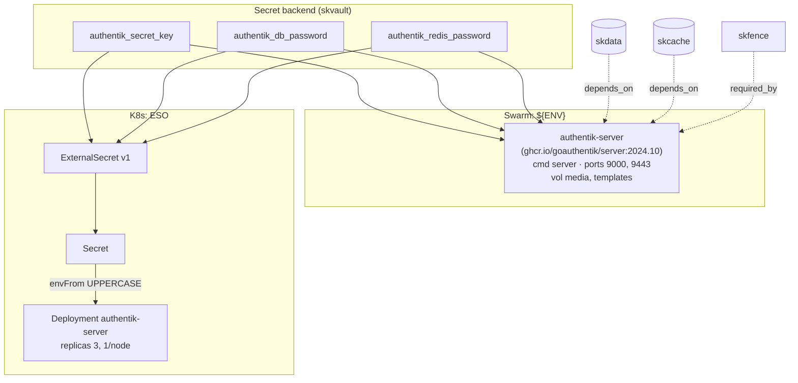

# sksso — Identity / SSO — human SSO (OIDC/SAML/LDAP) + agent service-auth upgrade path

✅ **deploy-ready** · layer: core · version CHANGEME_VERSION · scope `sksso`

## Capability / Provider
- **Capability:** Identity / SSO — human SSO (OIDC/SAML/LDAP) + agent service-auth upgrade path
- **Provider:** Authentik (human SSO, OIDC/SAML/LDAP); Zitadel as M2M/agent service-auth upgrade path
- **Alternates:** Zitadel (strong M2M/agent service-auth)
- **Platforms:** docker-swarm, kubernetes
- **HA:** yes — SSO is load-bearing, `min_replicas: 3` behind the Gateway

## Topology

## Secrets

| key | rotation_days | required | description |
|-----|---------------|----------|-------------|
| `authentik_secret_key` | 365 | yes | Authentik `SECRET_KEY` (Django signing) — sensitive |
| `authentik_db_password` | — | yes | PostgreSQL password for Authentik database — sensitive |
| `authentik_redis_password` | — | no | Redis/Valkey password for Authentik cache — sensitive |

## Config
`LOG_LEVEL=INFO` · `DOMAIN=${SKSTACKS_DOMAIN}` · `CLUSTER=${SKSTACKS_CLUSTER}`

## Deploy
- **Container/image:** `authentik-server` / `ghcr.io/goauthentik/server:2024.10`
- **Command:** `server`
- **Ports:** `9000:9000`, `9443:9443`
- **Volumes:** `authentik-media:/media`, `authentik-templates:/templates`
- **HA/replicas:** `min_replicas: 3` (behind the Gateway)
- **Healthcheck:** `["CMD","ak","healthcheck"]` (30s/5s/3)

Renders to **both** Swarm compose and K8s manifests via `skrender`. K8s materializes an ESO **ExternalSecret** (`external-secrets.io/v1`) synced into a **Secret** consumed via `envFrom` (UPPERCASE env names, consistent with Swarm's `${ENV}`).

## Dependencies
- **depends_on:** `skdata`, `skcache`
- **required_by:** listed as `required_by` of `skfence`
