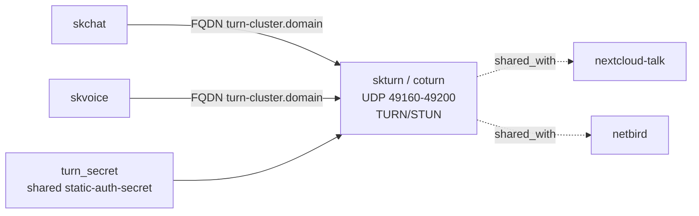

# skturn — WebRTC media relay — TURN/STUN for NAT traversal

📋 **descriptor-only** · layer: apps · version 4.6 · scope `skturn`

**Status:** 📋 descriptor-only — deploy block TODO. Needs a `deploy:` block (host-published edge container; on K8s a hostNetwork DaemonSet) wired to the existing `coturn_static_auth_secret` docker secret, plus the TURN listener healthcheck.

## Capability / Provider
- **Capability:** WebRTC media relay — TURN/STUN for NAT traversal
- **Provider:** coturn 4.6 (host-published edge node; DNS grey-cloud / DNS-only)
- **Alternates:** eturnal (Erlang TURN); Pion TURN (Go, embeddable)
- **Platforms:** docker-swarm (host-network edge; K8s = hostNetwork DaemonSet)

Media-relay plane for WebRTC; `skchat`/`skvoice` consume the resulting FQDN. This is the media plane that cannot traverse Traefik/cloudflared.

## Topology

## Secrets

| key | rotation_days | required | description |
|-----|---------------|----------|-------------|
| `turn_secret` | — | yes | EXISTING `skhub.turn_secret` — shared static-auth-secret for Nextcloud Talk (spreed), netbird, and skchat. Supplied as docker secret `coturn_static_auth_secret`. NEVER regenerate (breaks all 3); NEVER reuse the leaked NC_PASS; NEVER commit. Shared with `nextcloud-talk`, `netbird`, `skchat`. Sensitive. |

## Config
`TURN_REALM=${SKSTACKS_DOMAIN}` · `MIN_PORT=49160` · `MAX_PORT=49200` · `FQDN=turn-${SKSTACKS_CLUSTER}.${SKSTACKS_DOMAIN}` (A record → edge public IP, GREY-CLOUD / DNS-only, not proxied)

Healthcheck: TURN has no HTTP health — checks the listener via `turnutils_uclient -y -u test -w test 127.0.0.1` (60s/10s/3).

## Dependencies
- **depends_on:** none declared
- **required_by:** consumed by `skchat`, `skvoice` (FQDN); auth secret shared with `nextcloud-talk`, `netbird`
