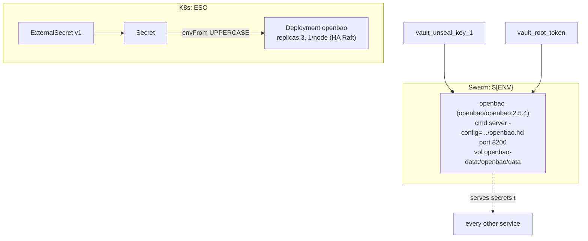

# skvault — Secrets management — pluggable backend: vault-file / HashiCorp Vault / CapAuth

✅ **deploy-ready** · layer: core · version CHANGEME_VERSION · scope `skvault`

## Capability / Provider
- **Capability:** Secrets management — pluggable backend: vault-file / HashiCorp Vault / CapAuth
- **Provider:** `SKSecretBackend` interface (`secrets/interface.py`): OpenBao (HA Raft, default) / vault-file (AES-256) / SOPS+age / CapAuth (PGP); HashiCorp Vault = compatible alt
- **Alternates:** AWS Secrets Manager; 1Password Secrets Automation
- **Platforms:** docker-swarm, kubernetes, bare-metal
- **HA:** yes — OpenBao HA Raft 3-node quorum, `min_replicas: 3` (no single point for secrets)
- This is the secret backend the **ESO `ClusterSecretStore`** (`skstacks-backend`) and Swarm `${ENV}` resolution point at.

## Topology

## Secrets

| key | rotation_days | required | description |
|-----|---------------|----------|-------------|
| `vault_unseal_key_1` | — | no | HashiCorp Vault unseal key shard 1 (Shamir — only for Vault backend) — sensitive |
| `vault_root_token` | — | no | HashiCorp Vault root token (bootstrap only — revoke after setup) — sensitive |

## Config
`LOG_LEVEL=INFO` · `DOMAIN=${SKSTACKS_DOMAIN}` · `CLUSTER=${SKSTACKS_CLUSTER}`

## Deploy
- **Container/image:** `openbao` / `openbao/openbao:2.5.4`
- **Command:** `server -config=/openbao/config/openbao.hcl`
- **Ports:** `8200:8200`
- **Volumes:** `openbao-data:/openbao/data`
- **HA/replicas:** `min_replicas: 3` (HA Raft, one-per-node). The authoritative HA Raft cluster (3-node quorum, PGP no-catch-22 bootstrap) lives in `secrets/openbao/`; this deploy block renders the single service shape for descriptor→deploy parity.
- **Healthcheck:** `["CMD","bao","status"]` (30s/5s/3)

Renders to **both** Swarm compose and K8s manifests via `skrender`. K8s materializes an ESO **ExternalSecret** (`external-secrets.io/v1`) synced into a **Secret** consumed via `envFrom` (UPPERCASE env names, consistent with Swarm's `${ENV}`).

## Dependencies
- **depends_on:** none
- **required_by:** none declared (but every service resolves its secrets through this backend)
