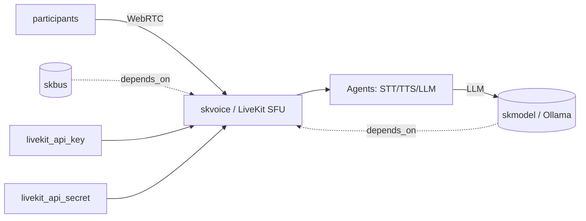

# skvoice — Voice/video RTC — SFU for agent-in-call (STT+TTS+LLM room participants)

📋 **descriptor-only** · layer: comms · version CHANGEME_VERSION · scope `skvoice`

**Status:** 📋 descriptor-only — deploy block TODO. Needs a `deploy:` block (LiveKit SFU container + Agents workers, ports, volumes) and a real healthcheck URL.

## Capability / Provider
- **Capability:** Voice/video RTC — SFU for agent-in-call (STT+TTS+LLM room participants)
- **Provider:** LiveKit (SFU + Agents framework: STT=Whisper, TTS=Chatterbox, LLM=Ollama)
- **Alternates:** mediasoup; Janus (SIP)
- **Platforms:** docker-swarm, kubernetes

## Topology

## Secrets

| key | rotation_days | required | description |
|-----|---------------|----------|-------------|
| `livekit_api_key` | 90 | yes | LiveKit API key |
| `livekit_api_secret` | 90 | yes | LiveKit API secret — sensitive |

## Config
`LOG_LEVEL=INFO` · `DOMAIN=${SKSTACKS_DOMAIN}` · `CLUSTER=${SKSTACKS_CLUSTER}`

## Dependencies
- **depends_on:** `skbus`, `skmodel`
- **required_by:** none declared
