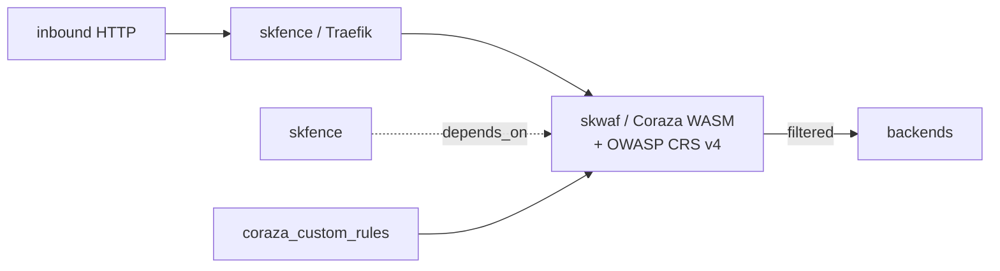

# skwaf — Web application firewall — OWASP Top 10 protection at the ingress layer

📋 **descriptor-only** · layer: core · version CHANGEME_VERSION · scope `skwaf`

**Status:** 📋 descriptor-only — deploy block TODO. skwaf is a Traefik WASM plugin (zero new processes, config change only) rather than a standalone container; needs the plugin-config rendering + a real healthcheck URL.

## Capability / Provider
- **Capability:** Web application firewall — OWASP Top 10 protection at the ingress layer
- **Provider:** Coraza WAF + OWASP CRS v4 (Traefik WASM plugin; BunkerWeb as GUI alternative)
- **Alternates:** BunkerWeb (GUI wrapper)
- **Platforms:** docker-swarm, kubernetes

## Topology

## Secrets

| key | rotation_days | required | description |
|-----|---------------|----------|-------------|
| `coraza_custom_rules` | — | no | Path to custom Coraza rule set (optional override) |

## Config
`LOG_LEVEL=INFO` · `DOMAIN=${SKSTACKS_DOMAIN}` · `CLUSTER=${SKSTACKS_CLUSTER}`

## Dependencies
- **depends_on:** `skfence`
- **required_by:** none declared
