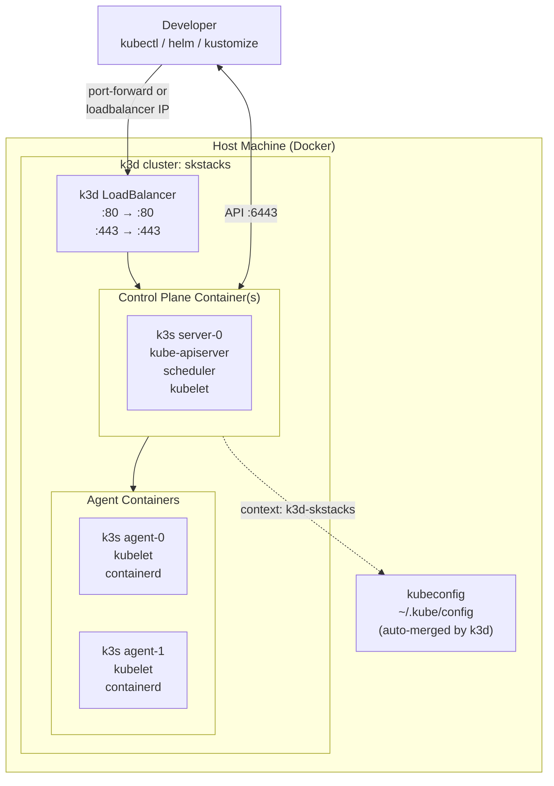
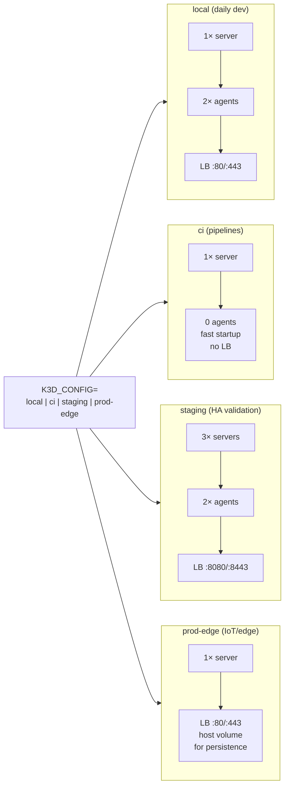
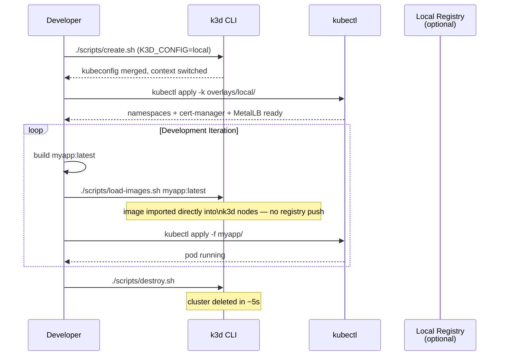

# SKStacks k3d Platform

k3d wraps k3s (a lightweight Kubernetes distribution) inside Docker containers,
giving you a multi-node Kubernetes cluster on a single machine in under 30 seconds.
This platform targets local development, CI pipelines, and single-node edge deployments.

## Prerequisites

| Tool | Min version | Install |
|------|-------------|---------|
| Docker | 24.0 | https://docs.docker.com/get-docker/ |
| k3d | 5.6.0 | `curl -s https://raw.githubusercontent.com/k3d-io/k3d/main/install.sh \| bash` |
| kubectl | 1.29+ | https://kubernetes.io/docs/tasks/tools/ |

Verify:

```bash
docker version
k3d version
kubectl version --client
```

## Quickstart (3 commands)

```bash
# 1. Configure
cp .env.example .env
# Edit .env if needed (defaults work for local dev)

# 2. Create the cluster
./scripts/create.sh

# 3. Deploy namespaces + ingress base
kubectl apply -k overlays/local/
```

Your kubeconfig is automatically merged and the context switched to `k3d-skstacks`.



```bash
kubectl get nodes
# NAME                    STATUS   ROLES                  AGE
# k3d-skstacks-server-0   Ready    control-plane,master   30s
# k3d-skstacks-agent-0    Ready    <none>                 25s
# k3d-skstacks-agent-1    Ready    <none>                 25s
```

## Cluster Profiles

| Profile | File | Servers | Agents | LB | Use case |
|---------|------|---------|--------|-----|----------|
| `local` | `clusters/local.yaml` | 1 | 2 | 80/443 | Daily development |
| `ci` | `clusters/ci.yaml` | 1 | 0 | none | CI pipelines (fast startup) |
| `staging` | `clusters/staging.yaml` | 3 | 2 | 8080/8443 | HA validation before prod |
| `prod-edge` | `clusters/prod-edge.yaml` | 1 | 0 | 80/443 | Single-node edge / IoT |

Switch profiles via `K3D_CONFIG`:

```bash
K3D_CONFIG=staging K3D_CLUSTER_NAME=skstacks-staging ./scripts/create.sh
```



## Common Operations

```bash
# Load a locally built image (skip registry push)
./scripts/load-images.sh myapp:latest

# Merge kubeconfig after manual cluster changes
./scripts/kubeconfig-merge.sh

# Destroy the cluster
./scripts/destroy.sh
```



## Overlays

```
overlays/
├── local/   — extends kubernetes/base; patches MetalLB for Docker bridge range,
│              ClusterIssuer redirected to LE staging (avoids rate limits)
└── ci/      — namespaces only; no MetalLB, no cert-manager (tests use port-forward)
```

Apply an overlay:

```bash
kubectl apply -k overlays/local/    # local dev
kubectl apply -k overlays/ci/       # CI pipeline
```

## Secrets Backend

k3d shares the same three secret backends as all other SKStacks platforms.
Set `SECRET_BACKEND` in `.env` (or export it) before running scripts:

| Backend | When to use |
|---------|-------------|
| `vault-file` | Local dev, single operator, no external deps |
| `hashicorp-vault` | Teams, audit trail, dynamic secrets |
| `capauth` | Sovereign agent mesh, PGP-only environments |

Wire secrets into the cluster via External Secrets Operator:

```bash
kubectl apply -f ../../kubernetes/external-secrets/helmchart.yaml
kubectl apply -f ../../kubernetes/external-secrets/cluster-secret-store.yaml
```

See `platform/kubernetes/external-secrets/README.md` for full ESO setup.

## cert-manager

`manifests/cert-manager.yaml` is a k3s HelmChart auto-deploy manifest.
For k3d, apply it manually:

```bash
kubectl apply -f manifests/cert-manager.yaml
# Wait for CRDs to settle before applying ClusterIssuer resources
kubectl wait --for=condition=available --timeout=120s \
  deployment/cert-manager -n cert-manager
```

Then patch your ACME email:

```bash
kubectl patch clusterissuer letsencrypt-prod --type=merge \
  -p '{"spec":{"acme":{"email":"you@example.com"}}}'
kubectl patch clusterissuer letsencrypt-staging --type=merge \
  -p '{"spec":{"acme":{"email":"you@example.com"}}}'
```

## Platform Comparison

| | k3d | Docker Swarm | RKE2 | Vanilla Kubernetes |
|-|-----|-------------|------|--------------------|
| **Setup time** | < 30 s | ~5 min | ~30 min | ~1 h |
| **Multi-node** | Simulated (containers) | Real VMs | Real VMs | Real VMs |
| **HA control-plane** | Yes (3-server config) | 3 managers (Raft) | 3 servers (etcd) | 3 control planes |
| **Production-ready** | Edge/IoT only | Yes (Swarm) | Yes | Yes |
| **Storage** | local-path or host mount | NFS / volume plugins | Longhorn (CSI) | Any CSI driver |
| **Networking** | Flannel (built-in) | VXLAN overlay | Canal / Calico | Any CNI |
| **Ingress** | ingress-nginx (we deploy) | Traefik v3 | ingress-nginx | Any |
| **GPU workloads** | No | No | Yes | Yes |
| **Resource cost** | ~512 MB RAM | 1–3 VMs | 3–6 VMs | 3–6 VMs |
| **Secret backends** | vault-file / Vault / CapAuth | vault-file / Vault / CapAuth | vault-file / Vault / CapAuth | vault-file / Vault / CapAuth |

## When to Use k3d

**Use k3d when:**
- You need a real Kubernetes API locally (not minikube's single-node quirks)
- CI pipelines need a throwaway cluster per PR (fast create/destroy)
- You want to test Kustomize overlays or Helm charts before staging
- Edge / IoT deployment on a single host that can run Docker

**Use Docker Swarm when:**
- Your team is already Docker-native and doesn't need Kubernetes APIs
- You need dead-simple HA without CRDs or Helm
- You're running on resource-constrained hardware (< 2 GB RAM per node)

**Use RKE2 when:**
- You need a production-grade, CIS-hardened Kubernetes cluster on real VMs
- You need Longhorn (block storage) or advanced CNI (Calico/Cilium)
- You require FIPS 140-2 compliance or SELinux enforcement

**Use Vanilla Kubernetes when:**
- You need maximum flexibility in every layer (kubeadm, etcd, CNI)
- You're running on a managed provider that already provisions control planes (EKS, GKE, AKS)
