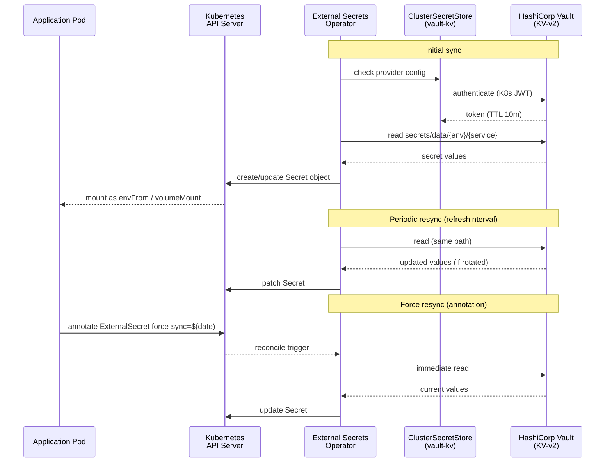
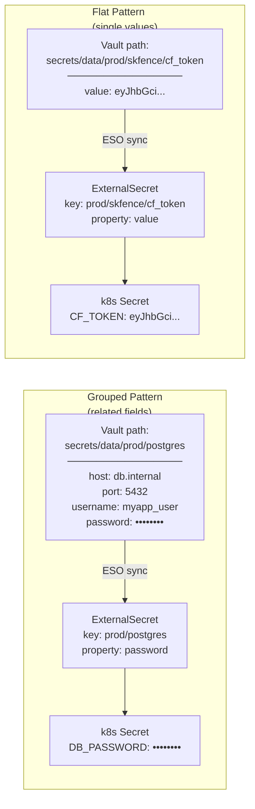

# External Secrets Operator — Kubernetes Platform Config
<!-- coord task: 55d31c18 -->

Bridges HashiCorp Vault KV-v2 into native Kubernetes Secrets.
Runs on any Kubernetes cluster; RKE2 clusters have their own HelmChart at
`platform/rke2/manifests/external-secrets.yaml` (auto-deployed by the RKE2 controller).

---

## Directory Contents

| File | Purpose |
|------|---------|
| `helmchart.yaml` | ArgoCD Application — deploys ESO v0.9.16 via Helm |
| `cluster-secret-store.yaml` | `ClusterSecretStore` CRD — Vault KV-v2 backend |
| `db-credentials.yaml` | `ExternalSecret` example — Postgres DB credentials |
| `api-keys.yaml` | `ExternalSecret` example — third-party API keys |
| `tls-wildcard.yaml` | `ExternalSecret` example — wildcard TLS cert/key |
| `vault-policy.hcl` | Vault ACL policy — read-only access to `secrets/` mount |

---

## Path Convention

```
secrets/{env}/{service}/{key}
└─ Vault KV mount:  secrets
   └─ path:         {env}/{service}/{key}
                    e.g.  prod/postgres/password
                          prod/myapp/stripe_secret_key
                          prod/certs/wildcard_tls_cert
```



**Two storage patterns** are supported and can be mixed:

| Pattern | Vault path | ESO remoteRef | Best for |
|---------|------------|---------------|----------|
| **Grouped** | `secrets/data/{env}/{service}` | `key: {env}/{service}`, `property: field_name` | Services with several related fields (DB host/port/user/pass) |
| **Flat** | `secrets/data/{env}/{service}/{key}` | `key: {env}/{service}/{key}`, `property: value` | Single-value keys (API tokens, passwords). Matches `HashiCorpVaultBackend.set()` in `secrets/hashicorp_vault/backend.py` |

The `value` property name in the flat pattern comes from how the Python secret backend
stores secrets: `{"value": "<plaintext>"}`. Both patterns are fully compatible with ESO.



---

## Prerequisites

### 1 — Install ESO

**ArgoCD (recommended):**
```bash
kubectl apply -f platform/kubernetes/external-secrets/helmchart.yaml
```

**Helm CLI:**
```bash
helm repo add external-secrets https://charts.external-secrets.io
helm upgrade --install external-secrets external-secrets/external-secrets \
  --version 0.9.16 \
  --namespace external-secrets --create-namespace \
  --set installCRDs=true \
  --set replicaCount=2 \
  --set webhook.replicaCount=2 \
  --set certController.replicaCount=2 \
  --set serviceMonitor.enabled=true
```

### 2 — Vault: enable the `secrets` KV-v2 mount

```bash
vault secrets enable -path=secrets kv-v2
```

### 3 — Vault: enable and configure Kubernetes auth

```bash
vault auth enable kubernetes

# Run from inside a pod (or supply values manually)
vault write auth/kubernetes/config \
  kubernetes_host="https://${KUBERNETES_PORT_443_TCP_ADDR}:443" \
  kubernetes_ca_cert=@/var/run/secrets/kubernetes.io/serviceaccount/ca.crt \
  token_reviewer_jwt="$(cat /var/run/secrets/kubernetes.io/serviceaccount/token)" \
  issuer="https://kubernetes.default.svc.cluster.local"
```

### 4 — Vault: apply the ESO policy

```bash
vault policy write eso-secrets-reader \
  platform/kubernetes/external-secrets/vault-policy.hcl
```

### 5 — Vault: create the Kubernetes auth role

```bash
vault write auth/kubernetes/role/skstacks-eso \
  bound_service_account_names=external-secrets \
  bound_service_account_namespaces=external-secrets \
  token_policies="eso-secrets-reader" \
  token_ttl=10m \
  token_max_ttl=1h
```

### 6 — Apply the ClusterSecretStore

Edit `CHANGEME_VAULT_ADDR` in `cluster-secret-store.yaml`, then:

```bash
kubectl apply -f platform/kubernetes/external-secrets/cluster-secret-store.yaml

# Verify it connects to Vault successfully
kubectl get clustersecretstore vault-kv
# Expected: STATUS=Valid
```

---

## Populating Secrets in Vault

### DB credentials (grouped pattern)

```bash
vault kv put secrets/prod/postgres \
  host="db.internal.your-domain.com" \
  port="5432" \
  name="myapp_prod" \
  username="myapp_user" \
  password="$(openssl rand -base64 32)"
```

### API keys (flat pattern)

```bash
vault kv put secrets/prod/skfence/cloudflare_dns_token value="<CF_TOKEN>"
vault kv put secrets/prod/myapp/stripe_secret_key      value="<STRIPE_KEY>"
vault kv put secrets/prod/myapp/sendgrid_api_key       value="<SG_KEY>"
```

### TLS wildcard cert (Option A — stored in Vault)

```bash
# Store PEM files base64-encoded (preserves newlines in Vault KV)
vault kv put secrets/prod/certs/wildcard_tls_cert \
  value="$(base64 -w0 /etc/ssl/certs/wildcard-fullchain.pem)"

vault kv put secrets/prod/certs/wildcard_tls_key \
  value="$(base64 -w0 /etc/ssl/private/wildcard.key)"
```

> **Option B:** For dynamic certs via cert-manager + Vault PKI, see `ARCHITECTURE.md`.
> Option B does **not** use ExternalSecret — cert-manager creates the Secret directly.

---

## Applying ExternalSecret Examples

```bash
# Edit CHANGEME_ placeholders in each file first

# DB credentials
kubectl apply -f platform/kubernetes/external-secrets/db-credentials.yaml

# API keys
kubectl apply -f platform/kubernetes/external-secrets/api-keys.yaml

# TLS wildcard cert
kubectl apply -f platform/kubernetes/external-secrets/tls-wildcard.yaml

# Verify sync
kubectl get externalsecret -A
kubectl describe externalsecret postgres-credentials -n <namespace>
```

---

## Secret Rotation Runbook

```mermaid
flowchart TD
    START(["Secret needs rotation"])
    TYPE{"Secret type?"}

    subgraph DB["DB Password Rotation"]
        DB1["1. Generate new password\nopenssl rand -base64 32"]
        DB2["2. ALTER USER on DB\n(old password still works)"]
        DB3["3. vault kv patch\nupdate Vault"]
        DB4["4. Annotate ExternalSecret\nforce-sync"]
        DB5["5. kubectl rollout restart"]
        DB1 --> DB2 --> DB3 --> DB4 --> DB5
    end

    subgraph API["API Key Rotation (zero-downtime)"]
        A1["1. Create new key\non provider (old key active)"]
        A2["2. Write to Vault\nunder _next path"]
        A3["3. Test new key"]
        A4["4. Swap to live path\nin Vault"]
        A5["5. Force ESO sync"]
        A6["6. Revoke old key\non provider"]
        A1 --> A2 --> A3 --> A4 --> A5 --> A6
    end

    subgraph TLS["TLS Cert Rotation"]
        T1["1. certbot renew\nor Cloudflare dashboard"]
        T2["2. vault kv put\nnew cert + key (base64)"]
        T3["3. Force ESO sync\ningress auto-reloads TLS"]
        T1 --> T2 --> T3
    end

    START --> TYPE
    TYPE -->|"postgres / mysql"| DB
    TYPE -->|"Stripe / CF / API key"| API
    TYPE -->|"TLS certificate"| TLS
```



### Forcing an immediate ESO re-sync

ESO normally waits for `refreshInterval`. To trigger an immediate refresh:

```bash
kubectl annotate externalsecret <name> -n <namespace> \
  force-sync="$(date +%s)" --overwrite
```

### DB password rotation

```bash
# 1. Generate new password
NEW_PASS="$(openssl rand -base64 32)"

# 2. Update the database user (while old password still works)
psql "host=db.internal dbname=myapp_prod user=myapp_user" \
  -c "ALTER USER myapp_user PASSWORD '$NEW_PASS';"

# 3. Update Vault (patch preserves other fields in the grouped secret)
vault kv patch secrets/prod/postgres password="$NEW_PASS"

# 4. Force ESO re-sync
kubectl annotate externalsecret postgres-credentials -n <namespace> \
  force-sync="$(date +%s)" --overwrite

# 5. Rolling restart pods (K8s propagates Secret updates automatically,
#    but most apps only read env vars at startup)
kubectl rollout restart deployment/<app> -n <namespace>
```

### API key rotation (zero-downtime)

Many providers support dual active keys:

```bash
# 1. Create the new key on the provider dashboard (keep old key active)
NEW_KEY="<NEW_KEY_FROM_PROVIDER>"

# 2. Write new key to Vault under a temporary path to validate first
vault kv put secrets/prod/myapp/stripe_secret_key_next value="$NEW_KEY"

# 3. Test new key independently, then swap it into the live path
vault kv put secrets/prod/myapp/stripe_secret_key value="$NEW_KEY"

# 4. Force ESO re-sync
kubectl annotate externalsecret myapp-api-keys -n <namespace> \
  force-sync="$(date +%s)" --overwrite

# 5. Verify pods are using the new key, then revoke the old key on the provider
```

### TLS wildcard cert rotation (Option A)

```bash
# 1. Obtain renewed cert (certbot, Cloudflare dashboard, etc.)
certbot renew --cert-name "*.your-domain.com"

# 2. Update Vault
vault kv put secrets/prod/certs/wildcard_tls_cert \
  value="$(base64 -w0 /etc/letsencrypt/live/your-domain.com/fullchain.pem)"
vault kv put secrets/prod/certs/wildcard_tls_key \
  value="$(base64 -w0 /etc/letsencrypt/live/your-domain.com/privkey.pem)"

# 3. Force ESO re-sync
kubectl annotate externalsecret wildcard-tls -n <namespace> \
  force-sync="$(date +%s)" --overwrite

# Ingress controllers (ingress-nginx, Traefik) reload TLS automatically.
# No pod restarts required.
```

### Monitoring cert expiry

Add a Prometheus alert rule:

```yaml
# alerts/tls-expiry.yaml
- alert: WildcardTLSExpiringSoon
  expr: |
    (ssl_certificate_expiry_seconds{secret="wildcard-tls"} - time()) / 86400 < 14
  for: 1h
  labels:
    severity: warning
  annotations:
    summary: "Wildcard TLS cert expires in < 14 days"
```

---

## Vault KV Versions and Audit

KV-v2 keeps a configurable version history. View version history:

```bash
vault kv metadata get secrets/prod/postgres
vault kv get -version=3 secrets/prod/postgres
```

Set max versions (default is 10):

```bash
vault kv metadata put -max-versions=20 secrets/prod/postgres
```

All reads and writes by ESO appear in the Vault audit log
(enabled in `secrets/hashicorp_vault/helm/vault-values.yaml`):

```bash
# Recent ESO token activity
vault audit list
vault read sys/audit
```

---

## Troubleshooting

| Symptom | Likely cause | Fix |
|---------|-------------|-----|
| `ClusterSecretStore` STATUS=Invalid | Vault unreachable or wrong `server:` URL | Check `CHANGEME_VAULT_ADDR`; verify TLS |
| `ClusterSecretStore` STATUS=Invalid, auth error | K8s auth role not bound correctly | Re-run vault write auth/kubernetes/role/... step |
| `ExternalSecret` Ready=False, `SecretSyncError` | Path doesn't exist in Vault | `vault kv get secrets/{env}/{service}` to verify |
| `ExternalSecret` Ready=False, permission denied | Policy missing capability | Re-apply `vault-policy.hcl` |
| Secret not updating after Vault change | `refreshInterval` not elapsed | Use `force-sync` annotation |
| `tls.crt` contains base64 garbage | Missing `b64dec` in template | Ensure `engineVersion: v2` and the template uses `{{ .tlsCrt \| b64dec }}` |

```bash
# Get detailed ESO controller logs
kubectl logs -n external-secrets \
  -l app.kubernetes.io/name=external-secrets --tail=100

# Describe a failing ExternalSecret
kubectl describe externalsecret <name> -n <namespace>
```
