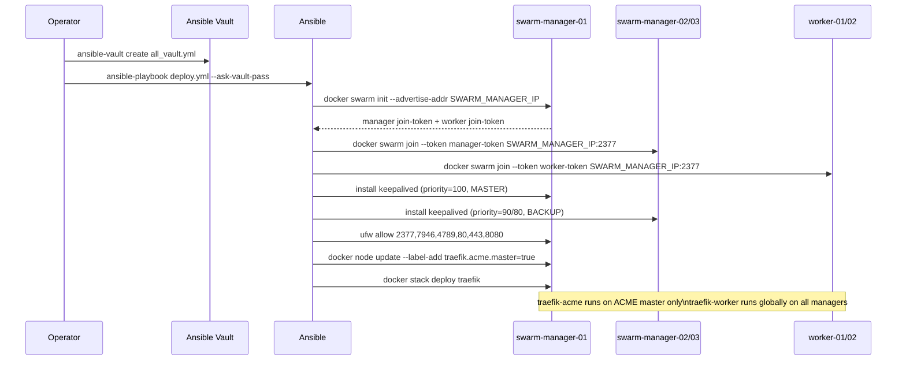
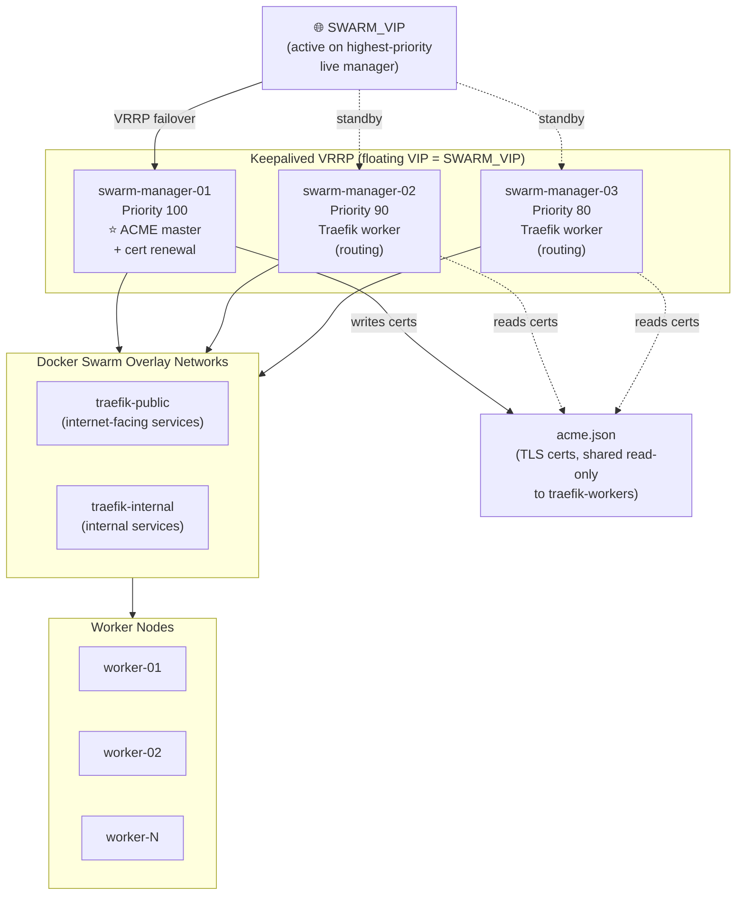
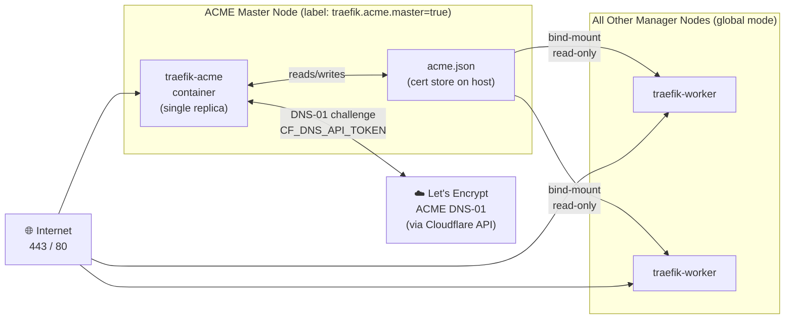

# SKStacks v2 — Docker Swarm Platform

A sanitized, public scaffold for deploying a production-grade Docker Swarm cluster with:

- **3-manager quorum** (Raft consensus)
- **Keepalived VRRP** floating VIP for HA ingress
- **Traefik v3** reverse proxy with automatic Let's Encrypt TLS (DNS-01/Cloudflare)
- **UFW firewall** rules for swarm and application ports
- **Ansible** automation for fully idempotent bootstraps

---

## Directory layout

```
platform/swarm/
├── ansible/
│   ├── roles/
│   │   ├── swarm-init/       # docker swarm init on primary manager
│   │   ├── swarm-join/       # join additional managers and workers
│   │   ├── swarm-ha/         # keepalived VRRP VIP across managers
│   │   └── swarm-firewall/   # UFW rules (2377, 7946, 4789, 80, 443)
│   ├── playbooks/
│   │   └── deploy.yml        # full cluster bootstrap + Traefik deploy
│   ├── group_vars/
│   │   └── all.yml.example   # variable template (copy → all.yml)
│   └── inventory.example     # host inventory template
├── stacks/
│   └── traefik/
│       ├── docker-compose.yml  # Traefik v3 Swarm stack (ACME master + workers)
│       └── traefik.yml         # static config (entrypoints, ACME, providers)
├── .env.example              # all environment variables with descriptions
└── README.md                 # this file
```

---

## Prerequisites

| Requirement | Notes |
|---|---|
| Ansible ≥ 2.14 | `community.general` collection for UFW tasks |
| Docker Engine ≥ 24 | Installed on all nodes before running playbooks |
| Ubuntu 22.04 / Debian 12 | Other distros work; adjust package names |
| Python 3 | On managed nodes (`ansible_python_interpreter=/usr/bin/python3`) |
| SSH key auth | Passwordless sudo for `ANSIBLE_USER` |
| Cloudflare account | DNS-01 ACME challenge (`CF_DNS_API_TOKEN`) |

Install the required Ansible collection:

```bash
ansible-galaxy collection install community.general
```

---

## Quick start



### 1. Configure environment

```bash
cp .env.example .env
# Edit .env — fill in all blank values
```

### 2. Configure inventory

```bash
cp ansible/inventory.example ansible/inventory
# Replace ${VAR} placeholders with real IPs and usernames
```

### 3. Configure group variables

```bash
cp ansible/group_vars/all.yml.example ansible/group_vars/all.yml
# Edit all.yml — replace ${VAR} placeholders
```

Create a vault file for secrets:

```bash
ansible-vault create ansible/group_vars/all_vault.yml
```

Add the following to the vault:

```yaml
vault_keepalived_auth_pass: "<strong-random-password>"
vault_acme_email: "admin@example.com"
```

Reference the vault variables in `all.yml`:

```yaml
keepalived_auth_pass: "{{ vault_keepalived_auth_pass }}"
acme_email: "{{ vault_acme_email }}"
```

### 4. Label the ACME master node

After the swarm is initialized, label exactly ONE manager as the ACME certificate node:

```bash
docker node update --label-add traefik.acme.master=true swarm-manager-01
```

### 5. Deploy

```bash
cd ansible
ansible-playbook -i inventory playbooks/deploy.yml \
  --extra-vars "env=prod" \
  --ask-vault-pass
```

---

## Environment variables

All variables are documented in [`.env.example`](.env.example).

Key variables:

| Variable | Description |
|---|---|
| `SWARM_MANAGER_IP` | Management IP of the bootstrap manager |
| `SWARM_VIP` | Keepalived floating VIP (same subnet as managers) |
| `DOMAIN` | Primary domain served by Traefik |
| `ACME_EMAIL` | Let's Encrypt registration email |
| `CF_DNS_API_TOKEN` | Cloudflare DNS API token (Zone.DNS:Edit) |
| `TRAEFIK_DASHBOARD_AUTH` | htpasswd hash for dashboard basic-auth |
| `ENV` | Environment tag: `prod`, `staging`, or `dev` |

---

## Swarm ports reference

| Port | Proto | Purpose |
|---|---|---|
| 2377 | TCP | Cluster management (managers only) |
| 7946 | TCP/UDP | Container network discovery |
| 4789 | UDP | VXLAN overlay data plane |
| 80 | TCP | Traefik HTTP (redirects to HTTPS) |
| 443 | TCP | Traefik HTTPS |
| 8080 | TCP | Traefik dashboard (restrict source) |

---

## HA architecture



The `traefik-acme` service handles **certificate renewal only** and runs on
the labeled ACME master. `traefik-worker` runs in **global mode** on all other
managers and performs actual request routing. Workers mount `acme.json`
read-only so they pick up renewed certificates without managing ACME themselves.



---

## Secrets management

This scaffold uses Ansible Vault for secrets at rest. For production deployments
consider integrating with the SKStacks v2 secrets backends:

- **vault-file** — Ansible Vault AES-256 (simplest, no external deps)
- **hashicorp-vault** — HashiCorp Vault KV-v2 (recommended for teams)
- **capauth** — PGP blobs via skcapstone MCP (sovereign agent mesh)

See `skstacks/v2/secrets/` for backend implementations and the migration tool.

---

## License

AGPL-3.0 — see repository root for full license text.
