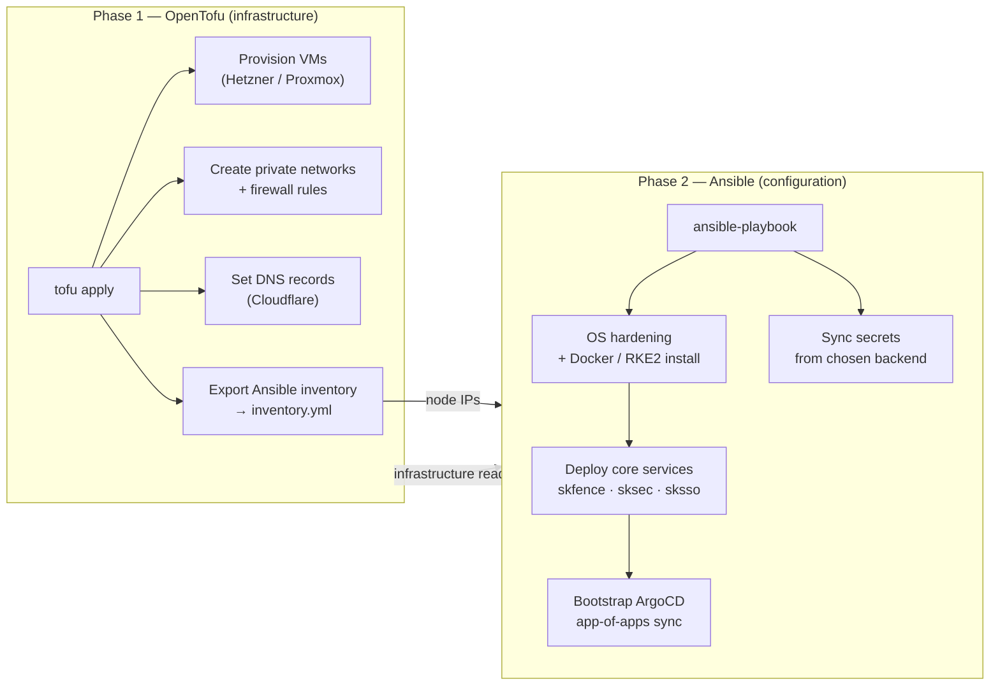
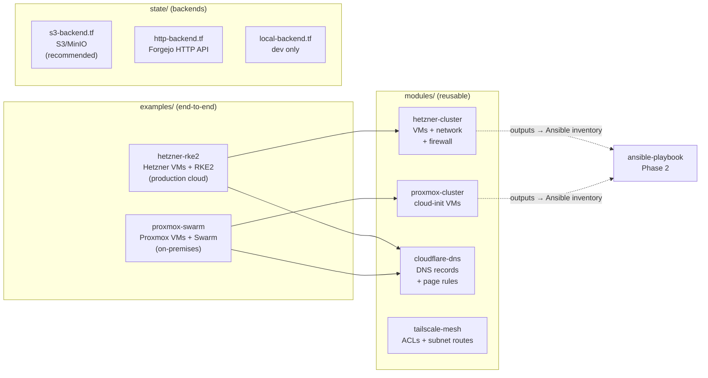
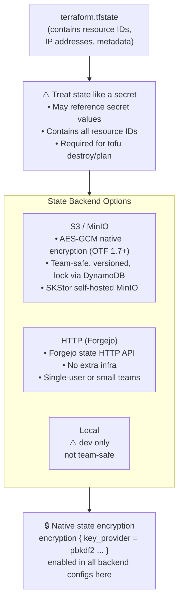

# SKStacks v2 — OpenTofu Infrastructure Layer

OpenTofu provisions the underlying infrastructure that Ansible then configures.
Think of it as the two-phase deploy:

```
Phase 1 — tofu apply     → creates VMs, networks, DNS, firewalls
Phase 2 — ansible-playbook → installs RKE2/Swarm, deploys core services
```

OpenTofu is the open-source fork of Terraform (Linux Foundation, MPL-2.0).
Install: https://opentofu.org/docs/intro/install/



---

## Supported Providers

| Provider | Use case | Module |
|----------|----------|--------|
| **Hetzner Cloud** | Cloud VMs (primary sovereign cloud) | `modules/hetzner-cluster/` |
| **Proxmox VE** | On-premises VMs (bare-metal sovereign) | `modules/proxmox-cluster/` |
| **Cloudflare** | DNS records, firewall, tunnel | `modules/cloudflare-dns/` |
| **Tailscale** | Mesh network ACLs, subnet routing | `modules/tailscale-mesh/` |
| **Generic / local** | Pre-existing bare-metal nodes | `modules/bare-metal/` |



---

## Secret Backend Integration

OpenTofu reads cloud credentials from your chosen secret backend:

### vault-file
```bash
# Export secrets as env vars before tofu apply
eval $(python3 ../secrets/factory.py export-env --scope tofu --env prod)
tofu apply
```

### hashicorp-vault (recommended)
```hcl
# tofu reads cloud tokens directly from Vault
# No credentials in .tfvars files or CI/CD secrets
data "vault_kv_secret_v2" "cloud_creds" {
  mount = "kv"
  name  = "skstacks/prod/tofu/hetzner"
}
```

### capauth
```bash
# GPG-decrypt the tofu credentials blob, pipe to env
eval $(gpg --decrypt ~/.skstacks/secrets/prod/tofu.gpg | jq -r 'to_entries|.[]|"export TF_VAR_\(.key)=\(.value)"')
tofu apply
```

---

## State Backend

OpenTofu state is sensitive — treat it like a secret.

| Option | When | Config file |
|--------|------|-------------|
| **S3 / MinIO** (recommended) | Team / CI use, state in SKStor | `state/s3-backend.tf` |
| **HTTP** (Forgejo) | Forgejo-native, no extra infra | `state/http-backend.tf` |
| **Local** | Single operator, dev | `state/local-backend.tf` |

OpenTofu 1.7+ native state encryption (AES-GCM) is enabled in all backends here.



---

## Quick Start

### Hetzner Cloud → RKE2 cluster

```bash
cd tofu/examples/hetzner-rke2/

cp terraform.tfvars.example terraform.tfvars
$EDITOR terraform.tfvars      # fill in CHANGEME_ values

tofu init
tofu plan
tofu apply

# After apply — run Ansible against the provisioned nodes
cd ../../..
ansible-playbook \
  -i platform/rke2/ansible/inventory.yml \
  platform/rke2/ansible/install-rke2-server.yml
```

### Proxmox → Docker Swarm

```bash
cd tofu/examples/proxmox-swarm/

cp terraform.tfvars.example terraform.tfvars
$EDITOR terraform.tfvars

tofu init && tofu apply

ansible-playbook \
  -i platform/docker-swarm/inventory.yml \
  platform/docker-swarm/swarm-init.yml
```

---

## Directory Layout

```
tofu/
├── README.md                      ← you are here
│
├── modules/                       ← reusable infrastructure modules
│   ├── hetzner-cluster/           ← Hetzner VMs + private network + firewall
│   ├── proxmox-cluster/           ← Proxmox VMs via cloud-init
│   ├── cloudflare-dns/            ← DNS records + page rules
│   ├── tailscale-mesh/            ← Tailscale ACLs + subnet routes
│   └── common-outputs/            ← Shared output structure (→ Ansible inventory)
│
├── state/                         ← state backend config fragments
│   ├── s3-backend.tf              ← S3/MinIO (default)
│   ├── http-backend.tf            ← Forgejo state HTTP API
│   └── local-backend.tf           ← local state (dev only)
│
├── secrets/                       ← secret backend integrations for tofu
│   ├── vault-provider.tf          ← HashiCorp Vault data sources
│   ├── vault-file-wrapper.sh      ← env export helper for vault-file
│   └── capauth-wrapper.sh         ← GPG decrypt → env export
│
└── examples/                      ← end-to-end reference deployments
    ├── hetzner-rke2/              ← Hetzner + RKE2 (production-grade)
    └── proxmox-swarm/             ← Proxmox + Docker Swarm (on-premises)
```
